# アプリ開発ノート

個人でアプリを開発する中で得た知見を、公開できる形で残していくためのリポジトリです。

機密情報、認証情報、秘密鍵、非公開のテスター情報、公開すべきでない事業上の情報は記載しません。
内容は、抽象度の高い原則から具体的な実装・運用へ流れるように整理します。

## 読む順番

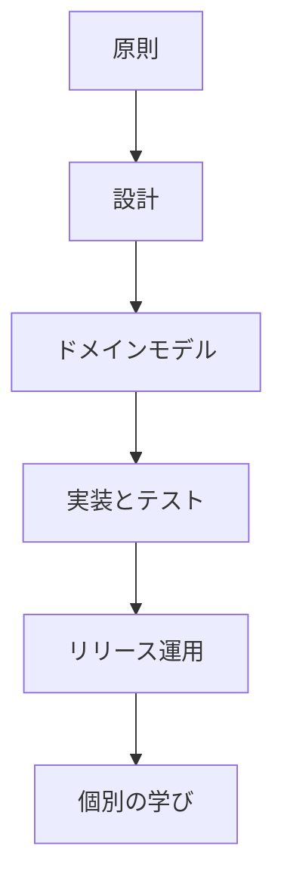

## 原則

### ユーザーの価値から始める

小さなアプリでも、まず「誰のどんな困りごとを解くのか」を明確にする。

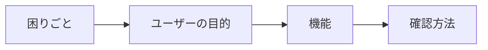

機能を追加する前に確認すること:

- 誰が使うのか。
- 何を解決するのか。
- 使った人は何を見て成功と判断するのか。
- 開発者はリリース前にどう確認するのか。

### ローカル優先にする

ネットワークが不要なアプリは、ローカルだけで完結するほうが速く、プライバシー上も説明しやすい。

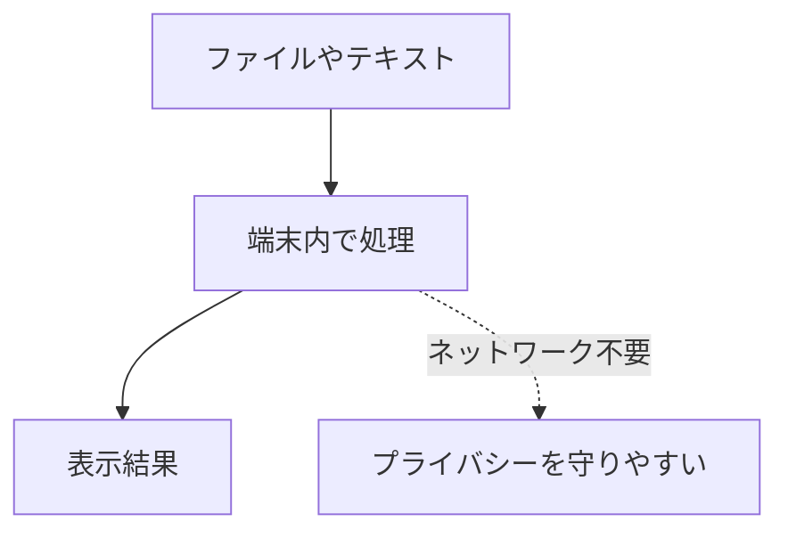

必要がない権限は要求しない。特に `INTERNET` 権限は、不要なら持たない。

### リリース作業を再現可能にする

リリース作業は、できるだけスクリプトと CI/CD に寄せる。

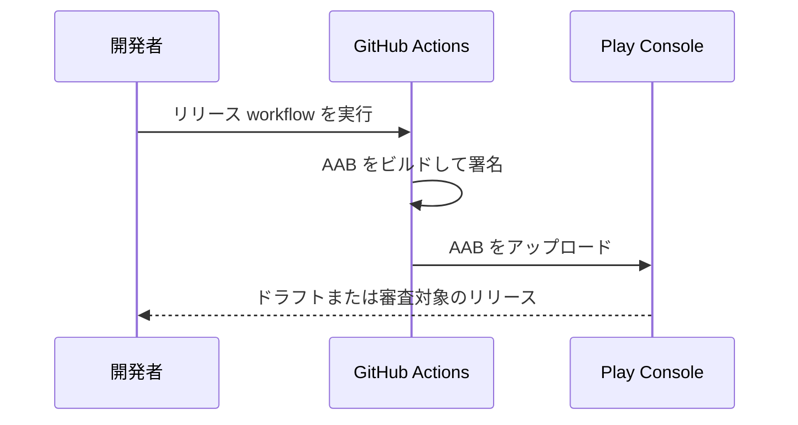

GUI 操作が残ってもよいが、ビルドとアップロードは手元の端末に依存しないようにする。

## 設計

### 安定した判断と変わりやすい詳細を分ける

原則やドメインモデルは変化を遅くし、UI やプラットフォーム連携は変更しやすくする。

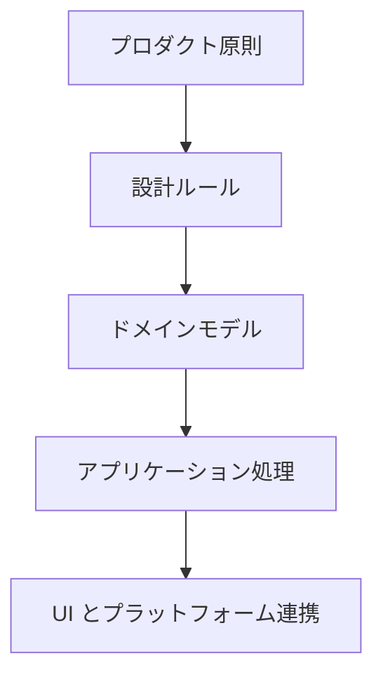

依存の向きは、具体的な実装から安定した概念へ向ける。

### 状態を型として表す

重要な状態を boolean や nullable な値だけで表さない。名前のある状態として表す。

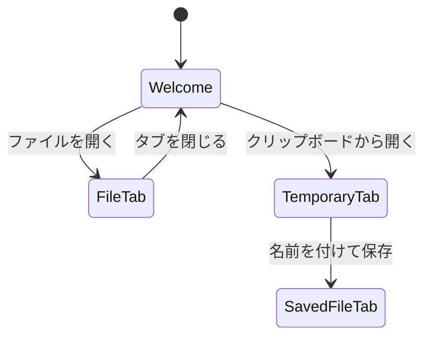

状態を明確にすると、UI、永続化、テストが追いやすくなる。

## ドメインモデル

### Always-Valid なオブジェクトを作る

ドメインオブジェクトは、不変条件を満たした状態でだけ生成する。

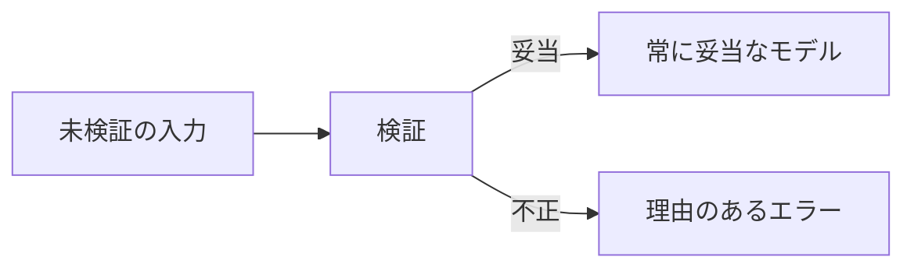

Always-Valid なオブジェクトだけを受け取る関数は、全域関数として設計しやすい。
結果として、コアロジック内の防御的な分岐を減らせる。

### スタンプ結合を避ける

関数が一部の値しか使わないなら、大きなオブジェクトを丸ごと渡さない。

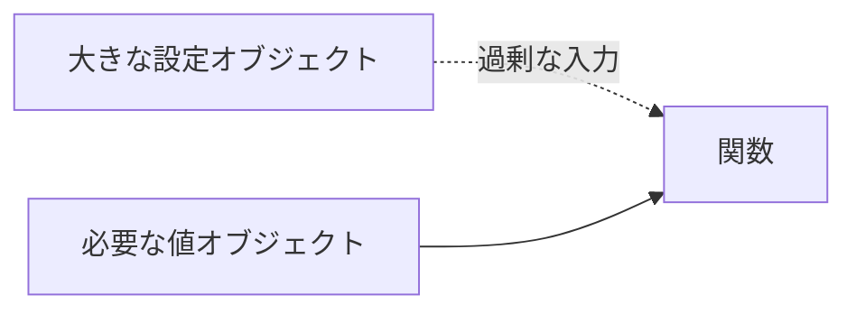

入力を小さくすると、テストの意図が明確になり、偶発的な依存も減る。

## 実装とテスト

### 実装とリファクタリングは TDD で進める

振る舞いを追加・変更する場合は、先にテストを書く。

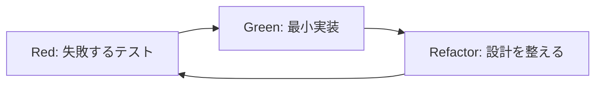

テスト名は仕様を説明する名前にする。実装を読まなくても、何を確認しているか分かる状態を目指す。

### テストの匂いを避ける

テストは実行可能な仕様書として扱う。

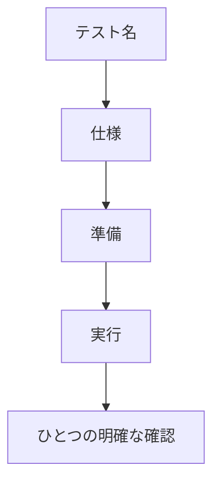

テスト内の条件分岐は避ける。ケースが違うならテストを分ける。

### 表示文言とテーマもモデルとして扱う

言語やテーマの判定を UI のあちこちに散らさない。

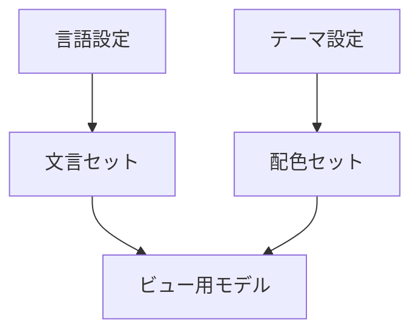

日本語表示と英語表示、ライトテーマとダークテーマが混ざらないように、まとまったモデルとして渡す。

## リリース運用

### Git に秘密を置かない

次のものはコミットしない。

- keystore
- パスワード
- サービスアカウントキー
- API トークン
- 非公開のテスター情報
- 公開を意図していない Play Console 関連情報

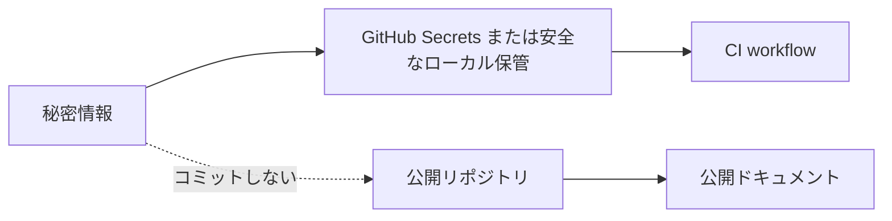

### CI の認証は鍵ファイルより OIDC を優先する

可能なら、長期保存するサービスアカウントキーではなく Workload Identity Federation を使う。

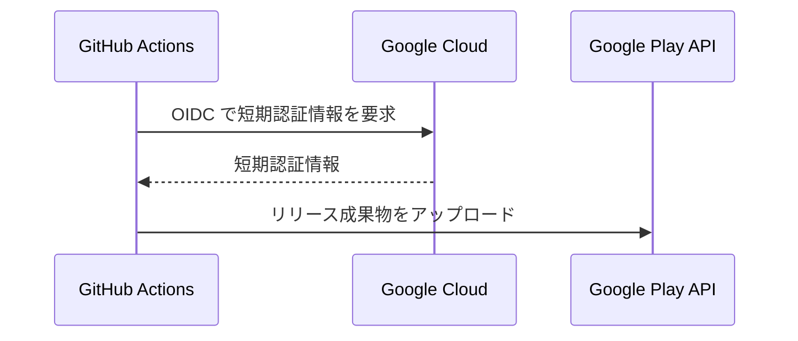

漏洩時の影響範囲を小さくできる。

### versionCode は必ず増やす

Google Play は一度使った versionCode を再利用できない。

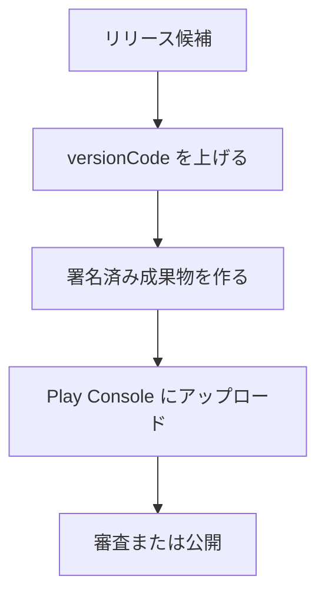

## 個別ノート

- [Google Play CI/CD で学んだこと](notes/google-play-cicd.md)
- [モバイル Markdown リーダーで学んだこと](notes/mobile-markdown-reader.md)
- [性質ベーステスト (PBT) で学んだこと](notes/property-based-testing.md)
- [ミューテーションテストで学んだこと](notes/mutation-testing.md)
- [ハーネスエンジニアリングで学んだこと](notes/harness-engineering.md)
- [ハーネスへの投資をどう考えるか](notes/harness-investment.md)
- [ハーネス層の有効性評価とライフサイクル](notes/harness-effectiveness-review.md)
- [ハーネスROI評価フレームワーク — 投資と効果を実測で比較する手順](notes/harness-roi-framework.md)
- [ハーネスの自己修正ループ — 弱点はどう見つかり、どう塞がれたか](notes/harness-self-correction.md)
- [ハーネス3層分類の設計 — 汎用コア・スタック別アダプタ・プロジェクト固有設定の分け方](notes/harness-3layer-classification.md)
- [モデル検査を設計段階のハーネスにする](notes/model-checking-design-harness.md)
- [値オブジェクトの永続化写像を Alloy で形式化する](notes/alloy-model-value-object.md)
- [AGENTS.md にハーネスとして何を書くべきか](notes/agents-md-as-harness.md)
- [潜在バグの考古学 — 一つのUI変更が掘り起こした3つのバグ](notes/latent-bugs-archaeology.md)
- [ドメイン知識深化ループ — 暗黙知を検査可能な仕様に変える](notes/domain-knowledge-loop.md)
- [harness-kit v0.1.0 — ハーネス抽出リポジトリの初回リリース記録](notes/harness-release.md)
- [ハーネスキットを実際に消費させる — 抽出しただけでは検証されない](notes/harness-kit-consumption.md)
- [探索テストを継続ループにする — AIエージェントのドメイン知識獲得](notes/exploration-loop.md)
- [AI改修コストをコード品質で測る — 偶有的複雑性の代理指標と結合の三角測量](notes/code-quality-metrics-for-ai.md)
- [決定的ゲートで囲うエージェント収束ループ — 「統率」と「判断」の境界](notes/deterministic-gate-agent-loop.md)

