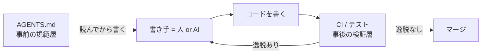
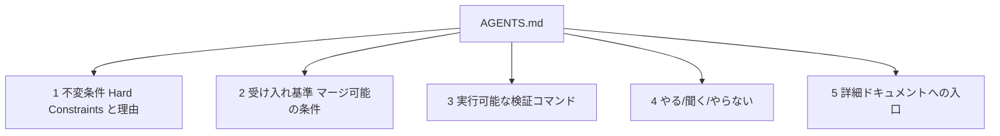
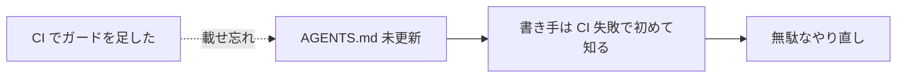

# AGENTS.md にハーネスとして何を書くべきか

## 見解（結論）

`AGENTS.md` は、ハーネス（[ハーネスエンジニアリングのノート](harness-engineering.md)を参照）における **「書き手が作業前に読むコンテキスト層・規範層」** として書くべきだ。

テストや CI が「書いた後に」逸脱を止める *事後の検証層* なら、`AGENTS.md` は「書く前に」逸脱を避けさせる *事前の規範層* である。両者は補完関係で、片方だけでは弱い。

`AGENTS.md` の本質は「エージェント向けの README」であり、ビルド手順・規約・制約など **コードからは推測できない運用知識** を持続的に与えるファイルである（[agents.md](https://agents.md/)）。ハーネスの観点を足すと、ここに書くべきは特に **プロジェクトの不変条件と受け入れ基準** になる。

## 位置づけ: 検証層と規範層

[ハーネスは検証の速さで層をなす](harness-engineering.md)。`AGENTS.md` はその層の *外側* にあり、書き手のループに **最初のフィードバックより前** に介入する。

- CI の高速ガード（秒〜分）は、逸脱を *機械的に* 止める。
- `AGENTS.md` は、その逸脱を *そもそも起こさせない* ための知識を与える。

CI ガードだけがあって `AGENTS.md` に載っていないと、書き手（特に AI エージェント）は **CI で落ちて初めてルールを知る**。これは遅く、無駄なやり直しを生む。規範を事前に渡すことで、自己修正サイクルの空振りを減らせる。

## 何を書くべきか

`AGENTS.md` の公開仕様は H2 セクションの自由構成を許し、決まった見出しは要求しない（[agents.md](https://agents.md/)）。ハーネスとして機能させるには、最低限つぎの 5 つを含めるとよい。

### 1. 不変条件（Hard Constraints）と、その理由

「絶対に壊してはいけない性質」を、**理由・影響・確認方法** とともに書く。理由を併記するのは、書き手が書かれていない状況でも判断できるようにするため。

例: 「`INTERNET` 権限を追加しない（理由: プライバシーをアーキテクチャで強制する／確認: CI の `check-hard-constraints.sh`）」。

これは [fitness function](https://www.thoughtworks.com/insights/articles/fitness-function-driven-development)（アーキテクチャ特性を機械的に評価する仕組み）の **人間可読な宣言** にあたる。CI のガードが「測定」なら、`AGENTS.md` の不変条件はその「目標の言語化」である。

### 2. 受け入れ基準（マージ可能の条件）

変更が **マージされるために満たすべき条件** を集約する。アジャイルでいう Definition of Done を、機械検証と結びつけた形で書く。各基準には「何で強制されるか（どの CI チェック）」を併記すると、書き手が事前に自己点検できる。

例: 必須チェック一覧、PR タイトル規約、秘密情報を置かない、テストが緑、レビュー会話の解決。

### 3. 実行可能な検証コマンド

ビルド・テスト・各種チェックを **そのまま実行できる形** で早い位置に置く。エージェントは説明文より実行コマンドを参照するため（[agents.md ベストプラクティス](https://agents.md/)）。

### 4. やること / 聞くこと / やらないこと

「always do / ask first / never do」で破壊的操作を防ぐ（[agents.md](https://agents.md/)）。曖昧な散文より、命令形の短い規則のほうが従われやすい。

### 5. 詳細ドキュメントへの入口

`AGENTS.md` 自体は短く保ち、設計やリリース手順の詳細は別ドキュメントへのリンクで示す。全部を書き込むと本質が埋もれる。

## なぜそう書くのか（根拠）

- **検証層だけでは不十分**。Fowler は「自己テストするコードがなければ継続的インテグレーションとは言えない」とし、自動テストを安全網として位置づける（[Self Testing Code, Martin Fowler](https://martinfowler.com/bliki/SelfTestingCode.html)）。だが安全網は *落ちてから* 効く。`AGENTS.md` は *落ちる前* に効く層を足す。
- **不変条件は測定可能にする**。Ford / Parsons / Kua は、アーキテクチャ特性を fitness function として継続的に測定し、進化を導くと説く（[Building Evolutionary Architectures](https://www.thoughtworks.com/insights/books/building-evolutionaryarchitectures-second-edition) / [Foreword by Martin Fowler](https://martinfowler.com/articles/evo-arch-forward.html)）。`AGENTS.md` はその目標を宣言し、CI がそれを測る、という対応をつくる。
- **AGENTS.md はエージェント向けの README**。コードから推測できない制約・コマンド・規約を持続的に渡す公開標準である（[agents.md](https://agents.md/) / [OpenAI Codex: AGENTS.md](https://developers.openai.com/codex/guides/agents-md) / [GitHub Blog: how to write a great agents.md](https://github.blog/ai-and-ml/github-copilot/how-to-write-a-great-agents-md-lessons-from-over-2500-repositories/)）。
- **規約は既存標準に従い、CI で強制する**。コミットや PR タイトルは [Conventional Commits](https://www.conventionalcommits.org/) のような標準に合わせると、書き手も検証も同じ基準を共有できる。

## 避けるべきこと（アンチパターン）

- **「強制したが周知していない」状態**。ガードを CI に足したのに `AGENTS.md` を更新しないと、規範層に穴があく。ガードを足したら受け入れ基準にも書く。
- **散文の過剰**。実行コマンドや「やる/やらない」を、長い説明文の中に埋めない。
- **存在しない手順を書く**。まだ無いスクリプトやコマンドを書くと、従った書き手が失敗する。**リポジトリに今あるもの** を指す。
- **秘密情報**。鍵・トークン・非公開のテスター情報は書かない。

## 参考文献

- agents.md — AGENTS.md オープン標準: <https://agents.md/> , <https://github.com/agentsmd/agents.md>
- OpenAI Codex — Custom instructions with AGENTS.md: <https://developers.openai.com/codex/guides/agents-md>
- GitHub Blog — How to write a great agents.md: <https://github.blog/ai-and-ml/github-copilot/how-to-write-a-great-agents-md-lessons-from-over-2500-repositories/>
- Martin Fowler — Self Testing Code: <https://martinfowler.com/bliki/SelfTestingCode.html>
- Neal Ford, Rebecca Parsons, Patrick Kua — Building Evolutionary Architectures (2nd ed., 2022): <https://www.thoughtworks.com/insights/books/building-evolutionaryarchitectures-second-edition>
- Martin Fowler — Foreword to Building Evolutionary Architectures: <https://martinfowler.com/articles/evo-arch-forward.html>
- Thoughtworks — Fitness function-driven development: <https://www.thoughtworks.com/insights/articles/fitness-function-driven-development>
- Conventional Commits: <https://www.conventionalcommits.org/>
