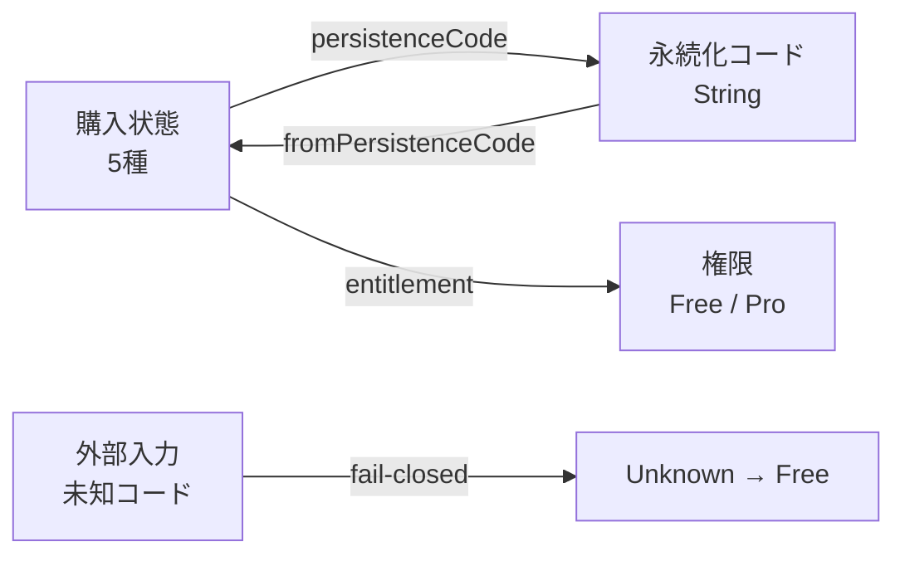
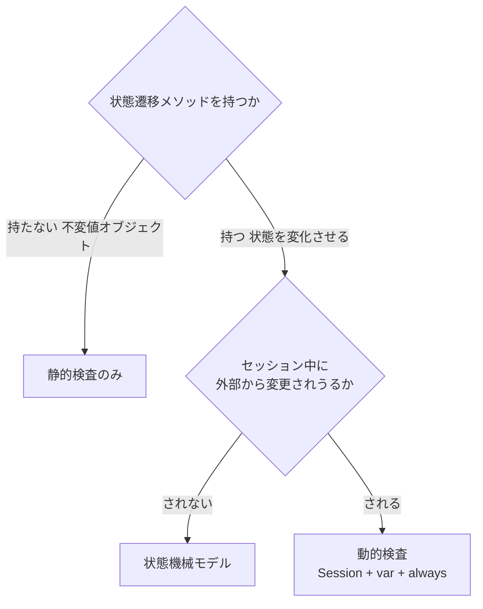

# 値オブジェクトの永続化写像を Alloy で形式化する

## このノートの目的

値オブジェクト（不変・遷移メソッドなし）の永続化写像と権限導出ルールを
Alloy 6 で形式化した際の判断ポイントと学びを記録する。
読者は「動的セッション検査が不要か否か」の判断基準と、
値オブジェクト用 6-check パターンの意図を理解できる。

前提として、[モデル検査を設計段階のハーネスにする](model-checking-design-harness.md) を読んでおくこと。
本ノートはその手法を「純粋な値オブジェクト」に適用したケース固有の判断を扱う。

## 問題: 値オブジェクトの永続化ルールはどこで守られるか

購入状態（`ProPurchaseState`）のようなドメイン値オブジェクトは、
永続化コード（`String`）と状態（`enum`）の間に複数のルールを持つ。



守るべきルール群:
- **単射性**: 異なる状態が同じコードに保存されない（復元時の化け防止）
- **往復則**: 保存 → 復元で元の状態に必ず戻る（権限の誤付与・剥奪防止）
- **権限導出の排他性**: Pro を与えるのは purchased だけ
- **fail-closed**: 未知の永続化コードは Unknown に倒し、権限は Free

これらは用語集の L1/L2 として文書化されているが、
**組み合わせの一貫性は人間のレビューにしか依存していなかった**。
新しい購入状態を追加したときに既存の保証が崩れても、コードを書くまで誰にも見えない。

## 静的モデル vs 動的モデル — なぜ静的で足りるか

Alloy には静的検査と動的検査（`sig … var`, `always`, `eventually`）がある。
どちらを選ぶかは検査対象の性質による。



`ProPurchaseState` は不変の値オブジェクトであり、
購入フローの進行（`Purchasing` → `Purchased` 等の遷移）は
`BillingPurchaseSnapshot` 側の責務である。
`ProPurchaseState` が変化するのは「アプリが次に受け取る値が変わる」ことであり、
それは新しいインスタンスの生成であって状態遷移ではない。

**だから**、セッションモデルは不要で `enum + fun + assert` の純粋静的検査で足りる。
動的検査を使った appearance-theme.als（`Session sig`, `var` フィールド）とは根本的に異なる。

## 6-check パターン：値オブジェクトの永続化写像に使える構造

`pro-purchase-state.als` で採用した 6 検査の構造は、
「永続化コードを持つ値オブジェクト」に一般化できるパターンである。

| # | 検査名 | 守るもの | 破れたら |
|---|--------|---------|---------|
| 1 | `PersistenceCodeIsInjective` | 保存コードの単射性 | 別の状態が同じコードに保存され、復元時に誤った状態へ化ける |
| 2 | `RoundTripRestoresEveryState` | 往復則 | 保存 → 復元で購入状態が失われ、Pro 誤付与または失効 |
| 3 | `OnlyPurchasedGrantsPro` | 権限導出ルール | pending / unknown 状態でも Pro 権限が付与され収益保護が崩れる |
| 4 | `FlagsArePairwiseExclusive` | 状態フラグの排他性 | UI や権限判定で複数フラグが同時に成立し矛盾した表示になる |
| 5 | `UnrecognizedCodeFailsSafeToFree` | fail-closed 設計 | 未知コードや破損データで Pro が誤付与される |
| 6 | `EveryStateIsRestorable` | 全射性 | 永続化はできるが復元では現れない「死に状態」が生まれる |

**チェック6はチェック1の双対**である。
1 = 「保存は区別する」（単射 = 異なる入力が異なる出力に写る）
6 = 「復元はすべてに届く」（全射 = すべての出力に至る入力が存在する）
どちらも欠けると永続化サイクルが壊れる。

## 既知の限界を「反例として文書化する」パターン

`fromPersistenceCode` は単射ではない — `UnknownCode` と `UnrecognizedCode`
（未知/破損コード）はどちらも `Unknown` に写る。これは **L1 fail-closed の
意図された帰結**であり、修正すべきバグではない。

```alloy
// 意図された非単射を反例として文書化する
assert FromPersistenceCodeIsInjective {
  all c1, c2: PersistenceCode |
    fromPersistenceCode[c1] = fromPersistenceCode[c2] implies c1 = c2
}
check FromPersistenceCodeIsInjective expect 1  // 反例を1件期待
```

`expect 1` によって:
- 検査器は反例を 1 件検出することを「期待どおり」と判断する（exit 0）
- 将来の変更でこの多対一写像が消えたときに `expect 1` が失敗し、
  「意図した非単射が失われた」ことをリグレッションとして検知できる

**学び**: 保証できないことを保証できないと明示するのも、仕様の一部である。
`expect N` 注釈は「ゼロ反例 = 正しい」だけでなく
「N 反例 = 意図どおり」を表現できるので、既知の設計上の限界を文書化できる。

## check-domain-model.sh が返す意味

```bash
sh scripts/check-domain-model.sh
# domain-model: checking docs/domain/models/appearance-theme.als
# domain-model: checking docs/domain/models/pro-purchase-state.als
# domain-model: all spec guarantees hold as expected.
```

この "all spec guarantees hold as expected." は:
- 全 `check ... expect N` コマンドで、反例の有無が `expect` と一致した
- `expect 0` → 反例なし（保証が成立）
- `expect 1` → 反例が正確に 1 件（既知の設計上の限界、設計どおり）

**exit 0 が「全員合格」ではなく「全員が期待通り」であることに注意**。
反例を 1 件期待しているコマンドが 0 件または 2 件になると exit 1 になる。

## 一般化できる学び

### 1. 値オブジェクトには静的 Alloy が有効

遷移メソッドを持たない値オブジェクトは、`var` や時相演算子不要で
`enum + fun + assert` だけで書ける。モデルが短く、検査が速い。
適用候補: 永続化コードを持つドメイン値（状態遷移の結果として生まれるが、
それ自体は不変な型）。

### 2. 6-check の汎用性

「永続化コード ↔ 状態」の双方向写像を持つ値オブジェクトには、
1.単射性 2.往復則 3.ドメインルール 4.排他性 5.fail-closed 6.全射性 の
6 検査が定番として使える。永続化層の保証は往復則（2番）だけでは不十分で、
単射（1番）と全射（6番）の両方が要る。

### 3. 設計の限界を `expect N` で封じ込める

`expect 0` だけではなく、意図的な非単射や既知の曖昧さを
`expect 1`（または適切な数）で文書化できる。
将来の変更がその「意図された挙動」を壊したとき自動で検知できる。

### 4. 動的 vs 静的の判断はモデルの前に確定する

セッション中に外部（課金基盤等）が状態を変えるか？
→ Yes: 動的モデル（`var`, `always`, `eventually`）
→ No: 静的モデル

この判断を誤るとモデルが大きくなる（不要な `Session sig` を作るなど）。
不変値オブジェクトには静的検査で十分。

## 関連

- [モデル検査を設計段階のハーネスにする](model-checking-design-harness.md) — 手法の全体像と動的検査の実例（appearance-theme）
- [ハーネスへの投資をどう考えるか](harness-investment.md) — 助言的運用から始める原則
- [ハーネス層の有効性評価とライフサイクル](harness-effectiveness-review.md) — CI 昇格の判断基準
