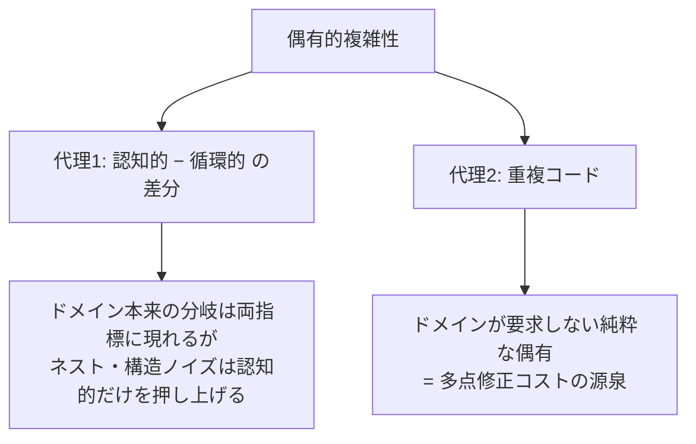
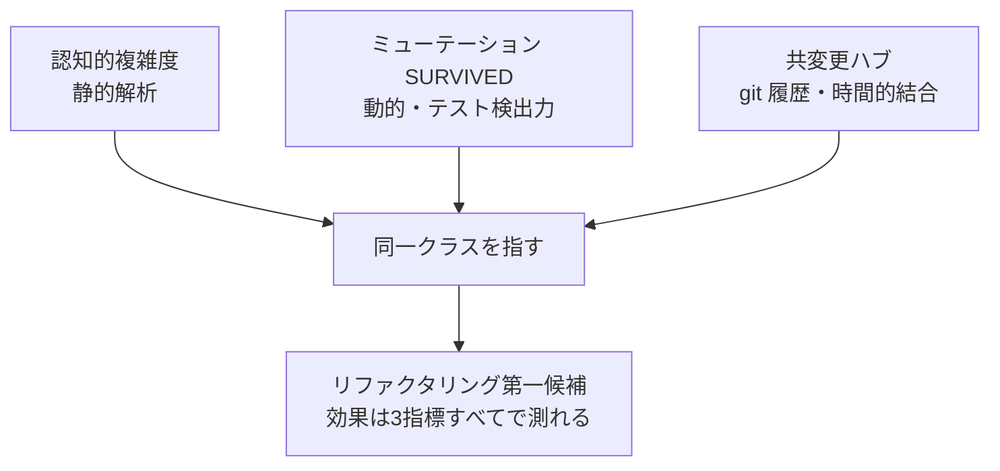

# AI改修コストをコード品質で測る — 偶有的複雑性の代理指標と結合の三角測量

## なぜ「AIの改修コスト」を測るのか

AIエージェントに改修を任せる時代のコード品質は、人間の可読性だけでなく**エージェントが安全に変更を入れるコスト**で測ると優先順位がつけやすい。コストの源泉は4つに分解できる。

| コストの源泉 | 対応する指標 |
|------------|------------|
| 分岐の組合せ（テストすべき経路数） | 循環的複雑度 |
| 構造把握の負荷（読んで正しく直す） | 認知的複雑度 |
| 本質に寄与しない複雑さ（純粋な無駄） | 偶有的複雑性 — **直接は測れない** |
| 変更の爆発半径 | 結合度 |

前2つは既存ツール（PMD 等）で測れる。後2つに工夫がいる。

## 偶有的複雑性は代理指標で近似する

偶有的複雑性（本質でなく解決手段に由来する複雑さ）を直接測るツールは無い。**だから代理を定義し、限界を明記して使う**。

**代理1（認知的 − 循環的）**: 差分が大きいメソッドは、Extract Method 等の**挙動を変えないリファクタで削減できる見込みが高い**——つまり偶有的。実測では、最大ホットスポット（認知的 64・差分 31）が後述の三角測量でも首位に立った。

限界も明記する: 本質的に複雑なアルゴリズムでも差分は出る。代理は「削減候補の順位付け」の道具であり「偶有の証明」ではない。絶対値に意味を持たせない。

## 結合は「強度 × 距離 × 変動性」で重みづけする

結合の数だけ数えても優先順位はつかない。Balanced Coupling の考え方（結合の負荷 = 強度 × 距離 × 変動性）に倣うと、**「強く依存している先がよく変わる」結合**が改修コストの期待値として最も高い。

外部ツールなしで縮約版を測れる:

| 成分 | 測り方（git + awk のみ） |
|------|------------------------|
| 強度 | パッケージ間の import 数 |
| 距離 | パッケージ境界の内外（フラット構造なら2値で十分） |
| 変動性 | 直近90日の git 変更回数（被依存側） |

加えて **共変更ペア**（別パッケージなのに同一コミットで頻繁に一緒に変わるファイル対）を git ログから出すと、**import に現れない隠れた時間的結合**が見える。実測では共変更ペア上位6件中5件に同じ巨大クラスが登場し、「このクラスが時間的結合のハブ」という体感が初めて数値になった。分割施策の効果も「共変更ペア数の減少」で検証できるようになる。

レイヤードアーキテクチャでは不安定度 I の分布も読み方に注意がいる: ドメイン層の I≈0 と UI 層の I≈1 は**健全**であり、実害シグナルは「自分より不安定な相手への依存」（安定依存の原則違反）の方にある。

## 三角測量 — 独立シグナルの交点が最優先

単独の指標は誤検出を含む。**測定方法が独立な複数のシグナルが同じ場所を指したとき、その優先順位は信頼できる**。

実測では、最大の認知的複雑度（64）・最多の SURVIVED（53）・共変更の最頻出が同一クラスに収束した。さらに重複検出が挙げた二重実装は、直前の修正作業で「同型変更を2か所に行った」実体験とも一致した。**メトリクスが既存の痛みを言語化したとき、改善投資の説得力が生まれる**。

逆に、SURVIVED は多いが認知的複雑度が低いクラスは「複雑さ」ではなく「観測可能性」の問題であり、リファクタ対象ではない（[ミューテーションテストのノート](mutation-testing.md)の「SURVIVED ランキングの2つの読み方」を参照）。三角測量は**外れ値の原因切り分け**にも効く。

## 運用 — advisory から始めて ratchet で昇格する

計測ハーネスをいきなりゲートにしない。

1. **advisory で導入**: レポートのみ・常に exit 0。ベースラインと改善優先順位を記録する。
2. **リファクタの前後で測る**: 対象メソッドの認知的複雑度・差分・共変更ペア数の変化をPRに記録する。
3. **傾向データが2〜3サイクル溜まったらゲート化を判断**: RED 件数の床（ratchet）として `--strict` を有効化する。

発火実績のないゲートを大量設置すると、維持費と偽陽性が「誰も見ない赤」を生む。ミューテーションテストの floor 運用（下げて緑にしない・上げるのみ）と同じ規律で育てる。

関連: [ミューテーションテストで学んだこと](mutation-testing.md) / [ハーネスへの投資をどう考えるか](harness-investment.md) / [ハーネス層の有効性評価とライフサイクル](harness-effectiveness-review.md)
