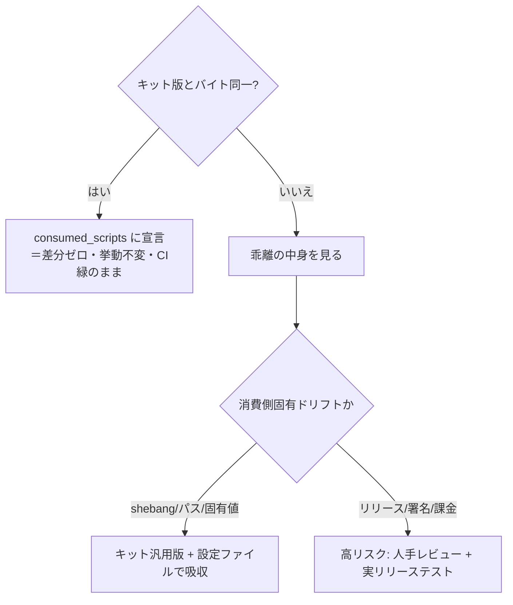

# 本番リポでハーネスを消費する — 安全な移行はバイト同一性から始める

## このノートの目的

抽出したハーネスキットを、**動いている本番リポジトリ**へ採用していくときの進め方を記録する。
新規プロジェクトと違い、本番リポには「壊してはいけない動線」（リリース・署名・課金）があり、
キットの汎用版で**盲目的に上書きすると本番を壊す**。読者が持ち帰るべきは、**バイト同一性の確認を
起点に、リスク階層で段階移行する**という安全な順序である。

## TL;DR

- 本番リポへのハーネス採用は、**まず差分(diff)を取る**。キット版と消費側版が**バイト同一**なら、
  採用は「宣言するだけ」＝挙動ゼロ変化・CI ゲート済みの安全な一歩。ここから始める。
- 乖離しているスクリプトは、乖離の**中身**を見る。多くは「消費側固有のドリフト」（実行環境固有の
  shebang・相対パス・ハードコードされた固有値）で、キットの汎用版＋設定ファイルが吸収できる。
- だが **release/署名/課金のスクリプトは別格**。これらは盲目的に上書きしてはならない。
  実リリーステスト＋人手レビューを伴う。**リスク階層**（低リスク＝非リリース / 高リスク＝リリース系）で分ける。
- 移行 PR は本番 CI を**必ず**ゲートにする。CI が緑でも、自動レビュー（Codex 等）の指摘は
  ハーネス自身の穴を突くことがある——**設定値の変更が重いゲートを再実行させるか**、
  **同期がピン留めしたタグから引くか**、は実際にこの経路で発見された。

## なぜ「バイト同一性」から始めるのか

ハーネスを抽出した直後、消費側にはキットと**実質同じスクリプトが既に置いてある**ことが多い
（キットがそのリポから抽出されたなら当然）。このとき重要なのは、それらが
**consumed_scripts として宣言されているか**である。宣言されていないと、キットが更新されても
その更新は消費側へ同期されない（追跡対象外）。

実例: ある本番 Android リポで、キットの `core/scripts/` 5本（PRタイトル検証・シークレット検査・
バージョン系）と消費側の同名スクリプトを diff したところ**全てバイト同一**だった。＝既に消費可能形を
実質採用済みで、宣言が漏れていただけ。宣言は**スクリプト本体を1バイトも変えない**ので、本番 CI は
緑のまま、以後キット更新がこの5本へ同期されるようになる。**これが最も安全な P2 の前半**である。

## 乖離スクリプトをリスク階層で分ける

残りのアダプタスクリプトは乖離していた。乖離の正体は2種類に分かれる。

- **消費側固有ドリフト（汎用化で吸収できる）**: 実行環境固有の shebang（例: Termux の
  `#!/data/data/com.termux/.../sh`）、相対 ROOT、ハードコードされたアプリ名やパッケージ ID。
  キットの汎用版は `git rev-parse` でルートを解決し、これらを設定変数（`APP_NAME` 等）に外出ししている。
  → キット版へ差し替え、設定ファイルに値を入れる。**ただし shebang を `#!/bin/sh` にすると直接実行
  （`./script`）が壊れる環境がある**（Termux 等）。`sh script` 経由で呼ぶなら無害。要確認。
- **高リスク（盲目的上書き禁止）**: `build-release-*`・`build-signed-release`・
  `create-release-keystore`・課金・ストア配信。これらは壊れると**本番リリースが出せなくなる**。
  CI だけでは守れない（実リリースで初めて分かる失敗がある）。**人手レビュー＋実リリーステスト**を必須とし、
  低リスク群とは別 PR で扱う。

## CI が緑でも自動レビューはハーネスの穴を突く

移行 PR は本番 CI をゲートにする。だが**CI 全緑＝完璧ではない**。自動コードレビュー（Codex 等）が、
ハーネス自身の設計の穴を指摘することがある。実際にこの経路で見つかった2件:

- **設定値の変更が重いゲートを再実行しない穴**: ミューテーションの floor や除外を設定ファイルへ外出し
  した結果、その設定だけを変える PR では（パスフィルタにかからず）ミューテーション解析が走らない。
  ＝**floor を緩めても無検証で通る**。→ 設定ファイルを変更検知パターンに加える。
- **同期がピン留めタグでなく HEAD から引く穴**: 更新同期ワークフローが、消費するバージョン（タグ）を
  記録しつつ、ファイルは**リモートの最新 HEAD** からコピーしていた。タグ以降のコミットが混ざる。
  → 同期先のタグを明示 checkout する。

教訓: **「なぜ問題か→だから何をするか」をレビューが教えてくれる**。指摘を dismiss せず、
ハーネスの改善として取り込む（[[harness-self-correction]] と同じ、証拠駆動の自己修正）。

## 持ち帰り（チェックリスト）

- 本番リポへの採用は、まず **diff でバイト同一なものを宣言**して安全に一歩進める。
- 乖離は**中身を見てリスク階層に分ける**。固有ドリフトは設定で吸収、リリース/署名系は人手レビューへ。
- shebang を汎用化するときは、その環境の**直接実行**が壊れないかを確認する。
- 移行 PR は本番 CI でゲートし、**自動レビューの指摘をハーネスの穴として取り込む**。
