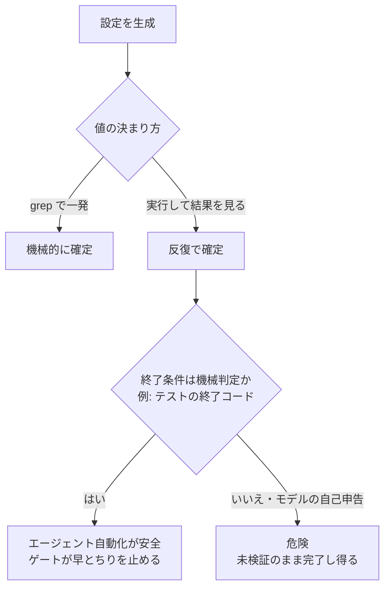
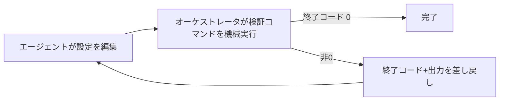
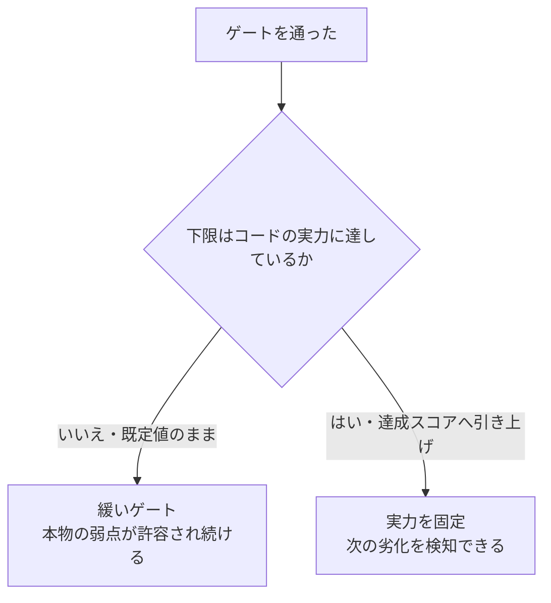

# 決定的ゲートで囲うエージェント収束ループ — 「統率」と「判断」の境界

## このノートの目的

設定ファイルの収束のような**反復作業をAIエージェントに任せたい**とき、どこまで自動化してよいか。
このノートは、ハーネスキットの設定（`harness.config.sh`）をエージェントに収束させる試みを、
オーケストレーション専用ツール（[TAKT](https://github.com/nrslib/takt)）で実走した記録から、
**「何を機械が強制し、何をエージェントが判断するか」の境界**を抽出する。読者が持ち帰るべきは、
個別のツール手順ではなく、**終了条件を機械判定にできるループだけが安全に自動化できる**という原則と、
**「動いた」と「堅牢」は別**という戒めである。

## TL;DR

- エージェントに反復作業をさせるとき、**終了条件を機械判定ゲート（コマンドの終了コード）にできるなら自動化は安全**。
  モデルの「できました」という自己申告で止めると、検証されないまま早とちりで完了してしまう。
- オーケストレータが担うのは**ループの統率とゲートの強制**だけ。エージェント（persona）が担うのは
  **不可分な判断**——この失敗はどの設定を直せという意味か、この未カバーは除外してよい低価値か。この境界を混ぜない。
- **「ゲートを通った」と「品質が高い」は別物**。エージェントは*ゲートを通る最小*を狙う。実走では、
  floor（下限スコア）を既定値のまま放置し、コードの実力(約92%)より緩い79%で通してしまった。
  品質の**上限を固定する指示**（達成スコアまで floor を引き上げよ）を persona に明示しないと締まらない。
- ツールは**実際に走らせて初めて分かる欠陥**がある（今回はワークフローのファイル名解決規約）。設計検証だけでは出ない。

## 問題設定 — 収束作業のどこを機械化するか

ある設定値は、コードを `grep` すれば一発で決まる（機械的）。別の値は、**一度実行して結果を見ないと決まらない**
（反復的）。後者をAIエージェントに任せたいが、放任すると「たぶん大丈夫」で止まる危険がある。
鍵は、反復の**終了条件が機械で判定できるか**である。

## なぜ機械判定ゲートが鍵か

エージェントは、与えられた目標に対して**最短で「完了」と言いたがる**。終了判定をエージェント自身の
テキスト判断（「テストは通るはずです」）に委ねると、実際には通っていない状態で完了し得る。
これを防ぐのが**コマンド品質ゲート**だ。オーケストレータが収束作業の各ターン後に検証コマンドを
**自分で実行**し、終了コード0のときだけ成功とみなす。失敗すれば、終了コードと出力を**同じステップへ
差し戻し**、エージェントに次の修正をさせる。

差し戻される出力が**決定的なシグナル**であることが効く。今回の検証コマンド（ミューテーションテスト）は、
コンパイルエラーの種別や、テスト不足の分類（後述）を機械的に吐く。エージェントは推測でなく、
**差し戻された事実**を読んで一手を打てる。

## 統率と判断の境界

ここが本題。**オーケストレータは判断を持ち込まない**。判断はエージェント（persona）が供給する。
両者は二者択一ではなく**合成**であり、役割を取り違えると破綻する。

| 担い手 | 担うこと | 例 |
|--------|---------|-----|
| オーケストレータ（統率） | ループを回す・ゲートを機械強制する・失敗を差し戻す | 検証コマンドを実行し終了コードで継続/完了を決める |
| エージェント＝persona（判断） | 失敗の意味を解釈し、正しい一手を選ぶ | 「未解決シンボル」→不足ソースを設定に追加 |
| エージェント＝persona（判断） | 似て非なるものを区別する | テスト不足の2分類（弱いアサーション vs 未カバー）を見分ける |

判断の中身を具体化する。検証コマンドが返すテスト不足は2種類あり、**対処が逆**になる:

- **アサーションが弱い（テストはあるが壊れても気づかない）** … 値を確かめる**テストを追加**して塞ぐ。除外してはいけない。
- **未カバー（そもそも例となるテストが無い）** … それが**低価値な対象**（文字列カタログ等）なら**除外**してよい。
  本物のロジックなら**テストを追加**する。

この「テスト追加か、除外か」の見極めは機械化できない**不可分な判断**で、まさにエージェントの仕事である。
オーケストレータはこの判断を代替しない——ループとゲートを保証するだけだ。

## 実走で出た2つの学び — 「動いた」と「堅牢」は別

設計上「動くはず」と「実際に動かして堅牢」の差は、走らせて初めて見える。

1. **ファイル名解決の規約**（設計検証では出ない欠陥）: オーケストレータはワークフローを
   `<名前>.yaml` で解決していた。`<名前>.workflow.yaml` という凝った命名は解決されず、実行で初めて発覚した。
   **なぜ重要か**: スキーマ上は妥当でも、ツールの実装規約に反すると動かない。**だから**設計検証で満足せず実走する。
2. **エージェントは「ゲートを通る最小」を狙う**（品質の上限は別途固定が要る）: エージェントは下限スコアを
   既定値のまま通し、コードの実力（約92%）より緩い79%で「完了」とした。結果、**本来テストで潰せる弱点が
   1件、許容されたまま**残った。**なぜ起きるか**: 目標が「ゲートを通す」なので、通った瞬間に手を止める。
   **だからどうするか**: persona に「緑になったら下限を**達成スコアまで引き上げよ**（下げるな、だけでは不十分）」と
   明示し、品質の上限を固定する。

## 持ち帰り（チェックリスト）

- 反復作業をエージェントに任せる前に、**終了条件を機械判定（終了コード）にできるか**を問う。できないなら自動化しない。
- オーケストレータには**統率とゲート強制だけ**を期待する。**判断は persona に明文化**する。判断を混ぜると破綻する。
- ゲートは「通す」だけでなく**品質の上限を固定**するよう設計する（下限を達成値まで引き上げる指示を入れる）。
- **必ず実走する**。設計検証では出ない実装規約の欠陥や、エージェントの「最小で止まる」癖は、走らせて初めて見える。
