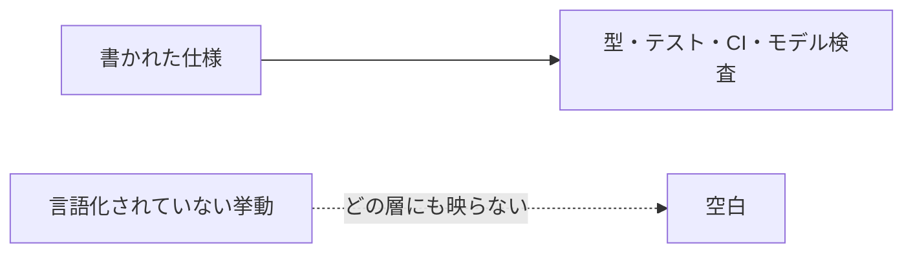
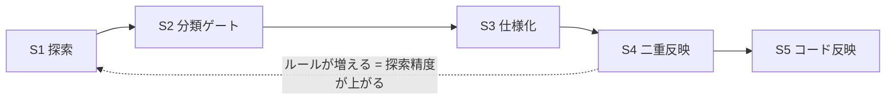
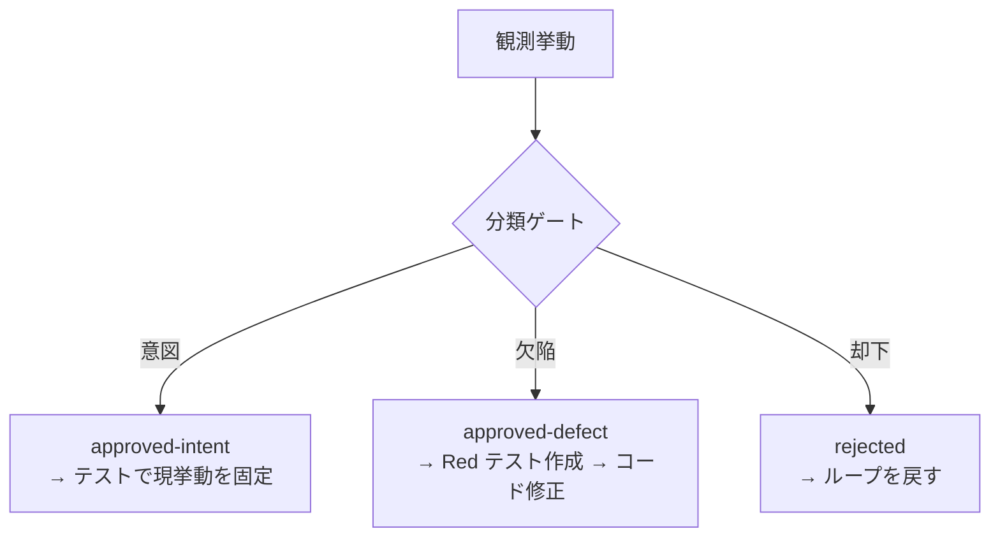
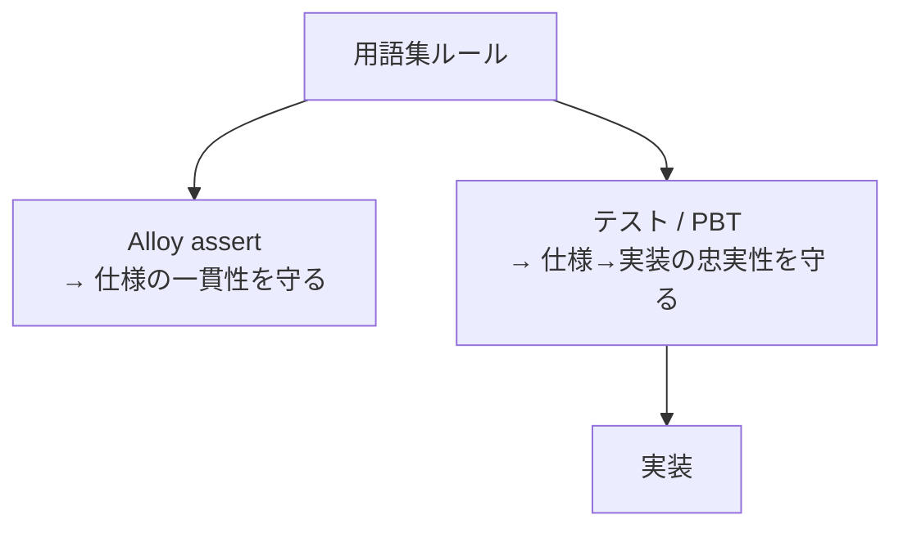

# ドメイン知識深化ループ — 暗黙知を検査可能な仕様に変える

## このノートの目的

「まだ言語化されていない挙動」を発見し、承認を経て検査可能な仕様に昇格させるループの
設計判断を記録する。読者はここを見れば「なぜこのループが必要か」「5段階はなぜその順か」
「二重反映とは何か」「分類ゲートはなぜ移譲不可か」を把握できる。

関連ノート: [モデル検査を設計段階のハーネスにする](model-checking-design-harness.md)
（ループが使う「設計層検査」の詳細はそちらで説明）

## 問題: 既存ハーネスは「書かれた仕様」しか検査できない

[ハーネスエンジニアリングで学んだこと](harness-engineering.md) で積み上げた多層ハーネスは、
すべて「書かれた仕様からコードを検査する」向きに強い。しかし挙動は「書かれていない」まま
コードの中に存在することがある。

実例: テーマのクランプ「窓」（Free 化後も Pro テーマが表示され続ける窓）。
用語集は「読み込み境界で絞る」とだけ書いていた。セッション中の失効反映が未定義で、
人手レビューにも既存テストにも映らなかった。モデル検査が初めて反例として提示した。

この「窓」を事後発見したとき、問題が明確になった。**発見はできる——しかし発見の仕組みがない**。

## 中心の考え方: 発見→承認→形式知化のループ

**なぜループか**: 探索して終わりでは、発見したルールが検査網に加わらない。
ルールが増えるほど探索で新たなルールが見つかる正帰還を作るには、
「発見→仕様化→二重反映（Alloy assert＋テスト）」を1サイクルとして回す必要がある。

**だから**: 5段階を1ループとして定義し、段飛ばしを禁止する。
特に「分類ゲート（S2）を飛ばして仕様化（S3）に進む」を禁止する（理由は後述）。

## 5段階とその理由

### S1 探索（Explore）

挙動はコードの中にある。引き出す探索エンジンとして **ステートフル PBT**（jqwik action-based）を
第一候補とする。

**なぜステートフル PBT か**:
- 操作の組合せ空間を機械的に網羅できる（人間の勘では「その操作列」が思い浮かばない）
- domain 層は Android 非依存の純粋層で JVM 単体実行可能（fast / 決定的）
- large 層（エミュレータ）は flaky 前提・必須チェック禁止 —— 常設できない

エミュレータ探索は「描画が絡む発見」のみに限定し、smoke ladder が成熟してから導入する。

**対象クラスタ（状態・順序が絡む場所）**:

| クラスタ | 複雑性の源泉 |
|---------|------------|
| purchase（状態×復元） | 外部課金基盤 × 永続化往復 × 権限導出 |
| タブ・Recent・Pin（順序×永続化） | 操作順による順序変化・保存・復元 |
| テーマ（権限×巡回） | Free/Pro 権限 × テーマ選択肢の巡回 |

**なぜステートレスな純関数を対象外にするか**:
単発入出力の性質は既存の unit/PBT で十分カバーできる。費用対効果が成立しない領域を
広げるとハーネスの維持コストが利得を超える（[ハーネスへの投資をどう考えるか](harness-investment.md)）。

### S2 分類ゲート（Classify）— なぜ移譲不可か

観測した挙動を「意図 / 欠陥」に分類し、承認を得る。

**なぜゲートが必要か**: 観測挙動をそのまま正典化すると characterization test の罠に落ちる。
バグが仕様になる。

**なぜ移譲不可か**: AI は設計意図を知り得ない（意図はコードに書かれていない）。
「窓がある」という挙動が「許容すべき意図」か「直すべき欠陥」かは、設計者だけが判断できる。

AI の役割は「観測の記録」「既存仕様との突合による矛盾検出」「proposed-rule の起票」
「判断材料の提示（intent / defect 両論の帰結）」に限る。

### S3 仕様化（Specify）

承認済みルールを用語集に L1/L2/L3 ルールとして追記する。ルール ID を付与し、
ミニ言語（invariant・policy 等）で形式記述する。

**なぜ S3 で用語集に書くか**: 検査の源流は用語集（仕様）であり、実装ではない
（[モデル検査を設計段階のハーネスにする](model-checking-design-harness.md) の中心命題と同じ）。
ルールが用語集に入ることで、S4 の両検査の源流として機能し、仕様の変化が差分として残る。

### S4 二重反映（Reflect×2）— なぜ2本か

1ルール＝2反映（設計層 Alloy assert ＋ 実装層テスト）を原則とする。

**なぜ2本か**:

- Alloy だけでは model-code gap が広がる（.als が緑でも実装が乖離しても検知できない）
- テストだけでは設計レベルの無矛盾性が検査されない
- 2本を並べることで「仕様に矛盾がないか」と「仕様が実装に入っているか」を両方ゲートできる

### S5 コード反映（Implement）

approved-defect の場合のみコード修正。approved-intent は「コード変更なし、テストが現挙動を固定」。

## 適用の起点: purchase クラスタ

**なぜ purchase が最初か**:
1. 既設の Alloy モデル（7 assert）が設計層の起点として存在する
2. 既存テスト 13 件が実装層の起点として存在する
3. 状態×復元×外部変換の合成があり探索価値が高い
4. 収益・安全に直結（購入済みのみが Pro を付与する）

**常設化の判断は実績データで行う**:
1 巡目終了後に「コスト・発見率・承認結果の内訳」を計測し、助言的運用から必須ゲートへの
昇格を判断する。実績なしに常設化しない
（[ハーネス層の有効性評価とライフサイクル](harness-effectiveness-review.md) の原則と同じ）。

## 限界と歯止め

- **分類の過負荷**: proposed-rule が溜まるとループ全体が止まる。滞留数と期間の可視化が要る
- **探索コスト**: ステートフル PBT は構成に知識が要る。最初のシナリオ設計に時間がかかる
- **ループの維持**: ルールが増えるほど探索で見つかるものが増え、承認の負荷が上がる。
  定期的に「この発見率でコストに見合うか」を再評価する

## 関連

- [モデル検査を設計段階のハーネスにする](model-checking-design-harness.md) — S4 設計層検査の詳細
- [値オブジェクトの永続化写像を Alloy で形式化する](alloy-model-value-object.md) — S4 の適用例
- [ハーネス層の有効性評価とライフサイクル](harness-effectiveness-review.md) — 常設化判断の原則
- [ハーネスへの投資をどう考えるか](harness-investment.md) — 対象外判断の根拠
- [性質ベーステスト (PBT) で学んだこと](property-based-testing.md) — S1 探索エンジン
