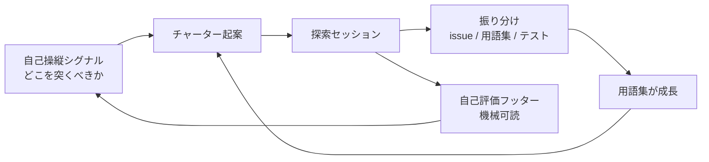
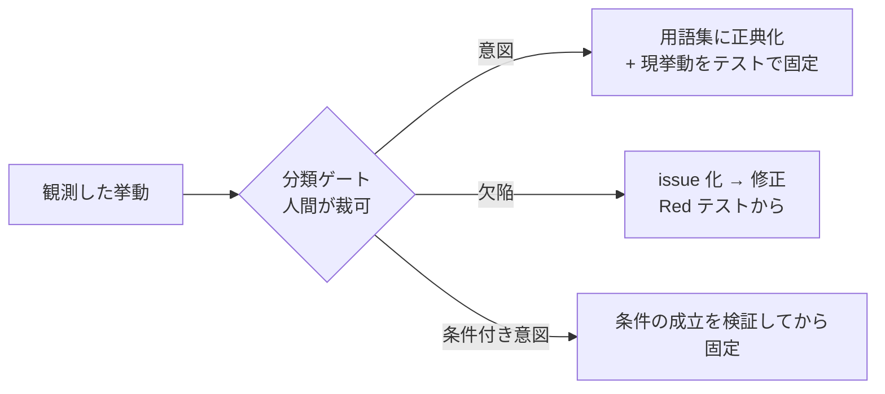

# 探索テストを継続ループにする — AIエージェントのドメイン知識獲得

## なぜ単発の探索では足りないか

スクリプト化された assert は「既知の期待」しか守れない。探索テスト（チャーターを立てて仕様の沈黙領域を突く活動）はその外側を見つける手段だが、**単発でやると3つの依存が残る**: いつやるか（人の思いつき）、どこを突くか（人の土地勘）、続ける価値があるか（誰も測らない）。

運用ルールだけ整備しても、実施が2回で止まった。仕組みにしないと回らない。

## 継続ループの3要素



### 1. トリガー（いつ）

| トリガー | なぜそのタイミングか |
|---------|-------------------|
| 機能PRの完了後、触れた領域に対して | 変更直後は仕様の沈黙領域が増える。欠陥はクラスタする |
| シグナル検出時（下記） | 「変更が集中しているのに未探索」は発見期待値が最も高い |
| 大きな機能追加の設計前 | 沈黙領域を着工前に洗うと手戻りが減る |

### 2. 自己操縦シグナル（どこを）

セッションログの機械可読フッターと git 履歴から、スクリプト1本で集計する:

- 領域別のセッション回数・最終探索日・累積発見数
- 直近の変更ホットスポット（git log の集計）
- **交差シグナル**: 「変更ホットスポット × 未探索」が最優先チャーター候補

実測では、このシグナルが指した領域（変更最多・未探索）がオーナーの体感（「この機能はよく壊れる」）と一致した。**機械シグナルと人の体感が一致する瞬間が、ループへの信頼をつくる**。

### 3. 自己評価フッター（続ける価値があるか）

各セッションログの末尾に機械可読の実績を残す:

```markdown
- probes: 12        # 突いた数
- findings: 5       # 「規則と異なる」+「規則が沈黙」の数
- triage-issue: 0   # issue 化した数
- triage-glossary: 4
- triage-assert: 0
```

数値は本文の probe 表から導出できるものだけを書く（憶測禁止）。この蓄積がそのままループ自体の ROI 評価の入力になり、「2回連続発見ゼロなら次の領域へ」「3セッション連続で知識還元ゼロならループ縮小を提案」という撤去基準も機械的に判定できる。

## 自動抽出より分類ゲートを選ぶ

観測した挙動をそのまま仕様として固定すると、**バグが仕様になる**（characterization test の罠）。だから発見と正典化の間に人間の分類ゲートを置く:



使用パターンから知見を自動抽出してスキル化する流派（エージェントハーネス製品に多い）に対し、このゲートが安全性の決定的な差になる。速度を落とす代わりに「観測の正典化」を全件人間が裁く。実測では、1回の裁可で「意図2件・欠陥1件」に分かれ、欠陥側は issue→修正PRまで到達した——**自動抽出なら3件とも「仕様」になっていた**。

「条件付き意図」が特に重要で、「現状は問題ないが、この性質が保たれる限りにおいて」という裁可は、その条件自体を検証してテストで固定する作業を生む。

## 計測実績（1プロジェクト・4セッション）

| 指標 | 値 |
|------|-----|
| probe 数 | 56 |
| 発見（規則と異なる/沈黙） | 20 |
| 用語集への還元 | 14 項目 |
| 裁可に挙げた提案 | 4 件（3裁可済み・1待ち） |
| issue → 修正PRまで到達 | 1 件 |
| 1セッションのコスト | 20〜25分（純JVM probe） |

副次効果として、**用語集はエージェントが毎セッション読み込むコンテキストなので、還元した知識は次の全作業の精度に複利で効く**。assert だけ足して文書化しないと「なぜその assert があるのか」が次の作業者に伝わらない。

## 運用上の教訓

- **probe の前に対象領域の文書を全部読む**。文書化済みの規則を「沈黙」と誤判定すると、発見数が水増しされて評価が壊れる（実際に1回やった。誤判定の訂正も記録に残す）。
- 探索はマージゲートにしない。再現性のない活動をゲートにすると CI が flaky になる。ゲート化するのは探索が見つけた事後条件の assert の方。
- 発見ゼロも成果として記録する。「この範囲は規則どおりだった」は安全性の肯定的証拠であり、停止基準の入力になる。

関連: [ドメイン知識深化ループ — 暗黙知を検査可能な仕様に変える](domain-knowledge-loop.md)（本ループはその探索段の常設運転にあたる） / [ハーネス層の有効性評価とライフサイクル](harness-effectiveness-review.md)
