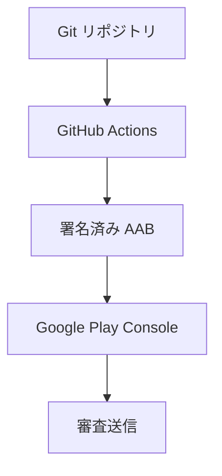
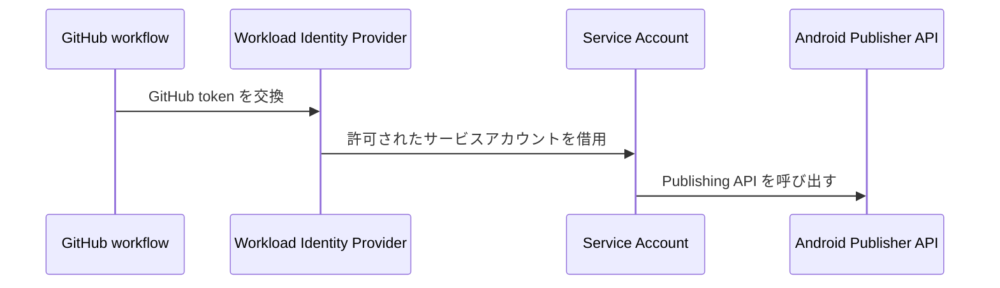
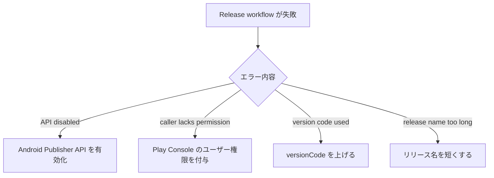

# Google Play CI/CD で学んだこと

## 原則

リリース経路は、開発者の端末や手作業に強く依存しない形にする。

## 認証

サービスアカウントキーを保存するより、GitHub OIDC と Google Cloud Workload Identity Federation を優先する。

サービスアカウントには、2 種類の権限が必要になる。

- Google Cloud IAM 側の Workload Identity 権限。
- Play Console 側の対象アプリに対する操作権限。

## よくある失敗

## 運用ルール

Google Play のリリース名は短くする。

よい例:

- `LocalMD 1a2b3c4`
- `v0.1.0-14`

フルのコミット SHA を入れると、Play Console の長さ制限に引っかかる。

