# Google Play CI/CD で学んだこと

## 原則

リリース経路は、開発者の端末や手作業に強く依存しない形にする。

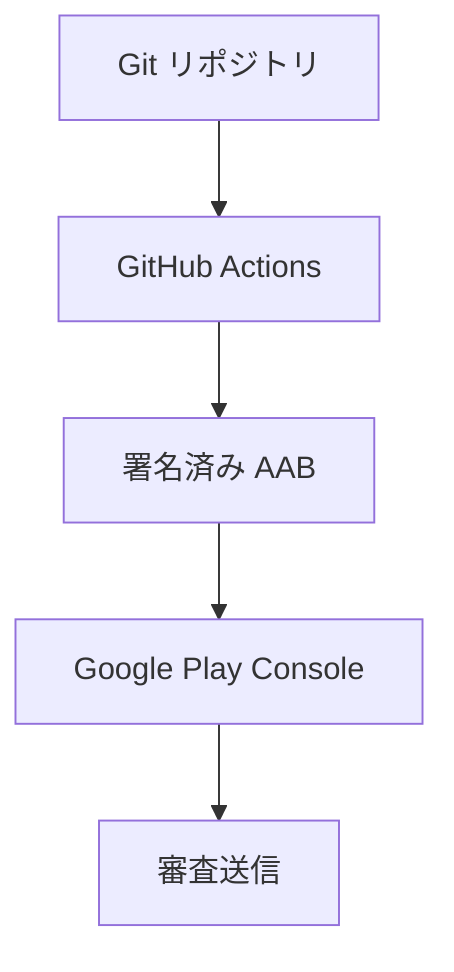

## 認証

サービスアカウントキーを保存するより、GitHub OIDC と Google Cloud Workload Identity Federation を優先する。

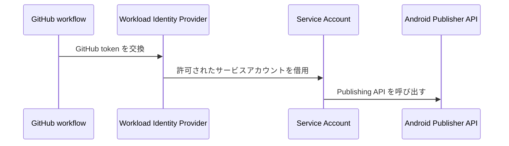

サービスアカウントには、2 種類の権限が必要になる。

- Google Cloud IAM 側の Workload Identity 権限。
- Play Console 側の対象アプリに対する操作権限。

## 全体構成

GitHub Actions から Google Play にアップロードする場合、構成要素は大きく 4 つに分かれる。

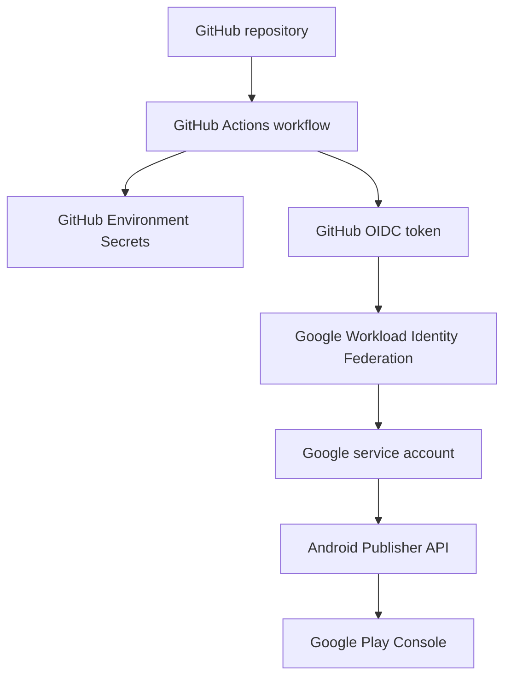

それぞれの責務は次のように分ける。

| 要素 | 責務 |
| --- | --- |
| GitHub Actions | テスト、ビルド、署名、AAB アップロードを実行する |
| GitHub Environment Secrets | 署名鍵と署名パスワードを安全に渡す |
| Workload Identity Federation | GitHub workflow に短期の Google 認証を与える |
| Play Console | 対象アプリへのアップロード権限と審査フローを管理する |

## 構築手順

手順は、先に「ビルドだけ通る状態」を作り、その後に「Play Console へアップロードできる状態」に広げると切り分けしやすい。

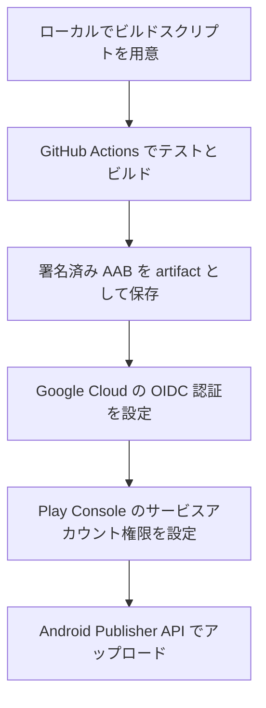

### 1. ローカルでビルドをスクリプト化する

CI に載せる前に、ローカルで次の処理をコマンド化する。

- テストを実行する。
- debug APK を作る。
- release AAB を作る。
- release AAB に署名する。
- `versionName` と `versionCode` の整合性を確認する。

CI はローカル手順の置き換えではなく、ローカルで再現できる手順の自動実行にする。

### 2. GitHub Actions に CI workflow を置く

pull request と `main` push で、最低限次を実行する。

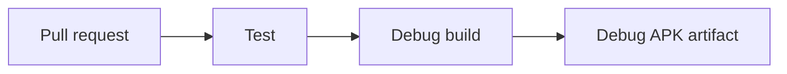

CI の目的は、リリース以前に壊れた変更を止めること。
リリース署名鍵は不要なので、通常の CI には release 用 secret を渡さない。

### 3. GitHub Actions にリリース workflow を置く

リリース workflow は手動実行にする。

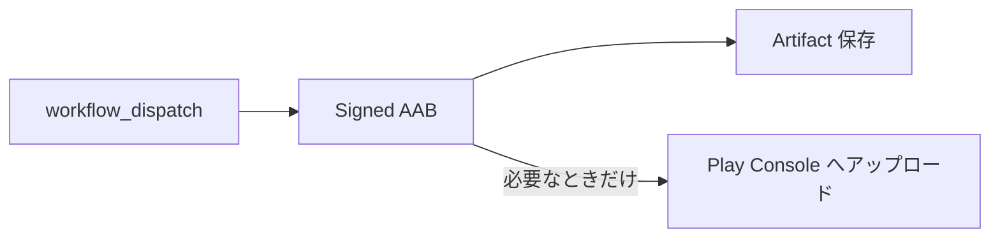

手動入力として、次を持たせると運用しやすい。

| 入力 | 意味 |
| --- | --- |
| `channel` | free 版、pro preview などのビルド種別 |
| `track` | `alpha`、`beta`、`production` などの Play track |
| `status` | `draft`、`completed` などの release status |
| `upload_to_play` | Play Console へアップロードするか |

`upload_to_play=false` でも署名済み AAB を artifact として保存できるようにすると、CI/CD の問題と Play Console の問題を分けて確認できる。

### 4. GitHub Environment を分ける

GitHub Actions の environment は、用途ごとに分ける。

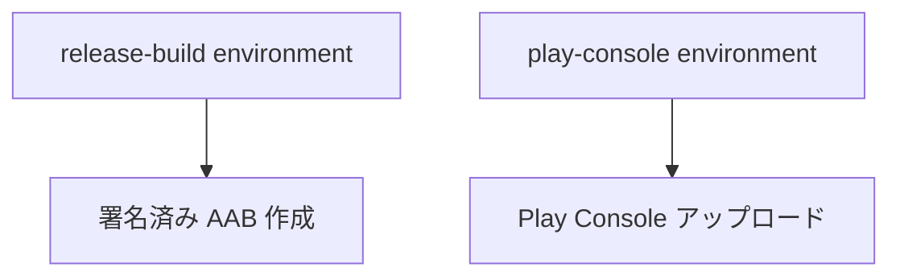

例:

| Environment | 用途 |
| --- | --- |
| `release-build` | 署名済み AAB を作るだけ |
| `play-console` | 署名済み AAB を作り、Play Console にアップロードする |

署名に必要な secret は両方に置く。
Play Console アップロードに必要な OIDC 設定は `play-console` にだけ置く。

### 5. 署名鍵を GitHub Secrets に登録する

公開リポジトリに署名鍵を置かない。署名鍵は base64 化して GitHub Environment Secret に登録する。

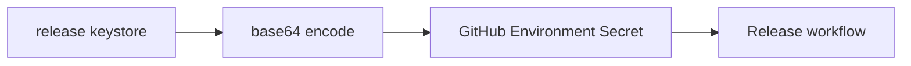

登録する値の例:

| Secret | 意味 |
| --- | --- |
| `RELEASE_KEYSTORE_BASE64` | release keystore を base64 化した値 |
| `RELEASE_KEY_ALIAS` | 署名鍵の alias |
| `RELEASE_STORE_PASS` | keystore password |
| `RELEASE_KEY_PASS` | key password |

secret 名はプロジェクトごとに接頭辞を付けると衝突しにくい。

### 6. Google Cloud で Workload Identity Federation を設定する

サービスアカウントキーを発行せず、GitHub Actions の OIDC token を Google Cloud の短期認証に交換する。

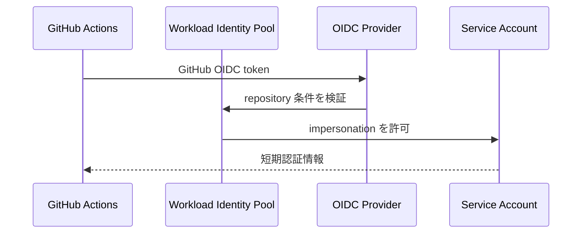

重要な設定:

| 設定 | 例 |
| --- | --- |
| Issuer URL | `https://token.actions.githubusercontent.com` |
| Subject mapping | `google.subject=assertion.sub` |
| Repository mapping | `attribute.repository=assertion.repository` |
| 条件 | 特定リポジトリだけ許可する |

OIDC の許可条件は、少なくとも対象リポジトリに絞る。
可能なら branch や environment でも絞る。

### 7. Play Console でサービスアカウントを招待する

Google Cloud IAM だけでは Play Console を操作できない。
Play Console の `ユーザーと権限` で、サービスアカウントを対象アプリに招待する必要がある。

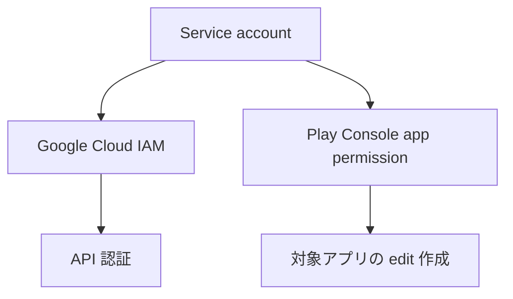

必要な権限は運用方針によって変わるが、少なくとも対象アプリのテストトラックに AAB をアップロードし、リリースを編集できる権限が必要になる。

### 8. Android Publisher API を有効化する

Google Cloud プロジェクトで `Android Publisher API` を有効化する。

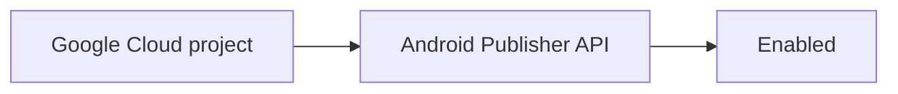

API が無効な場合、GitHub Actions 側の認証が成功していてもアップロードは失敗する。

## workflow の構成

リリース workflow は、次の順に並べると失敗箇所を切り分けやすい。

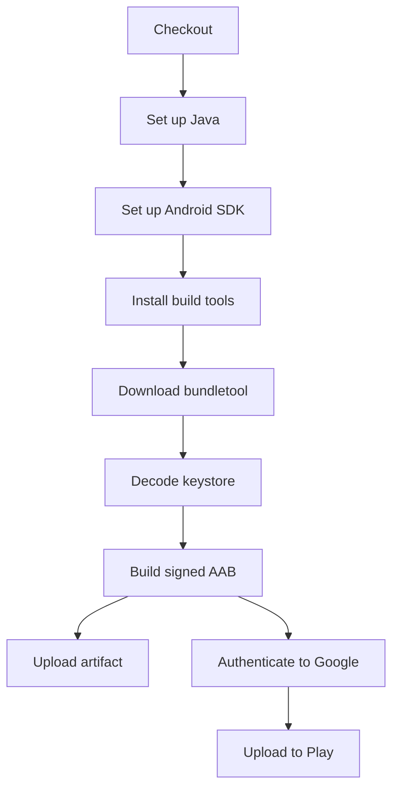

アップロードしない実行でも artifact を残す。
これにより、署名済み AAB の生成と Play Console API の問題を分けられる。

## テストピラミッドと CI/CD

CI/CD の目的は「全部を毎回重く確認すること」ではない。
テストピラミッドに合わせて、速い確認を下層に、実機に近い確認を上層に置く。

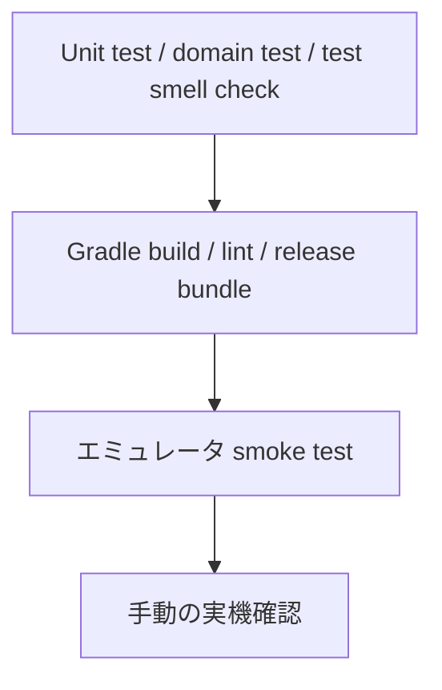

ローカルでは、速く失敗するものを確認する。

| 場所 | 確認すること | 理由 |
| --- | --- | --- |
| ローカル | unit test | 変更直後に壊れたことを知る |
| ローカル | test smell check | テスト自体の劣化を早く止める |
| ローカル | debug build | コンパイル破壊を早く見つける |
| CI | Gradle unit test | Gradle 経路でもテストできることを保証する |
| CI | Android lint | Android 固有の API 誤用を検出する |
| CI | debug APK / release AAB build | 配布物を作れることを確認する |
| 手動 CI | emulator smoke test | 実機に近い起動確認を重すぎない範囲で行う |

Termux のようなローカル環境では、Android SDK や Gradle の license 状態に左右される。
そのため、ローカルは速い手書きスクリプトを残し、CI では Gradle 経路も検証する二段構えにするとよい。

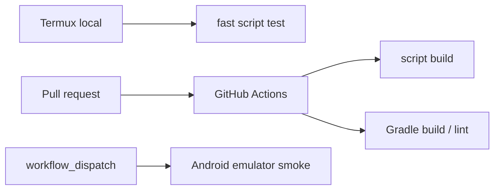

## Gradle 移行は段階的に行う

手書きビルドから Gradle へ移る場合、いきなりリリース経路を置き換えない。
まず CI 上で Gradle build を並走させ、成果物を作れることを確認する。

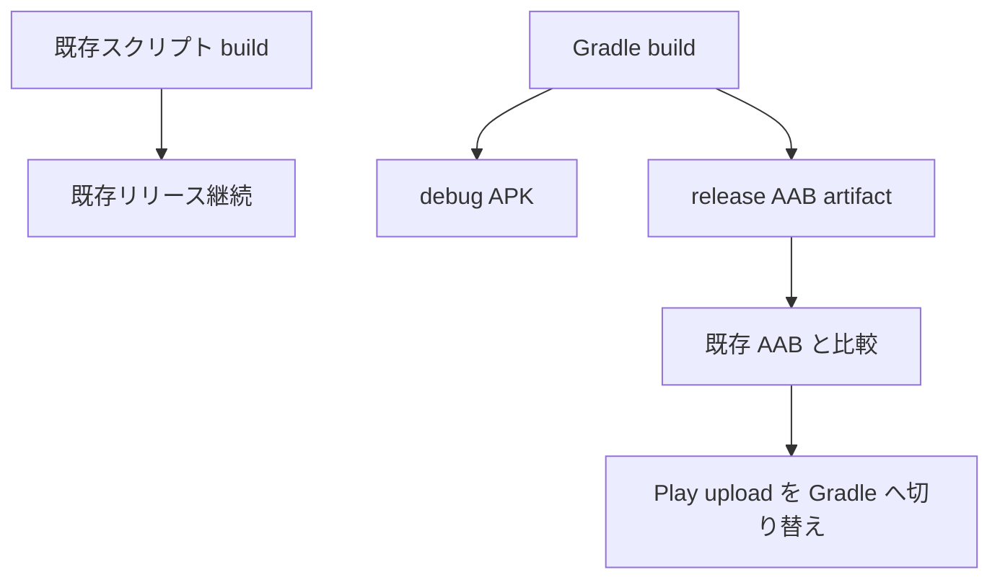

移行中は、Gradle 生成 AAB を artifact として保存するだけにしておく。
Play Console への upload は、署名、package name、versionCode、assets、feature flag を確認してから切り替える。

## GitHub Actions で実機に近い確認をする

GitHub Actions では Android Emulator を起動できる。
ただし重く、揺れやすいため、毎 push ではなく手動実行やリリース前確認に向いている。

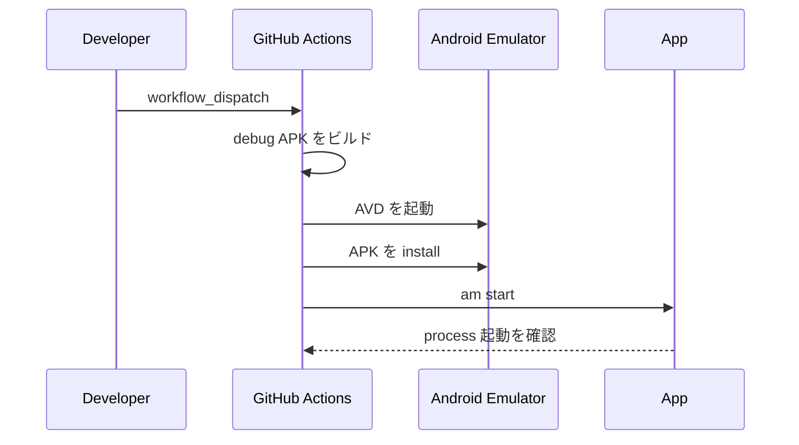

最初の smoke test は、凝った UI 検証よりも「インストールできる」「起動できる」を見る。
ここが安定してから、Intent でファイルを開く、共有から開く、スクリーンショットを保存する、といった確認を増やす。

## main ブランチ保護

公開リポジトリでは、`main` へ直接 push できる状態にしておくと、意図しない Actions 実行や未検証 commit の混入が起こりやすい。

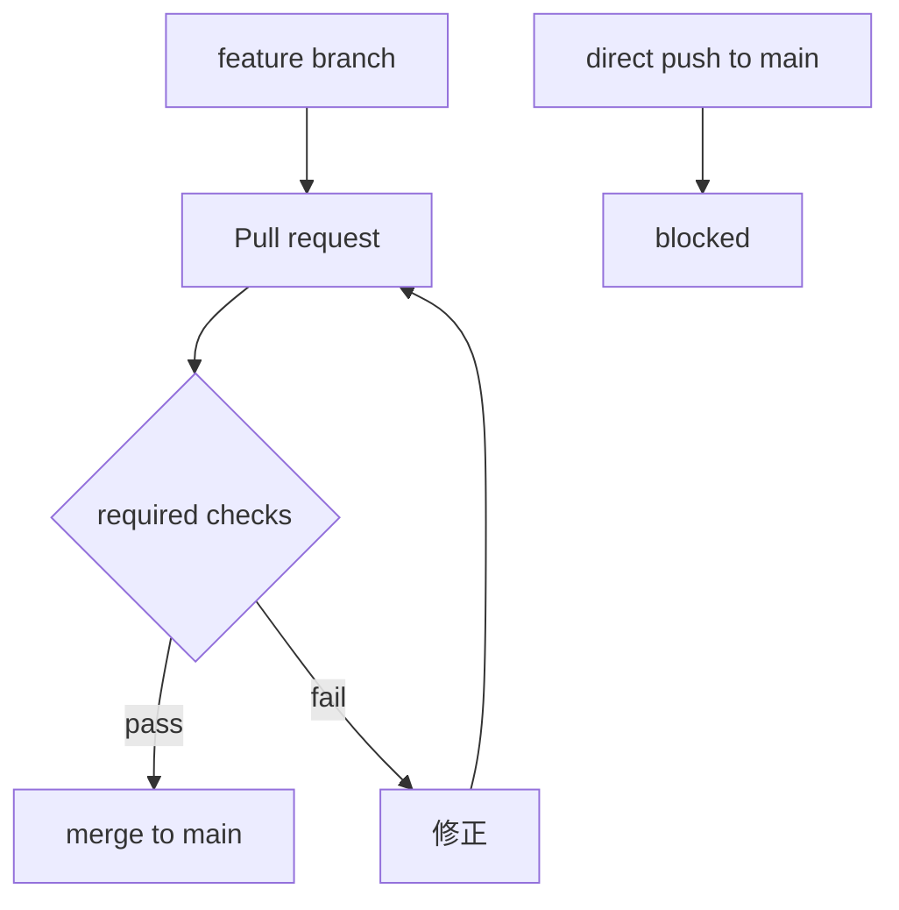

保護の基本は次の組み合わせにする。

| 保護 | 狙い |
| --- | --- |
| required status checks | `test` や `gradle-build` が通った commit だけ入れる |
| strict status checks | base branch 最新化を要求する |
| non-fast-forward 禁止 | 履歴の破壊を防ぐ |
| deletion 禁止 | main の削除を防ぐ |
| conversation resolution | 未解決レビューを残した merge を防ぐ |

solo 開発では、required approval を強くしすぎると自分の PR を自分で approve できず詰まることがある。
その場合は、レビュー承認ではなく required checks と conversation resolution を機械的な防御にする。

## PR 補助スクリプト

保護ブランチを入れたら、人間が毎回手順を思い出す運用にしない。
作業開始と PR 作成をスクリプト化する。

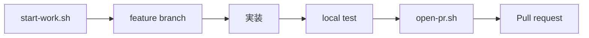

PR title は Conventional Commits に合わせる。
ただし、`feat(scope): ...` や `feat!: ...` も正当な形式なので、補助スクリプトで誤って拒否しない。

## versionCode の扱い

Play Console に commit 済みの `versionCode` は再利用できない。

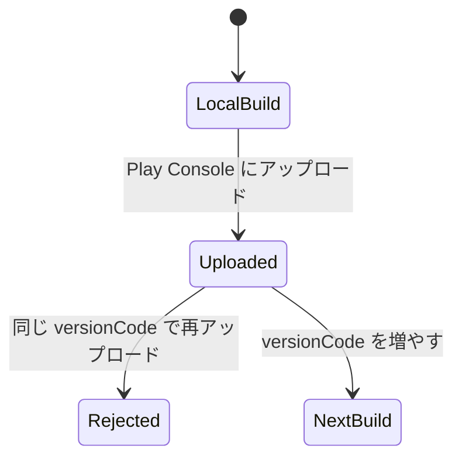

CI/CD 化すると再試行が増えるため、次の運用を決めておく。

- Play Console にアップロードする前に `versionCode` を上げる。
- アップロード失敗が commit 前なら、同じ `versionCode` で再試行できる場合がある。
- AAB upload まで成功して edit commit で失敗した場合は、Play Console 側の扱いを確認する。
- 判断が難しい場合は、`versionCode` を上げて再試行する。

## リリース名の扱い

Google Play のリリース名には長さ制限がある。

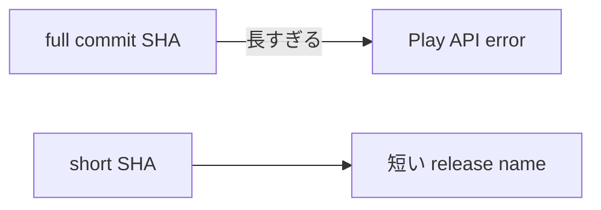

フル SHA を入れず、短い SHA や `versionName-versionCode` を使う。

## よくある失敗

```mermaid
flowchart TD
    A[Release workflow が失敗] --> B{エラー内容}
    B -->|API disabled| C[Android Publisher API を有効化]
    B -->|caller lacks permission| D[Play Console のユーザー権限を付与]
    B -->|version code used| E[versionCode を上げる]
    B -->|release name too long| F[リリース名を短くする]
```

## 運用ルール

Google Play のリリース名は短くする。

よい例:

- `LocalMD 1a2b3c4`
- `v0.1.0-14`

フルのコミット SHA を入れると、Play Console の長さ制限に引っかかる。
