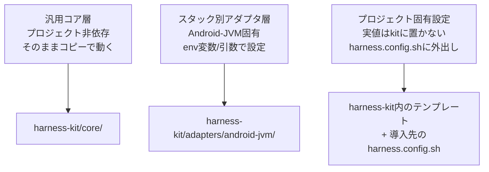
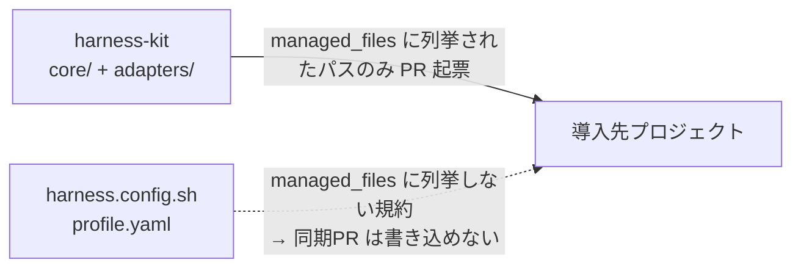

# ハーネス3層分類の設計

## TL;DR

localmd-reader の70ハーネス構成要素を他プロジェクトへ移植するにあたり、そのまま使えるもの・技術スタック選択後に使えるもの・各プロジェクトで定義し直すものを明確に分ける3層モデルを採用した。特にプロジェクト固有設定を "kit に実値を置かない" 構造にすることで、自動同期が固有設定を踏み潰さない保証を得る。

> 一次資料: [ハーネス移植性アーキテクチャ設計書](https://github.com/Yos-K/multi-agent-shogun/blob/main/docs/harness-portability/design.md) / harness-kit（裁可待ち）

---

## なぜ3層に分けるか

ハーネスを移植する場面には3つの独立した問いがある。

1. **どのスクリプトを持ち出せるか** — プロジェクト固有の文字列が含まれるかどうか
2. **どの技術スタックを選ぶか** — Android/JVM なのか、将来 Python や iOS になるか
3. **固有設定はどう渡すか** — 移植先ごとに違う値（パッケージ名・閾値・パス）をどこで定義するか

この3つを1つの型に混在させると、移植のたびに全スクリプトの中身を読んで「どこを書き換えるべきか」を探す作業が生じる。だから3層に切り分け、層ごとに移植方式を変える。

---

## 3層の定義

### 層1: 汎用コア（9ファイル）

スタックに依存しない。どのプロジェクトでもそのままコピーして動く。

| ファイル例 | 根拠 |
|---|---|
| check-conventional-title.sh | Conventional Commits 正規表現のみ。固有文字列なし |
| check-no-committed-secrets.sh | .jks/.pem/.env など汎用拡張子パターン。固有依存なし |
| start-work.sh | git fetch/switch/pull のみ |
| version-env.sh / version-check.sh / version-show.sh | VERSION ファイルの semver 読み書きのみ |
| ResizePng.java / StripImageMetadata.java | 汎用 PNG 処理 |
| prepare-play-store-screenshot.sh | 汎用 StripImageMetadata.java の薄いラッパー |

### 層2: スタック別アダプタ Android-JVM（31ファイル）

Android/JVM 技術スタックに依存するが、固有の実値は env 変数・引数で外出しできる。

| カテゴリ | ファイル例 | 外出しパラメータ例 |
|---|---|---|
| Fitness Gate | check-file-sizes.sh | MAX_LINES、例外ファイルパス |
| テスト実行 | run-unit-tests.sh、run-mutation-tests.sh | パッケージ名、スコア floor |
| Android ビルド | build-release-aab.sh、emulator-smoke.sh | ANDROID_HOME、パッケージ名 |
| バージョン管理 | version-bump.sh | AndroidManifest.xml パス |
| CI ワークフロー | ci.yml、mutation.yml、device-smoke.yml | パッケージ名、API level |

### 層3: プロジェクト固有設定（29ファイル相当）

localmd-reader 固有の文字列・パス・設計をハードコードしており、kit に実値を置けない。**テンプレート + 各プロジェクトの `harness.config.sh` に実値を外出しする。**

| ファイル例 | 固有依存の内容 |
|---|---|
| check-hard-constraints.sh | AndroidManifest.xml・MainActivity パス、INTERNET 権限制約 |
| check-domain-model.sh | docs/domain/models/*.als パス（Alloy フォーマル検証） |
| play-upload-*.py | Google Play API + GCP プロジェクト依存 |
| fitness-exceptions.txt | MainActivity/JavaSimpleMarkdownRenderer など固有クラス名 |
| pr-preflight.sh | 呼び出す7スクリプトのうち4つが固有層のため、wrapper 全体も固有 |

---

## 分類の判断基準

「スクリプトを読み、固有文字列がどのレベルで混入しているか」で判断する。迷った事例を記録する。

**境界線 1: 固有文字列の除去可否**

- `check-file-sizes.sh` — src/配下 Java ファイルを検索（L31）は JVM 固有だが、MAX_LINES は env 変数化済み → **アダプタ層**
- `check-hard-constraints.sh` — AndroidManifest.xml パスと INTERNET 権限制約をハードコード → **固有層**（パスを引数化しても、制約内容自体がプロジェクト設計依存）

**境界線 2: wrapper の扱い**

wrapper スクリプトは呼び出し先の層に従う。`open-pr.sh` は単純な wrapper に見えるが、呼び出す preflight/test スクリプトが固有層のため、wrapper ごと **固有層** に分類する。

**境界線 3: 設計概念の依存**

Alloy フォーマル検証（`check-domain-model.sh`）や Pro 課金設計（`apply-billing-manifest.py`）は、それ自体がプロジェクトの設計決定であり、env 変数化で解決できない → **固有層**。

---

## sync-manifest 方式との組み合わせ

なぜ固有設定の自動同期を構造的に防げるか、を説明する。

同期機構（`sync-manifest.yaml`）は **ホワイトリスト型**：`managed_files` に列挙されたパスしか書き換えられない。インストーラが `harness.config.sh` を `managed_files` から除外して生成するため、固有設定の踏み潰しは仕組み上発生しない（ブラックリスト除外ではなくホワイトリスト許可が保証の核）。

この構造は既存の `env.project.sh` 読み込みパターン（`build-release-aab.sh` L5 で確認済み）の一般化でもある。

---

## v0.1.0 リリース記録

2026-06-07 に [harness-kit v0.1.0](https://github.com/Yos-K/harness-kit/releases/tag/v0.1.0) を公開した。

設計段階から維持してきた3層モデル（core/adapters/templates）、ホワイトリストベースの sync-manifest、シークレットスキャンゲートがすべて初回リリースに含まれた。なぜ→だからの観点から: 「managed_files に src/**・harness-config.yaml・profiles/ を列挙すると消費側の固有設定を上書きする危険がある。だから CONTRIBUTING.md に規約として明文化し、スキーマレベルの検証を v0.2 ロードマップに積んだ。」

リリースの正直な限界: スキーマレベルの managed_files 禁止はまだ未実装（v0.2 予定）。規約に依存しているため、手動ミスによる違反を構造的に阻止はできていない。

---

## 参照

- [ハーネス移植性アーキテクチャ設計書](https://github.com/Yos-K/multi-agent-shogun/blob/main/docs/harness-portability/design.md) — 3層モデル定義・インストーラ設計・同期機構設計
- [ハーネスエンジニアリングで学んだこと](./harness-engineering.md) — ハーネスの概念と層構造
- [ハーネスへの投資をどう考えるか](./harness-investment.md) — プロファイル選択の根拠（minimal/standard/full）
- [harness-kit v0.1.0 リリース](./harness-release.md) — showcase: v0.1.0 公開の記録
