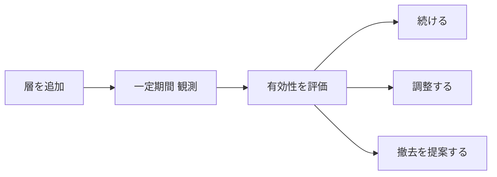
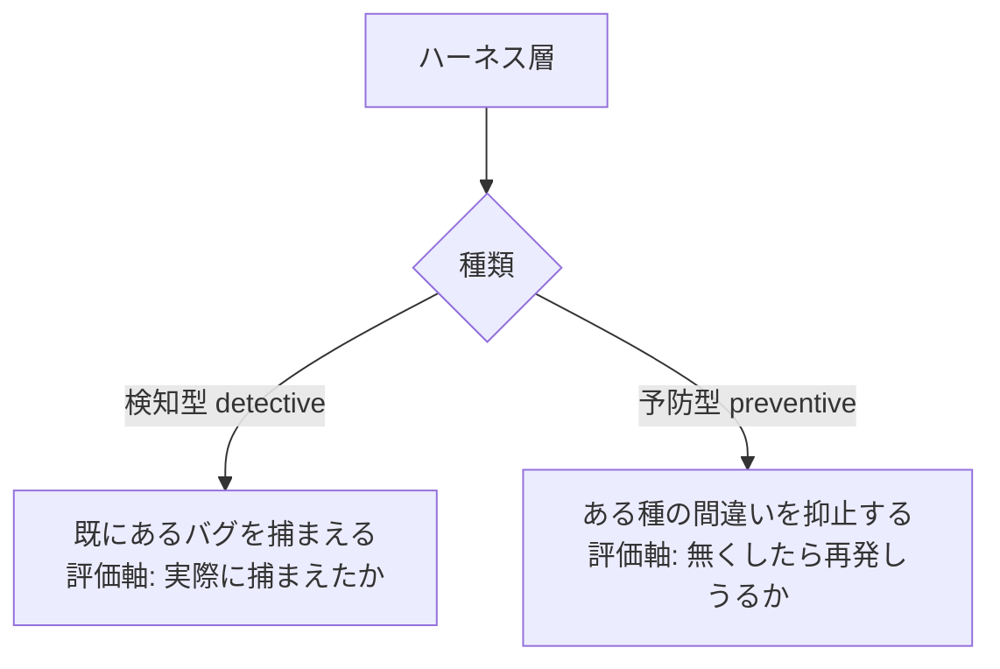
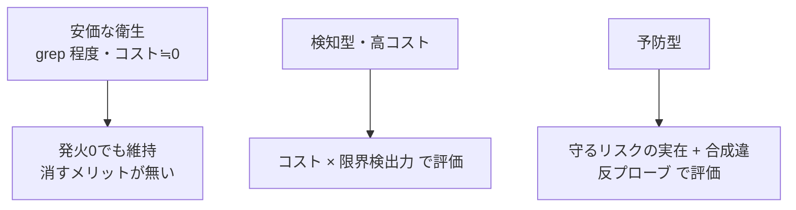
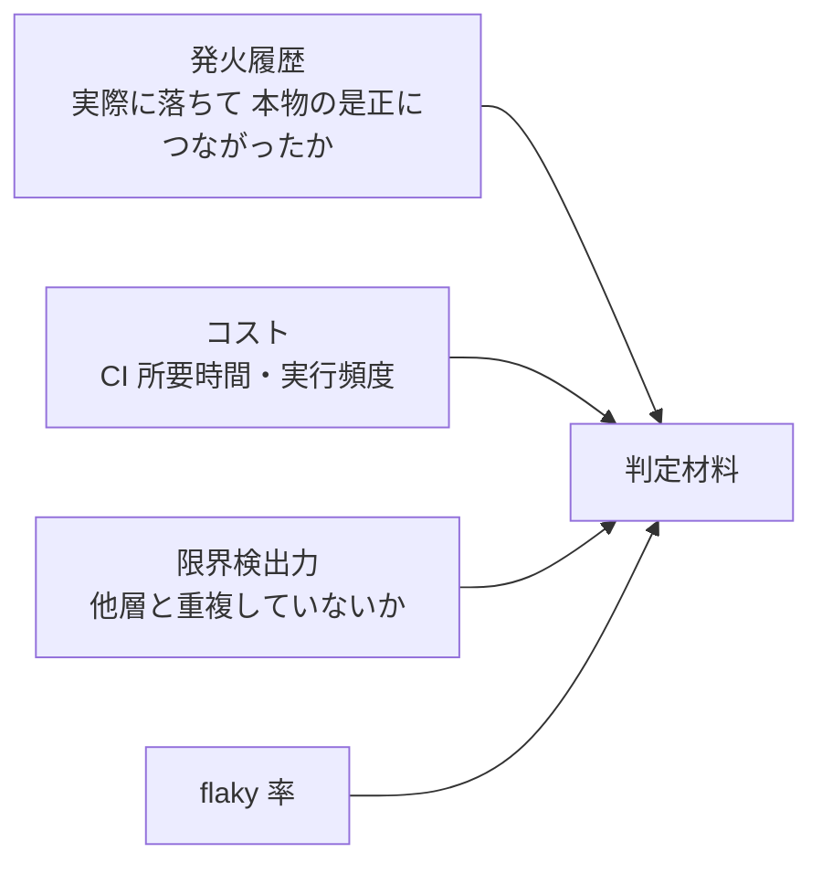
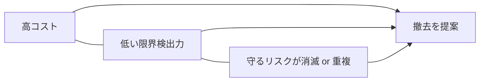
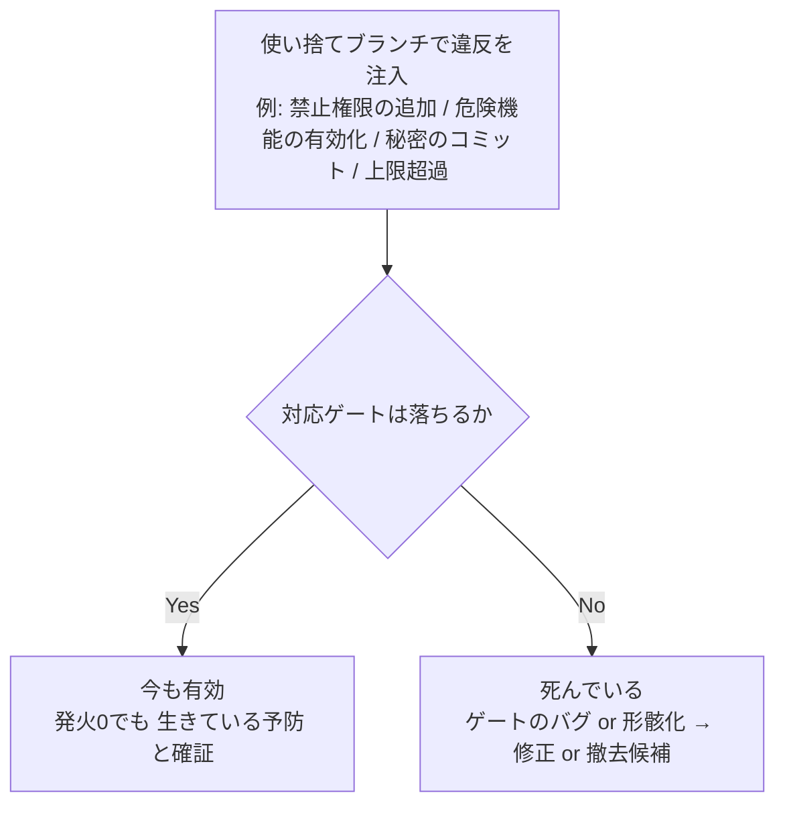
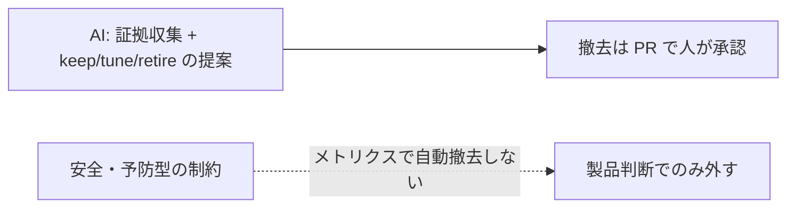
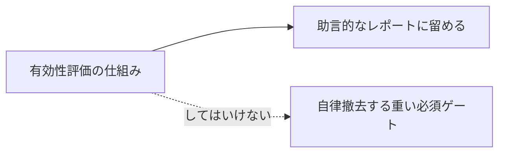
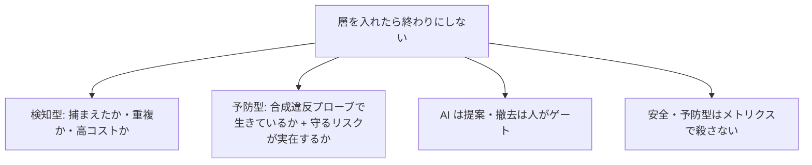

# ハーネス層の有効性評価とライフサイクル

## なぜ「入れたら終わり」にしないのか

ハーネスの各層 (検査・ゲート・テスト) は、追加した瞬間が一番うれしく見える。だが時間が経つと、効いている層と、コストだけ残って効いていない層に分かれる。層にもライフサイクルがあり、**続ける / 調整する / 撤去する**を定期的に判断する必要がある。

この評価を、AI が証拠を集めて keep / tune / retire を**提案**し、人が撤去を承認する、という分担で回せる。フラグ整理、テストスイートの衛生、セキュリティの統制有効性レビューと同じ構造だ。

## 最大の罠：「一度も落ちない＝無駄」ではない

ここを外すと、AI が最も重要な層を「無駄」と誤判定して消す事故が起きる。層は二種類に分けて評価軸を変える。

- **予防型**（例: ネットワーク遮断やスクリプト実行の禁止をソースで強制する制約）は、**一度も落ちないのが正常**だ。落ちない理由は「効いていて、誰もその間違いを通せないから」。発火履歴がゼロなことを根拠に消すと、**そのクラスのバグをまさに再導入する**。
- だから予防型の撤去基準は **発火回数ではなく「守っている前提リスクがまだ実在するか」**。これは製品判断であってメトリクスでは決まらない。前提が消えたとき (たとえば製品が正当にその機能を持つことになったとき) だけ、人が外す。

## 種類ごとの評価軸

AI が集める証拠は、多くが既存データから安価に取れる。

- **発火履歴**: 実 PR で落ちて、その修正が本物の是正だったか。ノイズで override され続けているなら、効いていない。
- **コスト**: そのジョブの所要時間と頻度。
- **限界検出力**: 他層と同じものしか検出していないか (例: ある層が、別の層がすでに殺す変異しか殺していない)。
- **flaky 率**: 偽陽性で信頼を失っていないか。

## 判定は積で考える

撤去候補かどうかは、単一の指標ではなく積で決める。

- **撤去候補** = 高コスト × 低い限界検出力 × (守るリスクが消えた or 完全に重複)。
- 安価な衛生チェックは、発火ゼロでも残す。消すメリットがコストを上回らない。
- 高コストな層 (遅いミューテーションや実機スモークなど) で、限界検出力が低く重複しているものが、真の撤去候補になる。

## 合成違反プローブ：ゲートに対するミューテーションテスト

履歴だけでは予防型を評価できない。そこで **わざと違反を注入してゲートが落ちるかを確認する**。これは事実上、ゲート自身に対するミューテーションテストだ。

これなら「一度も落ちない予防型」を、無駄ではなく **有効だと積極的に証明**できる。テストの検出力をミューテーションで測ったのと同じ発想を、ゲート自身に向けただけだ。「テストのテスト」の、ゲート版にあたる。

## AI は提案し、撤去は人がゲートする

- **撤去は不可逆性の高い安全操作**だ。AI が自律的にゲートを消し、その後バグが漏れたら本末転倒になる。AI は証拠付きで提案するところまで、撤去の決定は人 (または PR) がゲートする。これは計算的な指標収集と、推論的な是非判断の役割分担そのものだ。
- **安全・予防型の制約はメトリクスで自動撤去しない**。これらは「効いていないから消す」ではなく「守る前提が消えたから外す」対象で、判断は製品側にある。

## 再帰の歯止め

この評価の仕組み自体もハーネスだ。だから **助言的・低コスト・オンデマンド**に留める。

投資バランスを戒める仕組みが、それ自体で過剰になっては本末転倒だ。自律的に層を消す重い枠組みを作るより、証拠を出して人の判断を助けるレポートに留めるほうが、メタレベルでも過剰を避けられる。

## まとめ

各ハーネス層を定期的に評価し、効いていない高コスト層は撤去を提案し、効いている予防型は発火ゼロでも残す。判断の鍵は、**検知型と予防型を取り違えないこと**と、**合成違反プローブで「生きている予防」を証明できること**だ。撤去という不可逆な操作は人がゲートし、評価の仕組み自体は軽く保つ。

関連: [ハーネスへの投資をどう考えるか](harness-investment.md) / [ハーネスエンジニアリングで学んだこと](harness-engineering.md) / [ミューテーションテストで学んだこと](mutation-testing.md) / [モデル検査を設計段階のハーネスにする](model-checking-design-harness.md)
