# ハーネスエンジニアリングで学んだこと

## 定義

人や AI エージェントがソフトウェアを書くとき、コードを書く能力そのものとは別に、書いたコードが正しいかを素早く確認し、誤りを修正できる環境が要る。この環境を意図的に設計・整備する営みをハーネスエンジニアリングと呼ぶ。

馬具のハーネス、登山者の安全帯、パラシュートのハーネス、いずれも「動きを制約しつつ、危険な領域には行かせない」装置を指す。ソフトウェア開発におけるハーネスも同じ性質を持つ。書き手の動きを完全に制約はしないが、誤った方向に進んだ瞬間に止める。

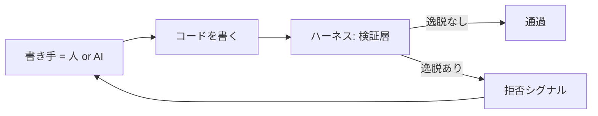

書き手と検証層を分離することで、書き手は速く動き、検証層が安全を担保する。書き手の能力を上げるのではなく、書き手が動く環境の能力を上げる、という発想が中心にある。

## 全体の構造

ハーネスは単一の道具ではなく、検証の速度ごとに層をなす構造として整備するのが現実的だ。書き手のループに対して、どれくらいの遅延でフィードバックが返るかが層を分ける。

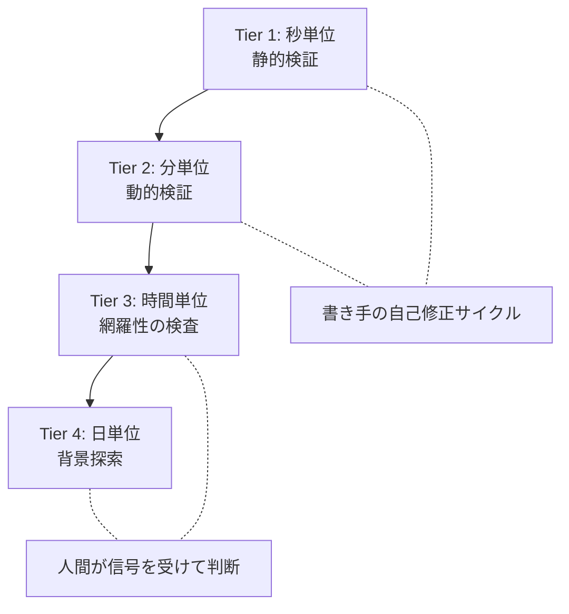

上の層ほどフィードバックが速く、書き手の手が止まりにくい。下の層ほど深い欠陥に到達できるが、書き手の作業時間スケールでは間に合わない。

このため、層によって「誰がフィードバックを受けるか」が変わる。Tier 1-2 は書き手 (特に AI エージェント) が直接受けて自己修正に使う。Tier 3-4 は人間が受け、必要に応じて書き手のループに伝える。

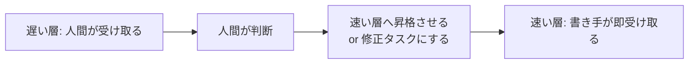

遅い層で見つけた問題は、可能なら速い層で再現できる形 (性質や規則) に昇格させる。これにより同じ問題が次に書かれた瞬間に止まる。

## 構成要素

各層に置く具体的な道具と、層に横断的に存在するプロセス系がある。

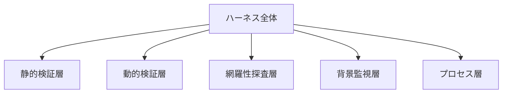

- 静的検証層 (Tier 1): コンパイラ、型システム、アーキテクチャ規則、コードスタイル、ファイルサイズ規約、依存方向の制約
- 動的検証層 (Tier 2): 単体テスト、性質ベーステスト、契約検証、統合テスト
- 網羅性探査層 (Tier 3): 突然変異テスト、変更共起分析、静的解析レポート
- 背景監視層 (Tier 4): Fuzzing、依存脆弱性スキャン、性能リグレッション検査
- プロセス層 (横断): エージェント向け文脈ファイル、変更テンプレート、設計判断記録、引き継ぎドキュメント

## 各要素の説明

### 静的検証層

書き手が一文字書くたびに検証できる速度で動くもの。コンパイラと型システムが基盤。その上に、コンパイラが見ない「設計上の規約」を機械検証可能な形で重ねる。

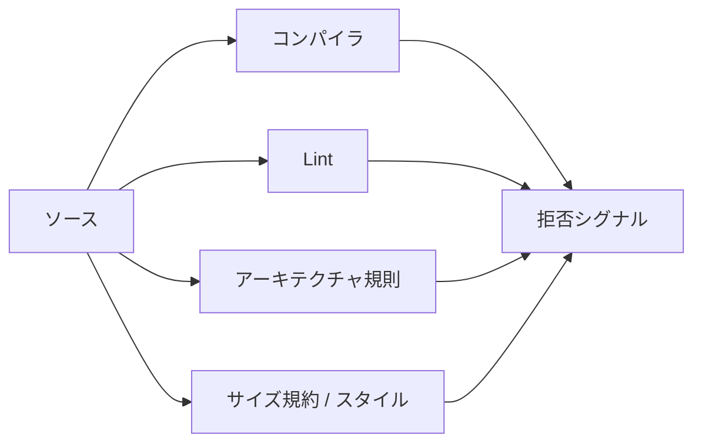

アーキテクチャ規則の例:

- ドメイン層が外部フレームワークに依存しないこと
- 公開 API が内部実装を露出しないこと
- パッケージ間に循環依存が生まれないこと
- 特定の権限や設定が無断で追加されないこと

これらは文書として書くだけでは守れない。実行可能なルールにして、違反したら即座にビルドが止まる形にする。文書とルールが二重に並ぶのではなく、ルールが文書を兼ねる構造を目指す。

### 動的検証層

実行してみないと分からない契約を、書き手の手が止まる前に確認する層。例ベーステストはここに置かれる。

性質ベーステストは、例ベーステストでは網羅しきれない「あらゆる入力で成り立つはずの性質」を一行で宣言し、フレームワークに反例を探させる。値オブジェクトの不変条件、境界処理の安全性のように、入力空間が広く、性質が明確な領域で力を発揮する。

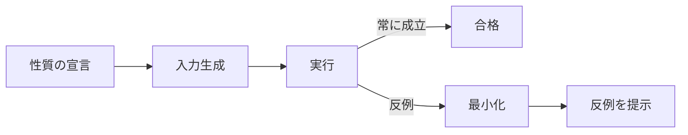

性質ベーステストで書ける性質と書けない性質の境界が、自然に「明文化された仕様」と「暗黙の仕様」の境界になる。書ける範囲を広げる作業が、仕様を明文化する作業と一体になる。

### 網羅性探査層

書き手が書いたコードと、書き手が書いたテスト、その両方をさらに検査する層。突然変異テストは「実装にわざとバグを入れたとき、テストが落ちるか」を測る。落ちなければ、そのテストは契約を実質的には検査していない、ということになる。

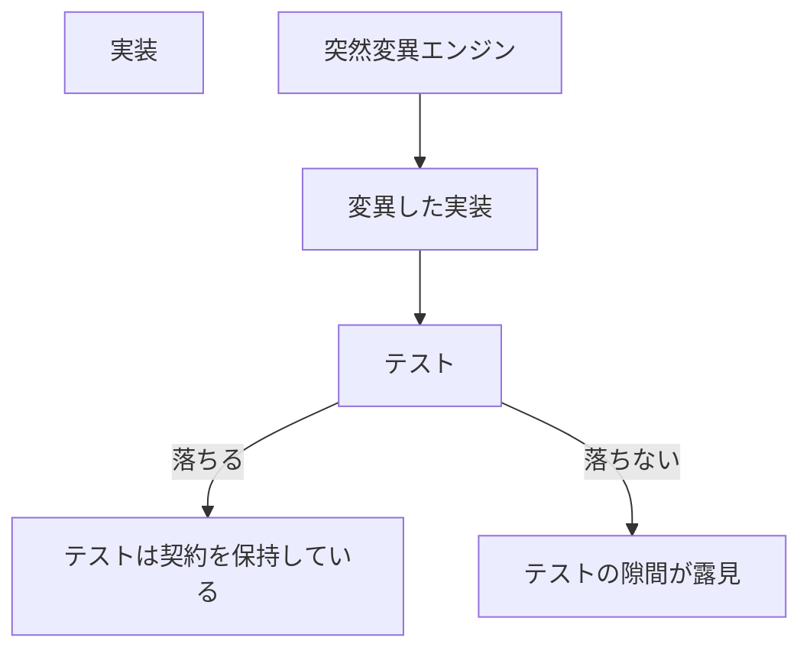

変更共起分析は、git 履歴から「一緒に変更されてきたファイル」を抽出する。物理的に離れた場所にあっても、変更が同期するなら、それは見えない結合がある証拠だ。設計上の凝集と、実際の変更パターンのずれが分かる。

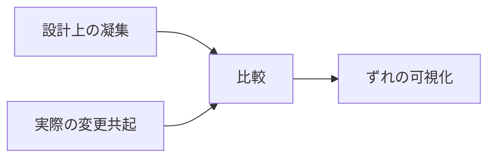

この層は遅いが、書き手の自己修正サイクルに頻繁に登場する必要もない。週次や PR マージ後の定期実行で十分なことが多い。

### 背景監視層

書き手の手元では完結しない、長時間の探索を任せる層。Fuzzing は未検証バイト列を執拗にミューテーションして、解釈系が予期しない入力で破綻しないかを探す。

書き手のサイクル時間 (分) と、この層のサイクル時間 (時間〜日) はかみ合わない。ここで見つかった反例は、まず人間が受け取り、必要なら上位層の検査 (性質ベーステスト) に格上げする。

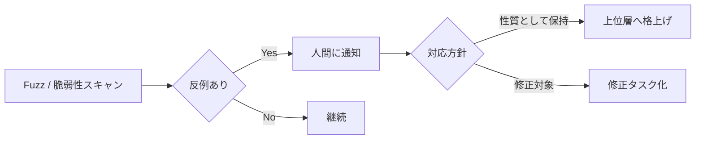

この層を書き手の自己修正サイクルに直接組み込むと、フィードバックが遅すぎて書き手が停滞する。「人間を経由して上位層に翻訳する」という流れを崩さないことが、層を機能させる条件だ。

### プロセス層

層を横断して書き手に「文脈」を提供するもの。コードの中には書ききれない判断の理由、制約の背景、進行中の作業状態を保持する。

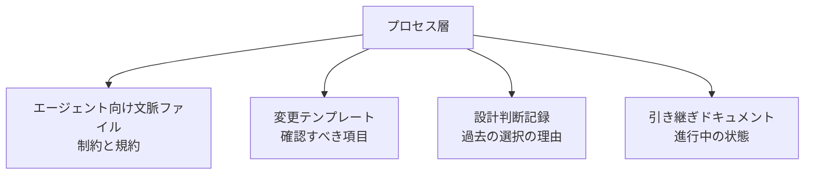

AI エージェントは多くの場合、過去の文脈を持たない状態で作業を始める。コードを読めば「どう書かれているか」は分かるが、「なぜそう書いたか」「他にどんな案が棄却されたか」は分からない。プロセス層がそれを補う。

人間にとっても効果は同じで、コードからは読み取れない判断の歴史が、レビューやリファクタリングのたびに役立つ。

## なぜ必要か、得られる効果

### なぜ必要か

書き手 (人も AI も) は速く動く。書く速度に比して、「書いたコードが正しいか」を確認する手段が乏しいと、誤りを抱えたまま先に進んでしまう。

AI エージェントの場合、この問題が顕著になる。コンパイルが通り、表面的な振る舞いが想定通りに見えれば「完了」と判断しがちで、意味的なバグや暗黙の制約違反を見逃す。

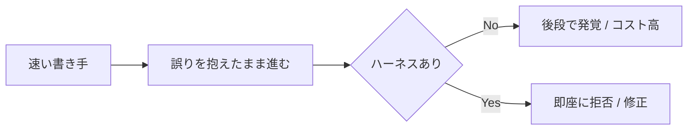

ハーネスは「書き手が速く動く」と「品質を保つ」の両立を、書き手の能力ではなく環境の能力で実現する。書き手の能力が変わらなくても、ハーネスを厚くすると成果物の質が上がる。

### 得られる効果

書き手にとっての効果:

- 自己修正サイクルが回る。書いては検査し、ダメなら直す、を分単位で繰り返せる
- 文脈の喪失が補える。プロセス層が過去の判断と現在の制約を伝える
- 作業範囲外への副作用を恐れずに動ける

レビュー側にとっての効果:

- 機械的にチェックできることは機械に任せ、判断が要る部分に集中できる
- レビューの質が「個人の経験」に依存しにくくなる
- 何を見落としやすいかが層として可視化されている

コードベースにとっての効果:

- 暗黙の制約が時間とともに失われない
- リファクタリングのリスクが下がる
- 過去の決定の理由がコードと並んで保持される

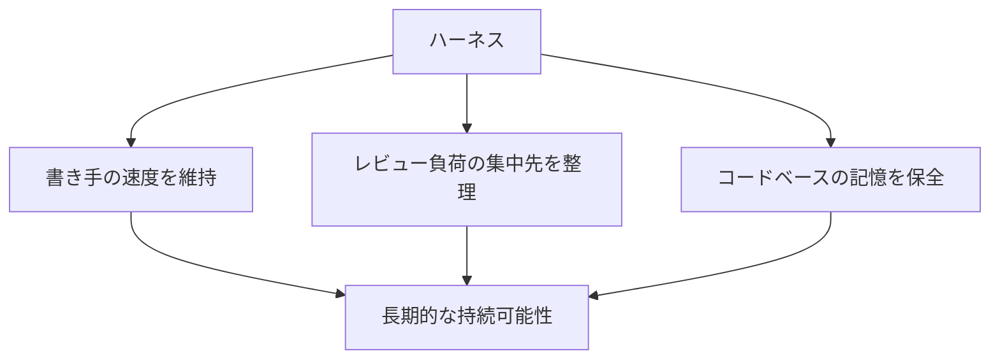

特に AI エージェント時代において、ハーネスの厚みがそのまま「どこまでエージェントに任せられるか」の上限を決める。ハーネスが薄いと、人間が常時監視員になるしかない。ハーネスを厚くするほど、人間は判断と方向付けに専念できる。

## 実装の組み立て方の例

ここまでの構造を、実際に開発環境と CI/CD にどう落とし込んだかの一例を残しておく。書き手の作業環境が固定的でない場合 (例えば移動先の軽量端末でも作業したい場合) に取りうる構成として書く。

### 開発フローの二重性

書き手のローカル環境と CI/CD 環境を、それぞれ違う役割を持たせて配置する。

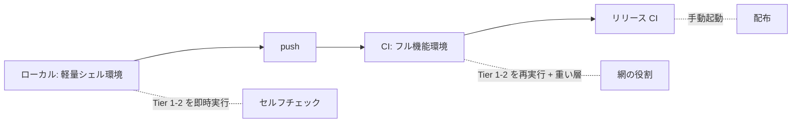

ローカルと CI で**意図的に重複させる**層と、**CI でしか動かさない**層を区別する。重複は「書き手の手元で先に止める」ためのもので、無駄ではない。

### ローカルで動かすもの

書き手のサイクル時間で完結する層を、軽量環境で実行できる形にする。

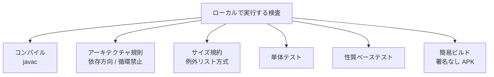

軽量環境にビルドツールチェーンが揃っていない場合は、検査に必要な JAR を**実行時にダウンロード**するスクリプトを書く。テストランナー、アーキテクチャ検査ライブラリ、性質ベーステストライブラリを、初回起動時にキャッシュへ取得し、二回目以降は再利用する。

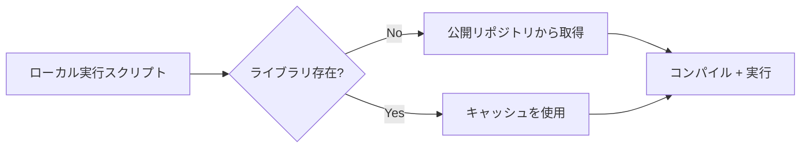

利点と注意点:

- 利点: 端末の事前準備が最小限。新しい端末でもスクリプト一本で立ち上がる
- 注意点: 初回はネットワークが要る。オフラインでも動かしたいなら、リポジトリ外に永続キャッシュを置く

軽量環境で「フル機能」を目指さない判断も重要だ。プラットフォーム SDK が必須のコンポーネント (UI 層など) はローカルではコンパイル対象から外し、CI に任せる。書き手のループ速度を維持するための割り切り。

### CI/CD で動かすもの

CI は三つの役割を分担する。

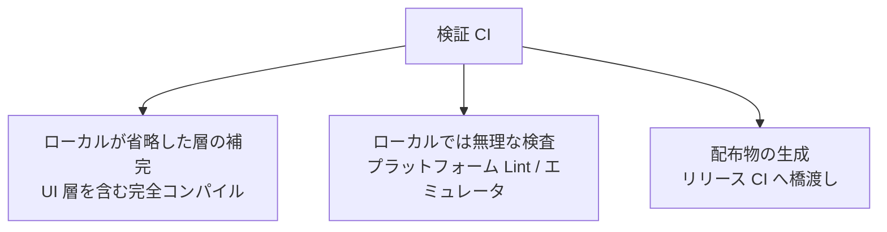

ジョブは観点ごとに分けて並列化する。一つの大きなジョブにすると、どこで失敗したか分かりにくく、再実行コストも上がる。

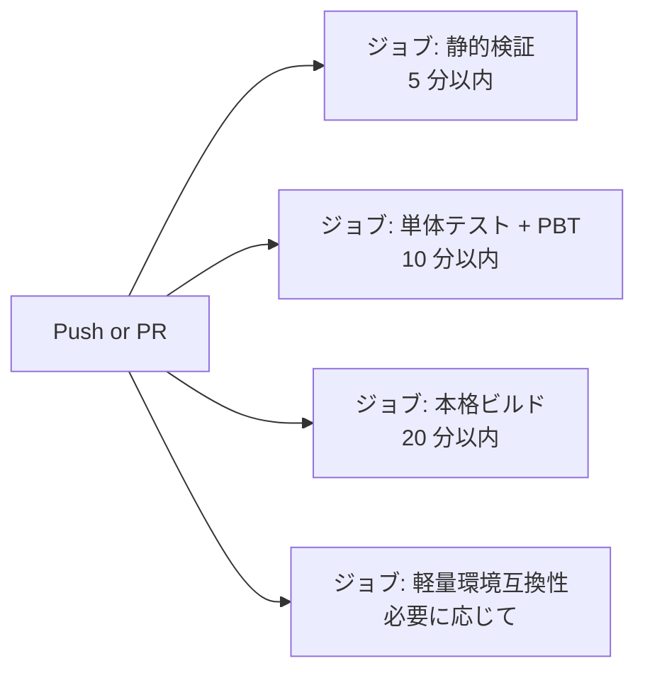

特に静的検証ジョブを独立させると、「分単位で失敗が分かる」フィードバックが得られる。書き手は重いジョブの完了を待たずに次の動きを決められる。

### リリース CI を分ける

通常の検証 CI とリリース CI を分けるかどうかは設計判断になるが、鍵のスコープを最小にしたいなら分けるのが妥当だ。

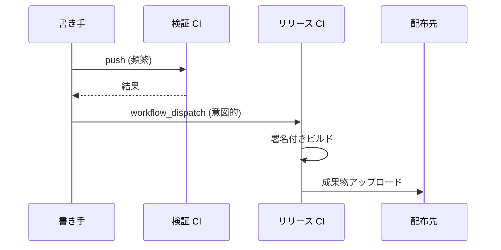

検証 CI は頻繁に走る。リリース CI は意図的に起動された時のみ動く。鍵情報、外部サービス認証、長時間ビルドを検証パイプラインと混ぜないことで、漏洩面を狭く保つ。

### 層ごとの配置例

これまでの 4 層モデルを、具体的にどう配置したかの一例。

| 層 | ローカル | CI/CD |
|----|---------|-------|
| 静的検証 (秒) | コンパイル / アーキテクチャ規則 / サイズ規約 | 同左 + プラットフォーム Lint |
| 動的検証 (分) | 単体テスト / 性質ベーステスト | 同左 (重複実行) |
| 網羅性探査 (時間) | 配置しない | 週次ジョブで実行 (予定) |
| 背景監視 (日) | 配置しない | 別ワークフローで継続実行、結果は通知 |
| プロセス層 | エージェント文脈ファイル / テンプレート / 設計判断記録 | 同左 (リポジトリに同梱) |

ローカルと CI で重複する層があってもよい。書き手が直すべきものを書き手の側で先に検出させた方が、ループが速く回る。CI 側の同等検査は「念のための網」として機能する。

### 実装上の選択肢

このような構成にする際、いくつかの判断が要る。

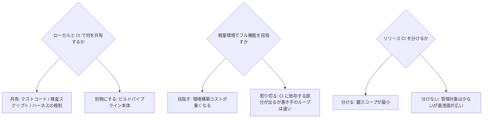

これらは「絶対の正解」ではなく、書き手の作業環境と配布要件に応じた選択になる。書き手が固定された PC で作業するだけならローカル側を軽量化する利益は薄い。複数環境を行き来するなら軽量側の整備が効く。

### 文書系の配置

プロセス層の成果物は、すべてリポジトリに同梱する。

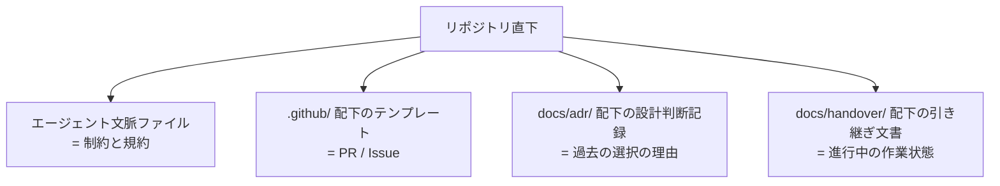

エージェントが新しいセッションでリポジトリを開いた瞬間に、必要な文脈が手元に揃っている形を作る。エージェントごとの外部ストレージに頼ると、エージェントを乗り換えた瞬間に文脈が消える。

## 今後の発展

ハーネスエンジニアリングはまだ若い領域で、いくつかの方向で発展していく可能性がある。

### 仕様と性質の収束

性質ベーステストが普及するにつれ、「実行可能な仕様」と「テスト」の区別が薄れていく。仕様の文章を書く代わりに、性質を書く形が増える。

```mermaid
flowchart LR
    Old[文章による仕様]
    Old --> Drift[実装とずれていく]
    New[性質としての仕様]
    New --> Live[実装と同期する]
```

「仕様駆動開発」が、性質を中心とした形で再定義されていく。仕様書とコードを二重に維持するコストが減る。

ただし、すべての仕様が性質として書けるわけではない。UI の印象、UX の質、業務ルールの列挙のような対象は、性質化が原理的に困難か、性質化すべきでない。仕様駆動の射程と非射程の境界を見極める成熟が、この方向の前提条件になる。

### エージェント向け文脈の標準化

エージェントごとに固有の文脈ファイルを置く現状から、ベンダー中立な慣習名が定着していく。さらに、文脈ファイル内の構造そのものが標準化されると、エージェントを乗り換えても情報資産が引き継げる。

```mermaid
flowchart TD
    Now[現状: ベンダー固有]
    Now --> Convergent[慣習名の収束]
    Convergent --> Structured[内部構造の標準化]
    Structured --> Portable[エージェント横断で再利用可能]
```

文脈ファイルが「コードの一部」として扱われる文化が広がる。

### モジュラリティ指標の動的化

凝集度と結合度のような構造指標は、これまで主に静的に計測されてきた。変更共起を継続的に抽出する手法が広がると、「設計上の凝集」と「実際の変更パターン」のずれが指標として現れる。

```mermaid
flowchart LR
    Static[静的構造の凝集]
    Dynamic[実際の変更共起]
    Static --> Compare[比較]
    Dynamic --> Compare
    Compare --> Drift{ずれの検出}
    Drift -->|ある| Refactor[分割境界の見直し]
```

ずれが見えれば、リファクタリングの優先順位を勘ではなくデータで決められる。

### ハーネス自身の検査

ハーネスもコードなので、誤りやすい。ハーネスの規則と実装のずれ、文脈ファイルとコードの実態のずれを自動検査する仕組みが必要になる。

```mermaid
flowchart TD
    Harness[ハーネス本体]
    MetaHarness[ハーネスを検査するハーネス]
    MetaHarness --> Check{記述と実態が一致するか}
    Check -->|Yes| OK[整合]
    Check -->|No| Stale[古い記述として検出]
```

ハーネスを「対象コードと並ぶ第一級の成果物」として扱う成熟が、次の段階だろう。

### ROI の測定と過剰最適化への抵抗

「ハーネスが効いているか」を測る指標がいずれ求められる。リグレッション率、修正までの時間、書き手が拒否シグナルから自己修正できた割合などが候補になる。

ただし指標の最適化は、指標を欺くハーネスを生む。「テストカバレッジ 100%」だけを追って意味のないテストが量産された歴史と同じ轍を、ハーネスでも踏みうる。指標は補助情報として持ち、ハーネスの厚みを決める最終判断は人間が下す形が望ましい。

### マルチエージェント分業

複数の AI エージェントがそれぞれ違う観点でハーネスとして機能する将来像もある。コードを書くエージェント、性質を提案するエージェント、設計判断をレビューするエージェント、といった分業の形態だ。

```mermaid
flowchart TD
    Writer[実装エージェント]
    Spec[仕様提案エージェント]
    Reviewer[設計レビューエージェント]
    Writer --> Output[コード]
    Spec --> Properties[性質]
    Output & Properties --> Reviewer
    Reviewer --> Verdict[判定 / フィードバック]
    Verdict --> Writer
```

エージェント同士のハーネスが、人間の介入を経由せずに一定の品質を維持する構造が模索されていく。人間の役割は「方向付け」と「最終判断」に純化していく。

## 始め方

最初から五層すべてを整える必要はない。書き手の自己修正サイクルに直結する Tier 1-2 と、横断的なプロセス層から始めるのが現実的だ。

```mermaid
flowchart TD
    S1[最小構成: 静的検証 + プロセス層]
    S1 --> S2[動的検証層を追加 / PBT を一つ書く]
    S2 --> S3[網羅性探査層を週次で回す]
    S3 --> S4[背景監視層を必要な対象に限定して入れる]
```

各段階の追加は、前段階で見つかった問題を契機にする方が無理がない。「層を埋めるために層を入れる」と、使われない検証が増えるだけになる。

書き手の作業を観察し、どこで誤りが漏れているか、どこで検証が遅すぎて手戻りが大きいかを見て、その隙間を埋める層を加える。ハーネスは「あらかじめ設計して一気に作るもの」ではなく、「書き手の動きに合わせて育てていくもの」だ。
