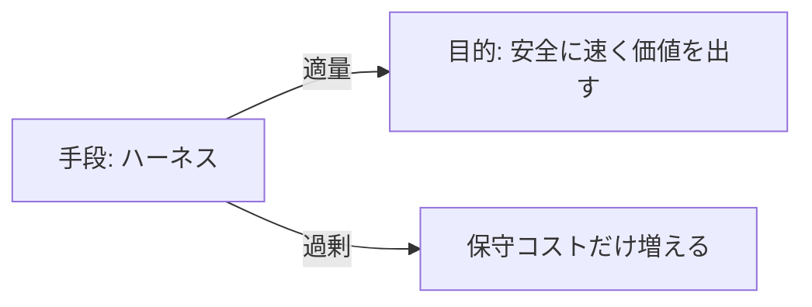
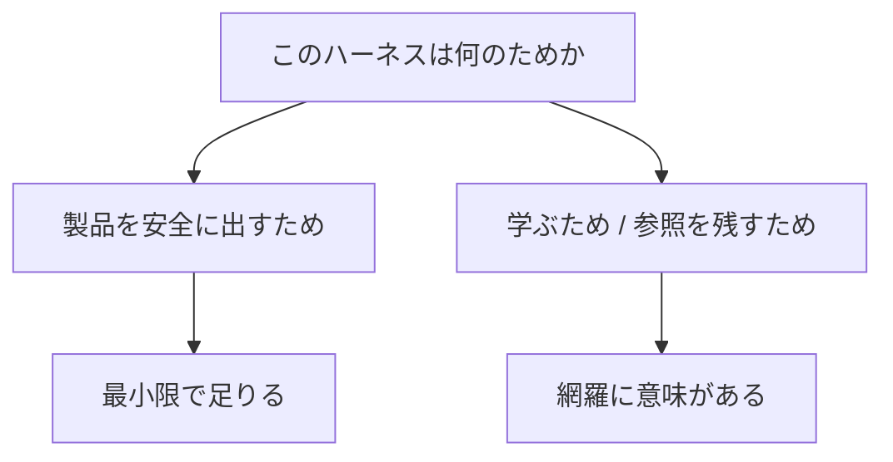
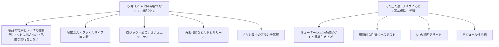
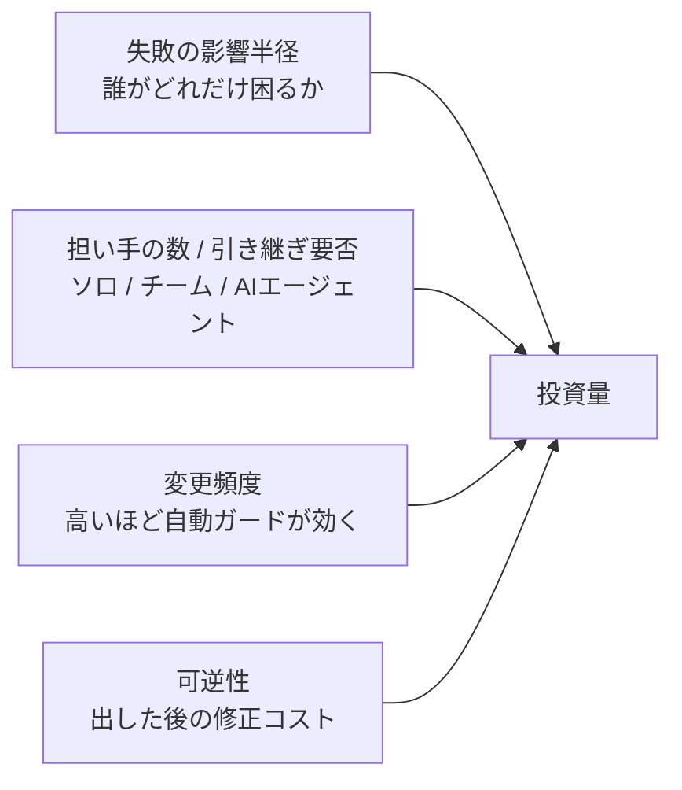
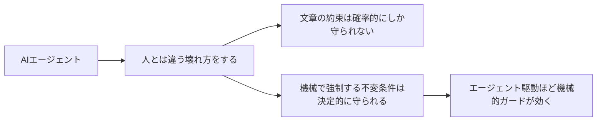
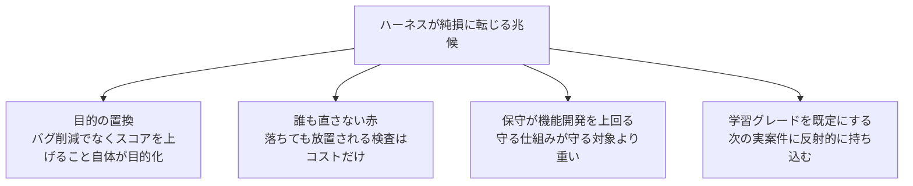
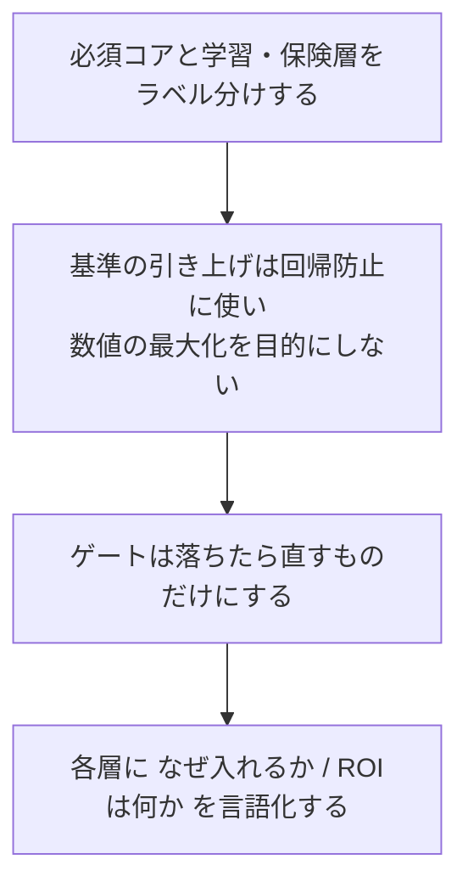
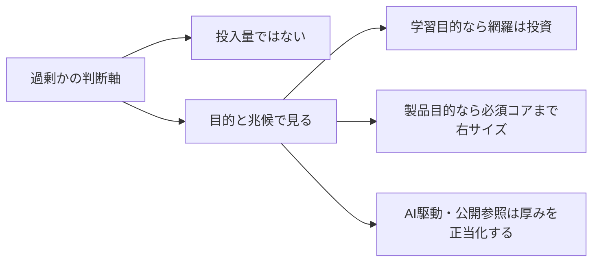

# ハーネスへの投資をどう考えるか

## なぜこの問いが要るか

ハーネス (テスト・CI・ガードレールの仕組み) は目的ではなく手段だ。手厚くするほど安全に近づく一方で、手段が目的化すると負担だけが残る。

「できることを全部やる」は学習としては正しくても、製品が必要とする量とは別物だ。だから投入量を意識的に決める必要がある。

## まず目的を分ける

同じ作業でも、目的が違えば「過剰かどうか」の答えが変わる。

この二つを混ぜたまま「過剰では」と問うと判断を誤る。学習目的なら網羅は投資であり、製品目的だけで見れば同じ網羅が過剰になりうる。先に「今はどちらの目的か」を確定させる。

## 必須コアと、その上の層

製品が本当に要るのは、**安価で効果が直結する層**だけだ。

必須コアは「製品の約束そのもの」を守る層なので、削るとプロダクトが成立しない。一方で上の層は、リスクプロファイルに応じて入れるかどうかを選ぶ。低リスクな対象に全部を被せると、守る価値より保守コストが勝つ。

## 投資量を決めるヒューリスティック

ハーネスの厚みは、次の積で決めると迷いにくい。各因子が小さいほど「コア + 一段」に絞り、大きいほど厚くする。

- **影響半径**が小さい (オフライン・無料・データを預からない) なら、厚い検証の費用対効果は下がる。
- **担い手**が増える、または引き継ぎが要るなら、口頭の約束が効かなくなるので機械的ガードの価値が上がる。
- **変更頻度**が高いほど、毎回の自動チェックが回収する手戻りが増える。
- **可逆性**が低い (リリース後の修正が高コスト) なら、出す前の関門に投資する価値が高い。

## AI エージェントが書くなら ROI は上がる

これは見落としやすい因子なので独立に挙げる。コードを書くのが AI エージェントの場合、ハーネスの価値は人間ソロより高くなる。

「コーディング規約を守って」とプロンプトで言うのと、規約違反で PR を止めるリンタを置くのは別物だ。エージェント駆動のリポジトリでは、慎重な人間ソロより一段厚いハーネスを正当化できる。

## 負担が純損に転じる兆候

過剰かどうかは投入量そのものでは測れない。次が起きたら赤信号だ。

- 指標の最大化が目的になると、仕様を表さない無意味なテストが増える。
- 落ちても誰も対応しないゲートは、信号価値がゼロでコストだけ残る。「落ちたら誰かが直すもの」だけをゲートにする。
- 機能より仕組みづくりに時間が偏り続けるなら、製品目的ではバランスが傾いている。
- 学習で身につけたフル装備を、リスクの小さい実案件に無自覚に持ち込むと、負担だけが移植される。

## 右サイズにするための実務

- リポジトリに「ここは学習目的で意図的に厚い。実案件ではコアまで右サイズする」と一文残すと、将来の自分や読者が誤って真似しない。
- ratchet (一度上げた基準を下げない) は回帰防止の床として使う。床を上げること自体を競技にしない。
- 学習目的なら、層を足すたびに目的と費用対効果を書き出す。これが最も学びを増やす。

## まとめ

危ないのは量そのものではなく、**目的のすり替え**と、**学習グレードを既定値にすること**だ。今がどちらの目的かを自覚し、必須コアと学習・保険層を分けておけば、網羅は浪費ではなく投資になる。

入れた後に各層を評価して続ける/やめるを判断する話は [ハーネス層の有効性評価とライフサイクル](harness-effectiveness-review.md) に分けた。

関連: [ハーネスエンジニアリングで学んだこと](harness-engineering.md) / [ミューテーションテストで学んだこと](mutation-testing.md)
