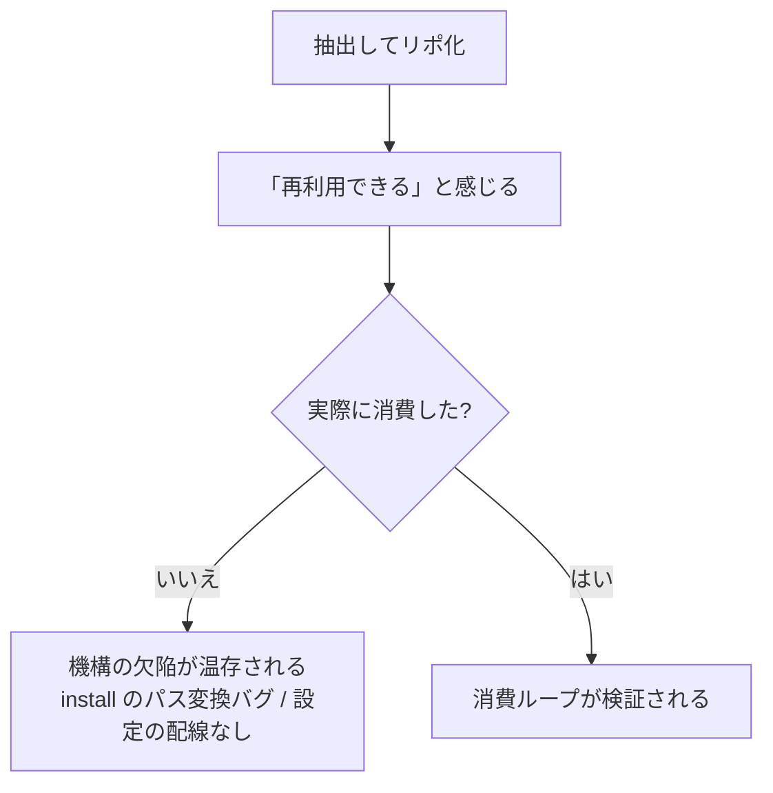
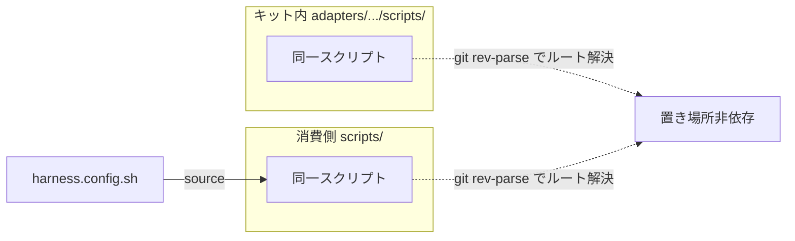
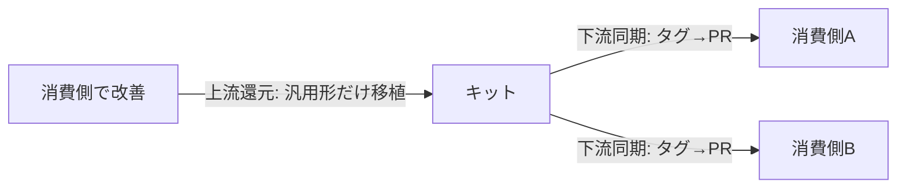
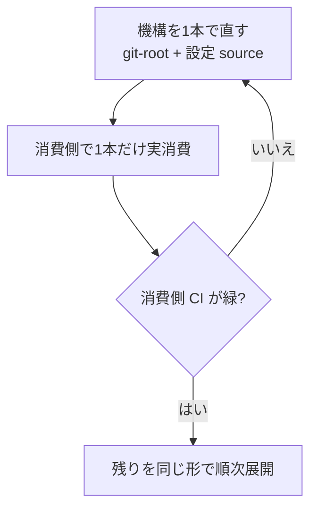

# ハーネスキットを実際に消費させる — 抽出しただけでは検証されない

## TL;DR

- ハーネスを再利用キットとして**抽出しても、消費者がゼロなら検証されていない**。「動くはず」と「実際に動く」は別。
- 移植可能キットの価値は**実消費者の数に比例する**。消費者が2未満なら、消費側に直接置くより二重管理コストが上回る。
- だから機能や2つ目のアダプタを足す前に、**1消費者で消費ループが回ることを先に証明**する。
- 鍵は2つ: スクリプトが**自分の置き場所に依存しない**こと（リポルートを git で解決）と、**設定をスクリプトが取り込める形**にすること（shell を source、YAML ではない）。
- 還元（消費側→キット）は**汎用形だけを移植**する。消費側固有のハードコードを戻すと移植性が退行する。

## なぜ「抽出」だけでは足りないか

ハーネスを別リポへ抽出すると「再利用可能になった」と感じる。だが抽出物に**実消費者がいない**間は、その汎用性は一度も実行されていない仮説にすぎない。

実例: あるキットはコア層は消費されたが、アダプタ層（ビルド/テスト/リリース系）は**一度も消費されていなかった**。理由は感情論ではなく機構の欠陥だった:

- インストーラのパス書き換えが、層の深さの違いを正しく吸収できていなかった（コア層だけで動作確認され、アダプタ層は壊れていた）。
- スクリプトは環境変数を読むのに、どこも設定ファイルを読み込んでおらず、インストーラは別形式（YAML）を配っていた。設定→スクリプトの配線が**そもそも存在しなかった**。

抽出時に「消費した」と一度も通していなければ、こうした欠陥は誰にも見えない。**消費者の不在は、検証の不在である。**

## 消費機構が満たすべき2条件

同じスクリプトが「キット内」と「消費側にインストールされた後」の両方で**無改変のまま動く**必要がある。これを満たすと、キット↔消費側の同期が**差分ゼロ**になり、機械的に追従できる。

1. **リポルートは相対深度でなく git で解決する。** `../../..` のような固定相対パスは層の深さに依存し、インストール先で壊れる。`git rev-parse --show-toplevel`（失敗時のみ相対へフォールバック）なら、どの置き場所でも正しいルートを返す。結果として**同一バイトのファイルが両方で動く**＝同期が差分ゼロになる。
2. **設定はスクリプトが取り込める形にする。** スクリプトが環境変数を読むなら、設定は **shell（`. config.sh` で source）**で渡す。YAML はスクリプトから読めず配線できない。固有値（パッケージ名・閾値・テーマ列）は消費側の設定ファイルに置き、キットのスクリプトは汎用のまま保つ。

## 双方向の流れ

改善はたいてい**消費側で先に生まれる**（ハーネスが実際に動くのは消費側だから）。だが伝播は両方向に要る。

- **上流還元（消費側→キット）**: 汎用性を保つ改善**だけ**を移植する。消費側固有のドリフト（ハードコードされた ID・ホスト固有のパスや shebang・固定値リスト）は戻さない。戻すと移植性が退行する。キットが既に汎用化済みのものは飛ばす。「現行版を丸ごとコピー」は、消費側の退行をキットに持ち込む。
- **下流同期（キット→消費側）**: タグ付きリリースを同期 PR として配り、各消費側自身の CI で検証してからマージする。固有設定ファイルは同期対象に含めない（上書き事故を防ぐ）。

## パイロットで先に証明する

未検証の汎用性の上に汎用性を積むと砂上の楼閣になる。だから**1スクリプトで消費ループを端から端まで通してから**全体へ広げる。

キット自身にも CI（構文チェック・lint・マニフェスト整合性）とブランチ保護を持たせる。頻繁に変更して育てる以上、**壊れたスクリプトが消費側へ伝播する前にキット側で止める**必要がある。

## 正直な限界と学び

- **値だけでなくロジックが固有なスクリプトは、機械的には消費できない**。例えばビルド設定の生成にプロジェクト固有のフィールドや特定ソースの取り込みが要る場合、汎用化には「値の差し替え口」だけでなく「ロジックの注入口」の設計が先に要る。値のパラメータ化で済むものから順に消費する。
- **消費者が当面1つなら、キット化は過剰投資**になりうる。2つ目の実消費者の見通しが、キットを育てる判断の前提になる。
- 「抽出して満足」を避ける唯一の方法は、**最初の実消費を完了させること**。それまでキットの汎用性は仮説のままだと自覚しておく。

## 関連

- [ハーネス3層分類の設計](harness-3layer-classification.md) — 汎用コア／アダプタ／固有設定の分け方
- [harness-kit v0.1.0 — 初回リリースの記録](harness-release.md) — 抽出側の記録。本ノートは「その後、実際に消費させた」段の学び
- [ハーネスへの投資をどう考えるか](harness-investment.md) — 消費者数とROIの判断
- [ハーネスの自己修正ループ](harness-self-correction.md) — 弱点の発見と是正
