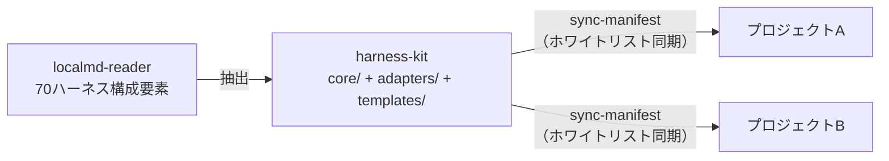
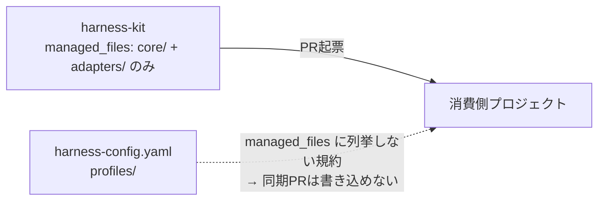

# harness-kit v0.1.0 — 初回リリースの記録

## TL;DR

70ハーネス構成要素の移植可能な部分を3層に抽出した [harness-kit](https://github.com/Yos-K/harness-kit) を、2026-06-07 に v0.1.0 として公開した。同期機構がホワイトリストベースである点が設計の核であり、消費側の固有設定を上書きしない保証を仕組みとして持つ。

---

## なぜリリースしたか

複数プロジェクトで同じハーネスを維持するコストが積み上がっていた。だから共通部分を中央リポジトリに抽出し、sync-manifest で自動同期できる仕組みを作った。

---

## v0.1.0 に含まれるもの

| 機能 | 説明 |
|---|---|
| **3層構造** | `core/`（汎用）・`adapters/android-jvm/`（Android/JVM固有）・`templates/`（新規プロジェクト用） |
| **インストーラ** | プロファイル選択（minimal/standard/full）対応、違反検知（managed_files 禁止パス） |
| **sync-manifest** | ホワイトリストに列挙したパスのみ PR を起票する同期機構 |
| **シークレットスキャンゲート** | CI での自家適用（`check-no-committed-secrets.sh`） |
| **SemVer管理** | ratchet 閾値の引き下げ = MAJOR 変更として規約化 |

---

## 設計の核: ホワイトリストベース同期

なぜ固有設定の上書きを防げるか。

ブラックリスト除外ではなく、ホワイトリスト許可が保証の核となっている。CONTRIBUTING.md にも「managed_files に `src/**`・`harness-config.yaml`・`profiles/` を列挙することを禁止する」として明文化した。

---

## 正直な限界

- **スキーマレベルの managed_files 検証は未実装**（v0.2 ロードマップ）。現在は規約依存のため、手動ミスによる違反を構造的に阻止できていない
- Android/JVM アダプタのみ対応。Python・iOS アダプタは将来の MINOR リリースで追加予定
- タグ比較での更新検知は `semver-compare.sh` が担うが、SemVer 外のタグへの耐性は未検証

---

## 参照

- [harness-kit GitHub リポジトリ](https://github.com/Yos-K/harness-kit)
- [v0.1.0 GitHub Release](https://github.com/Yos-K/harness-kit/releases/tag/v0.1.0)
- [ハーネス3層分類の設計](./harness-3layer-classification.md) — 3層モデルの詳細
- ハーネス移植性アーキテクチャ設計書（非公開）— 設計書
