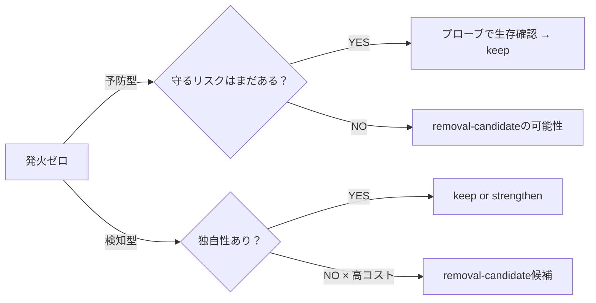

# ハーネスROI評価フレームワーク — 投資と効果を実測で比較する手順

## なぜ評価が要るか

ハーネスは追加した瞬間は価値が明確に見える。時間が経つと、効いている層とコストだけ残って効いていない層に分かれる。定期評価なしに放置すると維持費が累積し、真に効果のある層への投資が圧迫される。

**だから**: 投資と効果を実測で比較し、各層に `keep / strengthen / downgrade-to-advisory / removal-candidate` の4区分を機械的に適用する手順を持つ。

> **前提ノート**（フレームワークはこれらの上に乗る）
> - [ハーネスへの投資をどう考えるか](harness-investment.md) — なぜ層を選ぶか・必須コアの考え方
> - [ハーネス層の有効性評価とライフサイクル](harness-effectiveness-review.md) — 検知型/予防型の区別・撤去判断の構造

## 2軸の評価構造

投資対効果は「分母: 維持コスト」「分子: 効果」の比で測る。

```
ROI = 効果（発火実績 × 独自性） ÷ 維持コスト（CI時間 × 頻度）
```

**構築費はサンクコスト** — 分母に含めない。評価対象は継続的に発生するコストのみ。

### 維持コストの主要要素

| コスト要素 | 測定方法 |
|---|---|
| CI実行時間 × 発火頻度 | `gh run list` で分布・頻度を集計 |
| flaky対応コスト | `conclusion=failure` を手動/flaky起因に分類 |
| false positive対応コスト | PRでオーバーライドした件数 |
| 用語集・ルール文書の同期コスト | glossary/rule-doc の発火履歴 + doc stale実例数 |

### 効果の主要要素

| 効果要素 | 測定方法 |
|---|---|
| 発火実績（検知型） | 実PRで落ちて本物の是正につながった件数 |
| 検知の独自性 | 他層と重複していない失敗モードを捕まえているか |
| 予防型の生存証明 | 合成違反プローブで対応ゲートが落ちるか確認 |

## 検知型と予防型で評価軸が違う

ハーネス層には2種類あり、同じ指標で評価すると誤判定を生む。

**検知型**（unit/mutation/smoke/Codex等）: 既にあるバグを捕まえる。
評価軸: 発火実績 × 独自性 ÷ コスト。

**予防型**（fitness系: 禁止権限・secrets・INTERNET不在等）: ある種の間違いを抑止する。

- **発火ゼロが正常動作** — 落ちない理由は「効いていて誰も通せないから」
- 評価は2経路: (1) 守っている前提リスクがまだ実在するか (2) 合成違反プローブで落ちることを確認

## 反事実問題 — 発火ゼロ ≠ 無価値

「一度も落ちない = 無駄」と誤判定すると最重要な予防層を消す事故が起きる。



### removal-candidate の積判定3条件（3つ全部揃って初めて候補）

| 条件 | 内容 |
|---|---|
| ① 高コスト | CI時間 × 頻度が大きい、または同期コストが大きい |
| ② 独自性ゼロ | 他層と同じものしか検出しない（検知型）/ 守るリスクが消滅・完全重複（予防型） |
| ③ 発火ゼロ or 守るリスク消滅 | 検知型で一度も捕まえていない / 予防型で前提リスクが消えた |

**積が成立しないケース（keep が原則）**:
- 安価な衛生チェック（grep程度）: コスト≒0 のため条件①が不成立 → 発火ゼロでも keep
- 条件②のみ: 独自性がなくても安価なら消すメリットがない
- 学習目的PJ: 判定は記録のみ・削除実行しない

## 判定4区分の基準

| 区分 | 適用基準 | 対応 |
|---|---|---|
| **keep** | 独自性あり、または安価 | 現状維持 |
| **strengthen** | 発火実績あり × カバー漏れ判明 | テスト追加・閾値引き上げ等 |
| **downgrade-to-advisory** | 高コスト × 低独自性だが価値残存 | `required`から非必須へ降格。即撤去しない |
| **removal-candidate** | 積判定3条件全成立 | AIは提案のみ。撤去は人がPRで承認 |

**安全制約（予防型）はメトリクスで自動撤去しない。** 外す判断は製品側の判断でのみ行う。

## プロジェクト規模別 適正ラダー

プロジェクトの特性を5軸で宣言すれば、導入推奨ティアが導ける。

```yaml
# profile.yaml — 導入先プロジェクトが宣言する特性
size: small | medium | large
lifetime: throwaway | year | multi-year
change_freq: low | high
state_complexity: low | high   # Alloy層の要否に直結
failure_impact: low | high     # 課金・個人情報の有無等
```

| ティア | 含まれる層 | 想定プロファイル |
|---|---|---|
| **minimal** | 衛生チェック + unit small + ビルド再現 + PR保護 | failure_impact=low × size=small |
| **standard** | minimal + medium・mutation advisory・test-smell・balance | ロジック有・lifetime=year+ |
| **full** | standard + mutation required・Alloy・smoke L1-L5・PBT網羅 | state_complexity=high × failure_impact=high |

**AIエージェント駆動の場合は1段厚くする。**
プロンプトの約束は確率的にしか守られないが、機械的なゲートは決定的に守られる。

## localmd-reader での初回評価結果（2026年6月）

**対象**: localmd-reader（Android学習目的PJ）の CI/CDハーネス全17層。
**評価実施**: 独立レビュー担当（2026-06-07）

| 区分 | 件数 |
|---|---|
| keep | 15 |
| strengthen | 2 (mutation testing・theme-screenshots) |
| downgrade-to-advisory | 0 |
| removal-candidate | 0 |
| ギャップ（未整備） | 1 (プロダクションThread.sleep検知) |

**removal-candidateがゼロである理由**: 学習目的PJは「網羅が投資」であり（[投資ノート](harness-investment.md)）、コスト面でも積判定①が成立した層がなかった。

**Key Findings**:
1. **予防型評価の最大の実用価値**: 予防型6ゲート全てが合成違反プローブで生存証明済み。「発火ゼロ=無駄」の誤判定を構造的に回避。
2. **フレームワークは過剰投資と穴の両面を見る**: removal-candidate候補なし（過剰なし）＋ Thread.sleepギャップ発見（穴あり）の両方を同一手順で検出。
3. **要注意信号の早期検知**: theme-screenshots の失敗率27.8%はflaky判定の閾値に近い。flaky放置は「誰も赤を見なくなる」劣化の入口。

**C-7 投資判断 → 縮小導入（2026-06-07）**: ROIフレームワーク初の実戦適用で3点が確定。
- ①縮小導入: uiautomator dump方式の領域限定比較（`scripts/visual-regression-check-limited.sh`）
- ②flaky先行: theme-screenshots flaky解消（PR #134）を先行
- ③フル比較見送り: ROI不成立（発火実績乏しい・コスト高・影響半径小）

**詳細**: localmd-readerのdocs/harness/harness-roi-evaluation-2026-06.md を参照。

## 評価手順サマリ

```
① 発火実績を収集（実PR履歴から検知型の発火を計上）
② CIコスト・頻度を収集（gh run list で集計）
③ 合成違反プローブを実施（予防型のみ — 生存証明）
④ 検知型: (発火数 × 独自性) / (CI時間 × 頻度) を算出
   予防型: プローブ生存確認 + 前提リスクの実在確認
⑤ §反事実問題の積判定3条件を評価し、4区分を適用
⑥ 各判定に「なぜ→だから」と一次資料リンクを付記
   根拠が取れない項目は「未確認（○○の調査が必要）」と明記
⑦ removal-candidateはPRで人が承認してから撤去
```

**憶測記載禁止**: コードを読まずに判定を埋めない。根拠が取れない項目は空欄でなく「未確認」と書く。
