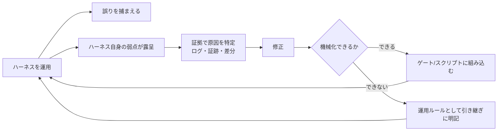

# ハーネスの自己修正ループ — 弱点はどう見つかり、どう塞がれたか

## このノートの目的

ハーネスは初期構築で完成しない。運用すると**ハーネス自身の弱点**が露呈する。
このノートは、実プロジェクト（LocalMD Reader）の2日間・13 PRの実録から、
(1) ハーネスが何を捕まえたか、(2) ハーネスの弱点が**何の証拠で**発見されたか、
(3) どう解決したか、(4) その解決が**ハーネス自体の強化**としてどう戻ったか、を記録する。
読者が持ち帰るべきは個別の修正ではなく、**証拠駆動で弱点を見つけ、機械化して返すループ**の形。

## まず成果: 2日間でハーネスが止めた誤り（8種・全てマージ前）

| 止めた層 | 誤り | 補足 |
|---------|------|------|
| コントラスト適応度テスト（新設） | アクティブタブ白文字のWCAG違反×3テーマ（1.59〜2.54:1） | 7テーマ×目視レビューを実際にすり抜けていた |
| テストスメル検出器 | **新設ゲート自身の欠陥**（ループで違反が隠れる・空振り緑の余地） | ハーネスがハーネスを検査した例 |
| Robolectric medium テスト | SDK 35 の NPE（`getInsetsController` が decor 未生成参照） | 実装者のAPI理解誤り |
| 同上 | Android 15 で `setStatusBarColor` が no-op（edge-to-edge強制） | プラットフォーム仕様変更の検知 |
| 同上 | `getEffectColor` はコンストラクタ色のgetterではない、というAPI誤解 | 「もっともらしい誤り」の典型 |
| AIレビュー＋会話解決必須ゲート | 修正の横展開漏れ（別ボタンの同種ハードコード）他3件 | 解決必須が「無視してマージ」を機械的に防いだ |
| 撮影ハーネスの証跡（画像） | エッジスワイプがOSのBackジェスチャーに食われアプリ退出 | 画像が原因を自己説明した |
| 同上（動画フレーム数） | アニメーションが録画に写っていない | 後述の弱点W4として発見 |

## 弱点の実録: 発見方法 → 解決 → ハーネスへの還元

### W1: ローカルミラーのドリフト（preflight にスメル検出器が無い）

- **発見**: ローカル preflight 全PASSで push → CI の test ジョブが **19秒で FAIL**。
  「ローカル緑・CI赤」という差分そのものが、ミラーの欠落箇所を指した。
- **解決**: 当初は「push 前に検出器も手で回す」**手順**で回避。後日、preflight にチェック6として組み込み
  （純grepでSDK不要なので、fitnessミラーに同居できると判断）。
- **還元**: ローカルミラーが CI に再同期。導入時は**欠陥挿入**（行頭 `for (` 入りテストを一時作成→FAILを確認→復元）で
  ゲート自体の検出力を検証した。
- **教訓**: ローカルミラーは作った瞬間からCIとドリフトし始める。**手順による防御は忘れたら再発する**。
  見つけた瞬間に機械化候補としてキューに積むこと。

### W2: auto-merge のレースでコミットがマージから漏れた

- **発見**: マージ後の**コンテンツ検証**（`git show main:対象ファイル` とブランチの比較）。
  レビュー対応コミットを push した直後にスレッドを解決したところ、新コミットのチェック完了を待たず
  **旧 head でマージが発火**し、対応コミットが main に入っていなかった。
- **解決**: cherry-pick で再提出。機械的防止は GitHub の仕様上困難と判断し、
  「レビュー対応 push 後のスレッド解決は**新コミットのCI完了後**」を運用ルール化、引き継ぎ資料に明記。
- **還元**: 「マージ後にマージコミットの内容を検証する」工程を標準手順に追加。以後の全マージで実施。
- **教訓**: ゲートの**評価タイミング**には穴がある。マージは「ボタンを押した」でなく「中身が入った」で完了と見なす。

### W3: 憶測修正の連鎖（dumpsys ポーリング2連敗）

- **発見**: 撮影スクリプトの起動待ちポーリングが2回連続でタイムアウト。一方 logcat 証跡は
  「アプリは約7秒で正常表示・クラッシュ0」を示しており、**証跡と検知器の矛盾**が
  「壊れているのはアプリでなく検知ロジック」だと特定した。
- **解決**: 2連敗の時点で**停止**し（リトライプロトコル）、代替案を提示してユーザー判断を仰いだ。
  採用案は「実績ベースの固定waitに後退＋**診断出力を常設**」: dumpsys の実形式を毎回 artifact
  （focus-diagnostics.txt）に保存し、将来ポーリングへ戻す際の根拠を先に確保した。
- **還元**: 撮影ハーネスは「失敗したら原因分類に足る証拠を自動で残す」構造になった
  （logcat・スクリーンショット・UIダンプ・診断出力）。
- **教訓**: **見たことのない出力に対して grep を書かない**。憶測修正は2回で止め、診断を先に仕込む。

### W4: 録画にアニメーションが写らない（既定値の罠）

- **発見**: `ffprobe` でエンコードフレーム数が **6枚**しかないという数値的証拠。
  CI のエミュレータランナーが**既定でアニメーションスケールを0にする**ことが原因だった。
- **解決**: 視覚証拠を撮るワークフローでは `disable-animations: false` を明示（理由コメント付き）。
  アニメ有効化で今度は uiautomator の idle 取得が遅延 → assert にリトライ＋失敗時証跡保存を追加。
- **還元**: 皮肉にも最初の「写らない録画」は**アニメ無効環境で即時切替し状態も壊れない**ことの実機証明になった
  （受け入れ条件の1つが、設定ミスの副産物として検証された）。
- **教訓**: ランナー/フレームワークの**既定値は自分の目的と逆**のことがある。証拠の「量」（フレーム数）も検査対象にする。

## 一般化できる5つの学び

1. **検知器は「落ちた/通った」だけでなく分類可能な証跡を残す**。W1〜W4 すべて、発見の決め手は
   ログ・画像・フレーム数・差分という「あとから誰でも検証できる証拠」だった。
2. **ローカルミラーはドリフトする**。CI に新しい検査を足したら、ミラーへの反映を同じPRで問うこと。
3. **手順は忘れたら再発する**。手順で塞いだ穴は機械化候補のキューに積み、順に潰す（W1は実際に後日機械化した）。
4. **ハーネスはハーネスを検査する**。新設ゲートの品質を既存ゲートが弾き、直した結果ゲートの検出力が上がった。
   層が増えるほど次の追加が安全になる——投資が複利で効く実体はこれ。
5. **機械化できない穴は、引き継ぎ文書の「注意事項」として明文化する**（W2）。文書化は機械化の代替ではなく、
   次に機械化するまでのつなぎと位置づける。

## 数字（実測）

- 期間: 2日 ／ マージ: 13 PR ／ ハーネスが止めた誤り: 8種
- main に到達した欠陥: **1件**（W2のレース。マージ後検証で即日検知・修復）
- 撮影ハーネスが安定するまで: 7 run（失敗3回は全て証跡から原因特定）
- 弱点の機械化: W1=ゲート化済み、W3/W4=証跡自動保存として組み込み済み、W2=運用ルール（機械化不能と判断）

関連: [ハーネスエンジニアリングで学んだこと](harness-engineering.md) ／
[ハーネス層の有効性評価とライフサイクル](harness-effectiveness-review.md) ／
[ミューテーションテスト](mutation-testing.md)
