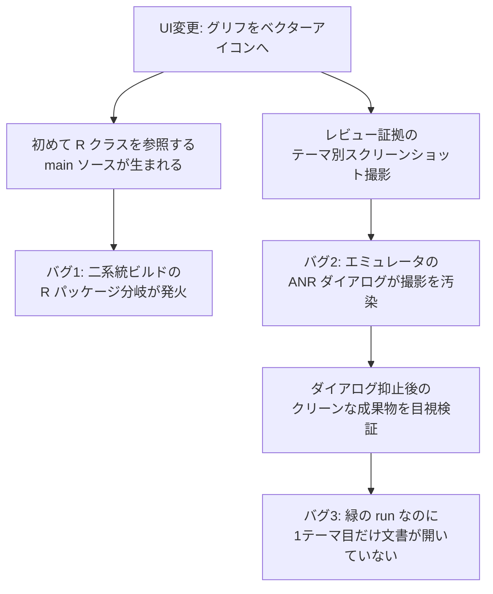
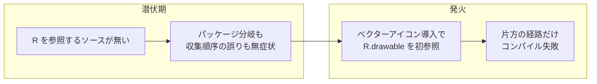
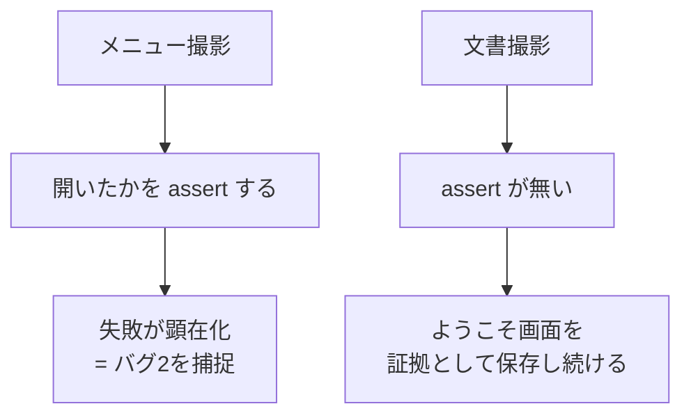

# 潜在バグの考古学 — 一つのUI変更が掘り起こした3つのバグ

## このノートの目的

「テキストのグリフ（☰・×）をベクターアイコンに置き換える」という小さなUI変更が、
数百コミット潜伏していたビルドスクリプトのバグと、レビュー証拠を撮るハーネス自身の2つの盲点を、
連鎖的に露出させた。このノートは3つのバグそれぞれについて
**(1) どう混入したか、(2) なぜ潜伏できたか、(3) 何がきっかけで見つかったか、(4) どう対処したか**を記録する。
持ち帰るべきは個別の修正ではなく、「**潜在バグは『最初に踏む変更』が来るまで眠る**。
だから踏んだときに**推測でなく観測で**真因へ到達できる証跡を、平時から仕込んでおく」という原則。

## 前提: 二系統のビルド経路

このアプリには成り立ちの事情で2つのビルド経路がある。

| 経路 | ツール | 用途 |
|------|--------|------|
| Gradle | Android Gradle Plugin | CI の `gradle-build` ジョブ、IDE |
| 手書きスクリプト | aapt2 + javac + d8 を直接呼ぶ | 実機 (Termux) でのビルド、CI の検証ジョブ、署名付きリリース |

同じソースを2つの経路でビルドできることは利点だが、**「2経路が同じ成果物を作る」ことを検証するゲートは無かった**。
これがバグ1の土壌になる。

## バグ1: 二系統ビルドの R パッケージ分岐

### 混入原因

Android のリソースコンパイラ aapt2 は、リソース ID 定数クラス `R.java` を
**manifest の package 属性から導いたパッケージ**に生成する。一方 Gradle は
**ビルド設定の namespace** から導く。手書きスクリプトはデバッグビルドを
リリースと共存インストールするために manifest の package へ `.debug` を後付けしていたので、

- 手書き経路: `io.github.yosk.mdlite.debug.R`
- Gradle 経路: `io.github.yosk.mdlite.R`

と、**同じソースツリーに対して R のパッケージが分岐**していた。
さらに手書きスクリプトには第二の欠陥が重なっていた。javac に渡すソース一覧を
**aapt2 link の前に**収集していたため、link が書き出す `R.java` がそもそも
コンパイル対象に入らない。生成ソースの先客（BuildConfig.java）は収集より前に
書き出されていたから、この順序の誤りは何も壊さずに居座れた。

### なぜ潜伏できたか

**R を参照する main ソースが1つも無かったから。**
このアプリは UI をコードで組み立てており、アイコンも `☰` や `×` という文字グリフだった。
リソース参照が要らない世界では、R がどのパッケージに生成されようと、
javac に渡されなかろうと、誰も困らない。この状態が数百コミット続いた。

### 見つかった経緯と診断

ベクターアイコンの PR が `R.drawable.ic_menu_20` などを import した瞬間、
Gradle 経路は通るのに手書き経路の CI ジョブだけが落ちた。

診断で効いたのは「**推測で直さず、まず観測する**」だった。
1回目の修正（ソース収集を link 後へ移動）では直らず、ここで原因を推測して
修正を重ねる誘惑があったが、代わりに**生成ツリーをダンプするだけの診断コミット**を入れた。
出力には `io/github/yosk/mdlite/debug/R.java` が写っており、
「R は生成されているが**別のパッケージに**生成されている」という真因が一発で確定した。

### 対処

| 欠陥 | 対処 |
|------|------|
| ソース収集が link より前 | 収集を aapt2 link の**後**へ移動し、理由をコメントで併記 |
| R のパッケージ分岐 | aapt2 link に `--custom-package` を渡し、manifest が `.debug` でも R を base パッケージに固定 |

そして**レビューの横展開**が仕上げになった。PR レビューで
「同じ手順を持つ署名付きリリース用スクリプト2本も、収集が link より前のままではないか」
という指摘が入った。リリース用スクリプトは PR の CI では実行されないため、
ここを直さなければ**次のリリース作業で同じバグを踏む**ところだった。
同種の欠陥がコピー先に残っていないかを探すのは、レビューの定石として機能した。

## バグ2: エミュレータの ANR ダイアログが撮影を汚染

見た目を変える PR は、7テーマ分のスクリーンショットを CI のエミュレータで自動撮影し、
レビュー証拠として添付する運用にしている。そのレビュー用 artifact のリンクを共有した後で、
**撮影 run 自体が失敗していた**ことが分かった。

### 見つかった経緯

撮影ハーネスは失敗時に **UI ダンプとスクリーンショットを証跡として保存する**よう作ってあった。
その証跡画像を開くと、アプリと新アイコンは正常に描画されているのに、
画面の中央を **「Pixel Launcher isn't responding」という OS の ANR ダイアログ**が覆っていた。
メニューを開くタップはこのダイアログに食われていた。つまりアプリの欠陥ではなく、
ヘッドレスエミュレータでランチャーが応答不能になるという環境ノイズである。
**証跡画像1枚が、ログを掘るまでもなく真因を自己説明した。**

### 対処

エミュレータの設定でエラーダイアログ自体を抑止する（`hide_error_dialogs`）。
置き場所は撮影スクリプト本体ではなく **CI の workflow 定義側**にした。
スクリプトは実機に対しても使うので、共用スクリプトが実機のグローバル設定を
黙って書き換えるのは侵襲的すぎる、という線引きである。

## バグ3: 緑の run が嘘をつく — 開いていない文書を「撮影成功」と報告

### 見つかった経緯

ANR 対策後の再撮影は**全テーマ成功（緑）**で完了した。だが成果物を目視検証すると、
7テーマ中**1番目のテーマだけ**、開いているはずの fixture 文書が開かれておらず、
ようこそ画面のスクリーンショットが「文書ビューの証拠」として保存されていた。
もう一度 run しても同じ1番目だけが再現し、2番目以降は毎回正常だった。
APK インストール直後の最初の起動だけ、文書を開く intent が反映されていないように見える
（正確な機構は当時のログが無く未確認。確認には初回起動時の logcat の保存が必要）。

### 混入原因

ハーネスの**事後条件の assert が非対称**だったこと。
メニュー撮影には「メニューが本当に開いたか」を UI ダンプで確認する assert があり、
実際にバグ2はこの assert が捕まえた。一方、文書撮影には
「**文書が本当に開いたか**」の assert が無く、intent の成功を暗黙に信頼していた。
assert の無い側だけが、静かに嘘の証拠を量産した。

### 対処

文書撮影の前に「fixture のタブが画面に存在するか」を UI ダンプで assert し、
無ければ**アプリが温まった状態で同じ intent を再送**してリトライする
（2番目以降のテーマが毎回通っている、実証済みの経路に載せ直す）。
リトライしても開かなければ、UI ダンプ・スクリーンショット・logcat を証跡保存して fail する。
あわせて、前のテーマの UI ダンプが端末に残って偽の成功判定を生まないよう、
ダンプ取得前に古いダンプを削除するようにした。

## 横断する教訓

1. **潜在バグは「最初に踏む変更」が来るまで眠る。** コードが古いことは安全を意味しない。
   むしろ参照されない経路（リリーススクリプト、未使用の生成物）ほど検証から漏れる。
2. **同じ成果物を作るはずの複数経路は、同一性を検証しない限り発散する。**
   片方だけ直して安心しない。コピーされた手順の**全箇所**へ横展開する。
3. **推測で直さず、観測してから直す。** 観測だけの診断コミットは遠回りに見えて、
   修正の試行錯誤を1回で打ち切る最短路だった。
4. **失敗時に証跡を残す投資は回収される。** 証跡画像1枚で真因が確定したのは、
   失敗パスの設計に事前投資していたからである。
5. **緑の run の成果物も検証する。** 証拠を作るハーネスは、事後条件
   （「写っているべきものが写っているか」）を assert しない限り、黙って嘘をつく。
   assert は対称に張る。片側だけの assert は、無い側の嘘を覆い隠す。

## 関連ノート

- [ハーネスの自己修正ループ — 弱点はどう見つかり、どう塞がれたか](harness-self-correction.md)
  — ハーネス自身の弱点を証拠駆動で塞ぐループの実録。本ノートのバグ2・3はこのループの新しい実例
- [ハーネスエンジニアリングで学んだこと](harness-engineering.md) — ゲートと証跡の全体設計
- [ミューテーションテストで学んだこと](mutation-testing.md) — 「テストが通る」と「検出できる」の差
