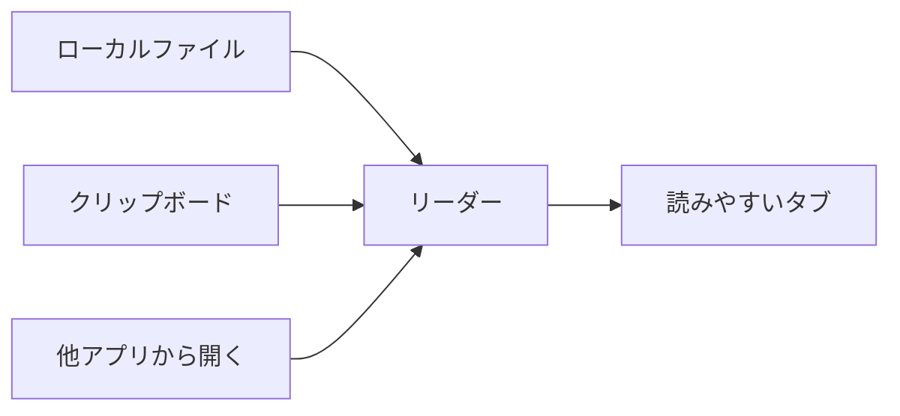
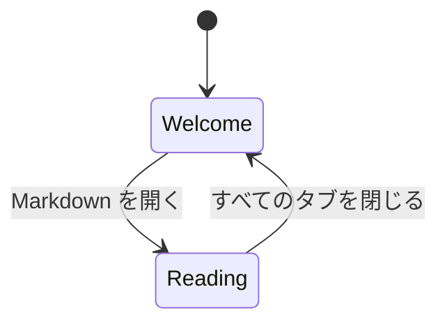
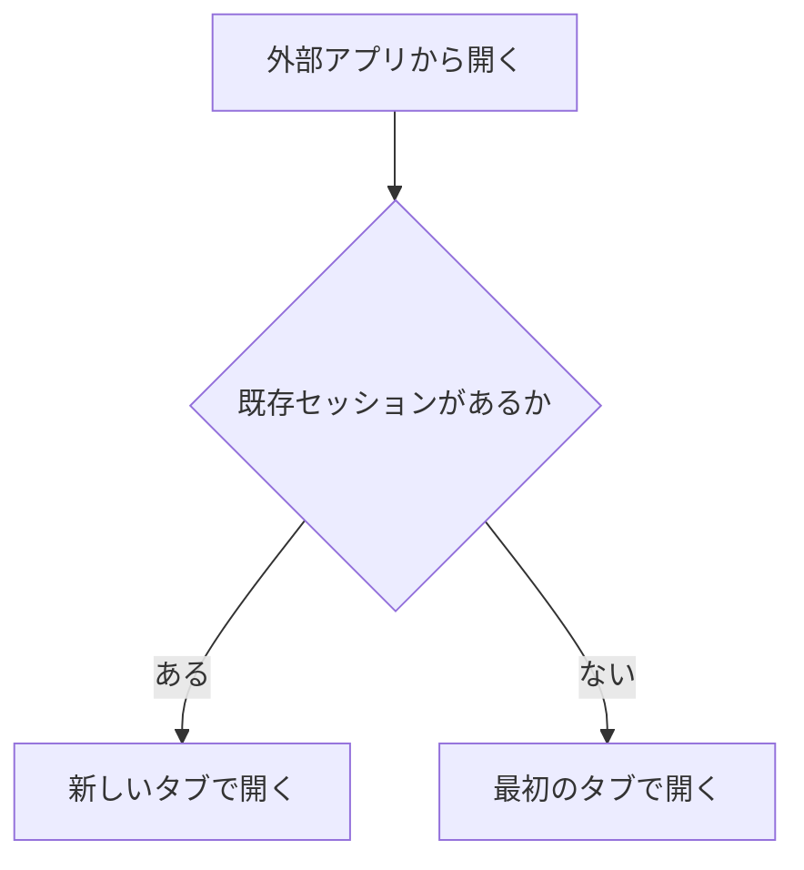
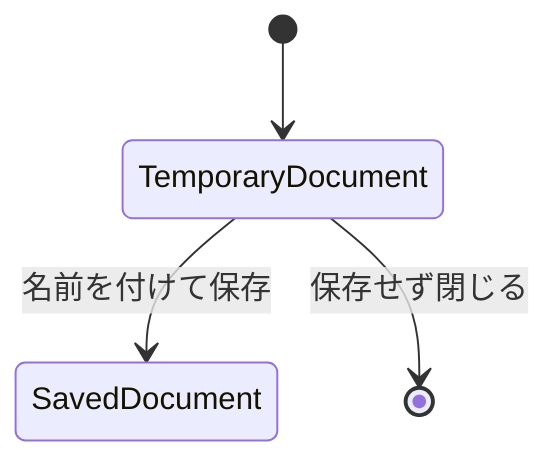
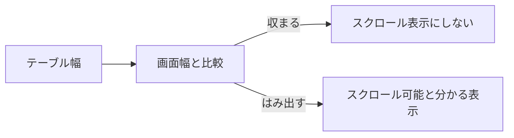
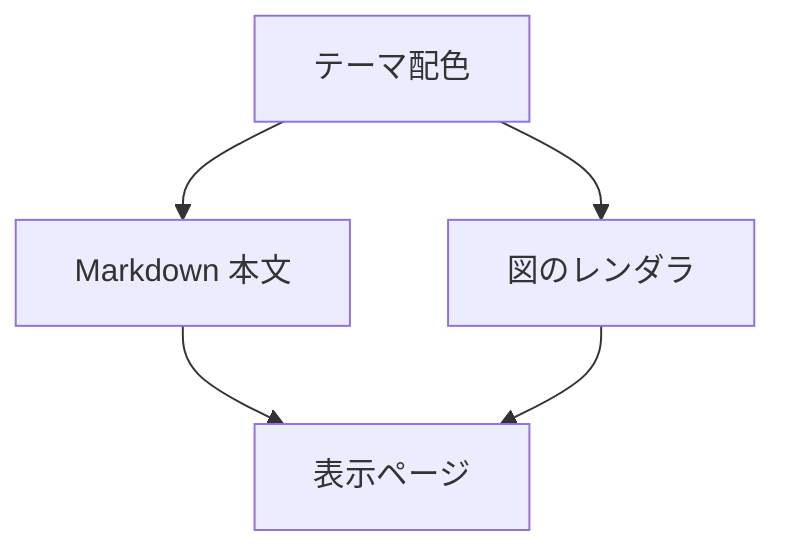
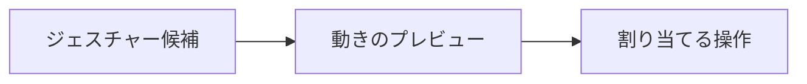

# モバイル Markdown リーダーで学んだこと

## プロダクトの形

モバイルの Markdown リーダーは、アプリ内のファイル選択だけでなく、実際の受け渡し経路に対応して価値が出る。

## UX

### 空の状態は次の操作を明確にする

空の画面は、次に何をすればよいかが分かる必要がある。

ボタンに見えるものは、実際に押せるようにする。

### 文脈を失わせない

他アプリから 2 つ目のファイルを開いたとき、最初のファイルを黙って置き換えない。

### 一時的な内容は通常ファイルと分ける

クリップボードや選択テキストは、保存するまでは一時的な内容として扱う。

通常のファイルタブと同じ扱いにすると、保存導線やメッセージ表示が破綻しやすい。

## レンダリング

### テーブルの横スクロールは必要なときだけ見せる

横スクロールできる見た目は、実際に横幅が足りないときだけ表示する。

### 図はテーマに合わせて描画する

ダークテーマでは、Markdown 本文だけでなく図の線や文字色も調整する。

## ジェスチャー

ジェスチャーは文章で説明するより、小さなアニメーションで伝えるほうが分かりやすい。

通常のスクロールがジェスチャーとして誤判定されないようにする。

