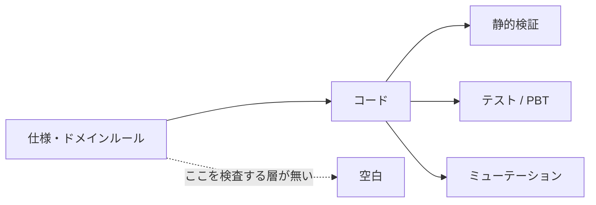
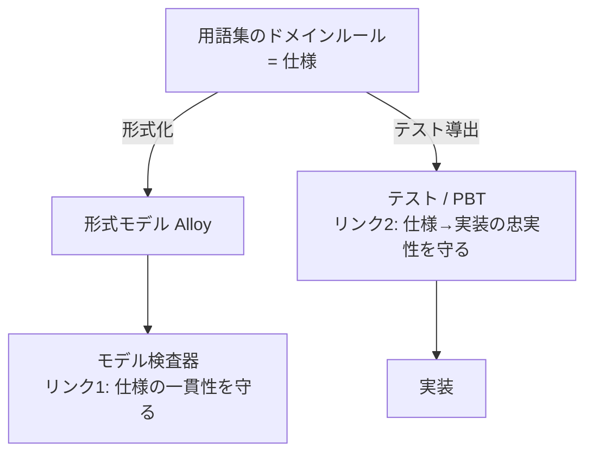
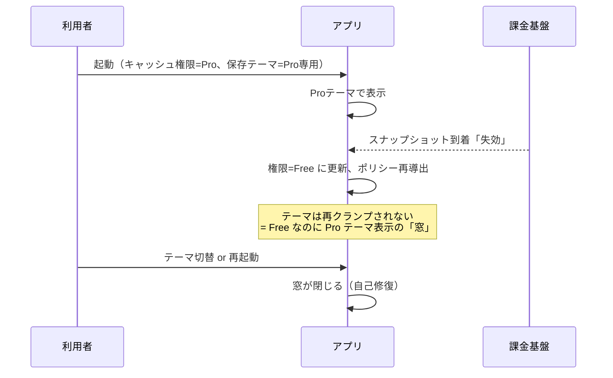
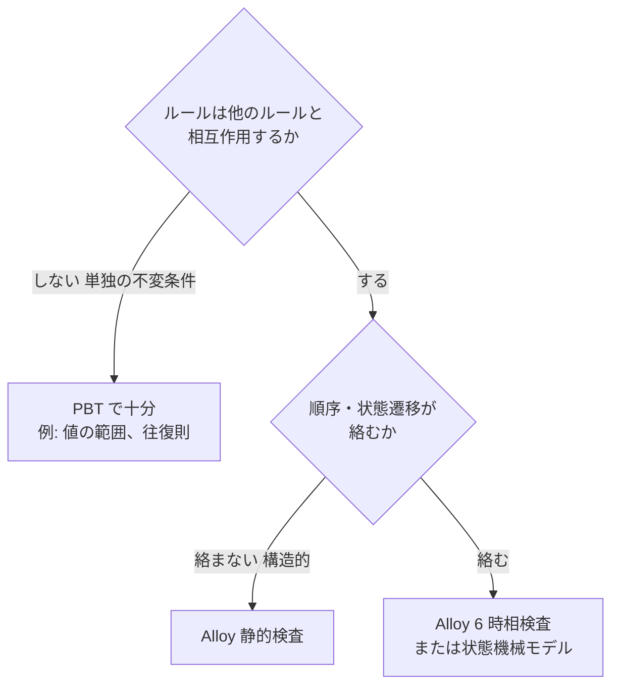

# モデル検査を設計段階のハーネスにする

## このノートの目的

型・テスト・CI といった既存のハーネスは、すべて**コード**を検査する。しかしドメインルール同士の矛盾や、
仕様変更が既存の保証を壊すシナリオは、コードが書かれるまでどの層にも映らない。このノートは、
モデル検査（Alloy）を「仕様そのものを検査するハーネス」として位置づけ、実プロジェクトで試行した
結果と、適用基準・限界を記す。読者は「コードより左に、もう一枚ふるいを置く」具体的な方法を得る。

## 問題: 仕様の誤りは最も高くつくのに、最も検査されていない

誤りは左で止めるほど安い、という原則でハーネスを多層化してきた（[ハーネスエンジニアリングで学んだこと](harness-engineering.md)）。
だが既存の層には共通の前提がある。**検査対象はコードである**ということだ。

ドメインルールは相互作用する。「権限が使えるテーマの範囲を決める」「切替は範囲内を巡回する」
「読み込み時に範囲外の保存値を絞る」——個々のルールが正しくても、組み合わせると矛盾したり、
新しいルールの追加が古い保証を静かに壊したりする。この種の誤りは実装後にテストで発覚するか、
最悪の場合は出荷後に発覚する。仕様の誤りは直す頃には最も高くついている。

## 中心の考え方: モデルは実装の鏡ではなく、仕様そのものにする

モデル検査の古典的な失敗は **model-code gap** にある。実装と別にモデルを書くと、検査が緑でも
保証されたのはモデルであって実装ではなく、モデルと実装の同期維持という新たな腐敗ポイントが生まれる。

この罠は、モデルの役割を変えると消える。モデルを「実装の写し」ではなく「**検査可能な形式で書いた仕様**」
とみなす。すると保証の連鎖は2本のリンクに分かれ、それぞれ別の道具が守る。

検査器は「ルール群が無矛盾か」「仕様変更後も既存の保証が立つか」を守り、
仕様と実装のずれは従来どおりテストと PBT が守る。モデルが実装を追いかける必要はない。

## 何が機械的に止まるか

| 検査 | 止まる誤り | 従来の防御 |
|---|---|---|
| 無矛盾性 | ルール同士の衝突（全ルールを満たす実例が存在しない） | 人間の脳内突き合わせのみ |
| 実例の列挙 | 過少制約 = 仕様が許してしまう「変な世界」の可視化 | なし |
| 仕様変更リグレッション | 新ルールが既存の保証を壊すシナリオを、実装前に反例トレースで提示 | 実装後のテストで発覚 |

特に2つ目は、ドメイン知識の構築時に効く。検査器に「この仕様を満たす実例を列挙せよ」と頼むと、
書いていない前提が具体物として現れる。「この実例、許していいんでしたっけ？」という会話が、
抽象的なレビューではなく目の前の反例を指して行える。

## 実例: Markdown リーダーのテーマ権限ルール

実プロジェクトで、用語集の L2 ルール「使えるテーマと切替の巡回は権限から導く」
（Free は light/dark、Pro は全7種）を Alloy 6 で約140行に形式化し、7つの検査を書いた。

結果は二層だった。**静的な保証4件**（切替の行き先は常に権限内・巡回で全テーマに到達できる・
読み込み境界は保証を確立する・許可された保存値は失われない）はすべて反例なし。一方で
**セッション動作の検査が反例を1件検出**した。

この「窓」は、用語集が「読み込み境界で絞る」とだけ書いていた未定義領域を検査器が突いたものだ。
2状態の最小トレースとして提示されたので、議論は「直すか、許容するか」に即座に進めた。
同じモデルで**自己修復性も証明**できた（切替1回または再起動で必ず保証が回復する）ため、
「許容」の選択肢にも根拠があった。最終判断は「再クランプ追加」となり issue 化された。
修正が入るとき、モデルの期待注釈を「反例あり」から「反例なし」へ反転させる。
**仕様の変化がモデルの差分として現れる**——これがこの手法の目指す運用そのものだ。

仕様変更リグレッションも実証した。「8つ目のテーマを追加するが巡回順の更新を忘れる」という
変異をモデルに入れると、到達性の検査が期待違反で非ゼロ終了する。`expect` 注釈が
「期待される反例の有無」を宣言するので、仕様変更の影響が CI でゲートできる形になっている。

## 適用基準: どこに使い、どこに使わないか

- **使わない**: 単独で完結する不変条件（文字サイズの範囲など）。既存の PBT
  （[性質ベーステストで学んだこと](property-based-testing.md)）の守備範囲で、モデル化の利得がない。
- **使う**: ルールが交差する場所。権限×機能、状態遷移×永続化、複数エンティティにまたがる導出規則。
- 検査は有界（テーマ7種×権限2種のような小さな空間の全数探索）だが、この種のドメインルールの
  バグは小さいスコープで現れる。無限の状態空間を持つ並行システムとは要求が違う。

## 限界と歯止め

- **翻訳ギャップは残る**。意図→用語集→モデルの翻訳自体が誤りうる。緩和策は生成された実例を
  人が眺めること。変な実例が出たら翻訳ミスか過少制約のどちらかで、どちらにせよ発見が利益になる。
- **新しい成果物が増える**。モデルは用語集のルールが変わったら追従が要る。用語集とコードの同期を
  ゲートで強制しているのと同様に、「ルール変更時にモデル検査を促す」動線が要る。
- **助言的運用から始める**。発火実績のない検査を最初から必須ゲートにしない
  （[ハーネス層の有効性評価とライフサイクル](harness-effectiveness-review.md)の原則どおり）。
  今回の試行はランナーが環境不備時に skip する設計にし、ブロックしない形で導入した。
- **AI との分業が前提として効く**。用語集→Alloy の翻訳は AI が担い、検査器が決定的な拒否シグナルを
  返す。翻訳の質は実例レビューで人が確認する。決定的な部分と推論的な部分の役割分担そのものだ。

## 先行事例について

調査した範囲では、この組み合わせはまだ空白に近い。ハーネスエンジニアリングの主要文献
（OpenAI、Martin Fowler サイト、各社ガイド）の強制手段はリンタ・構造テスト・CI ゲートまでで、
形式手法への言及はない。形式手法側には AWS の TLA+ など設計検証の実績があるが、分散システムの
正しさが目的で「AI エージェント開発ループの設計段階ゲート」という枠組みではない。LLM と形式仕様の
研究（仕様を中間生成物にしてコード生成の信頼性を上げる系）は近接しているが、仕様自体の無矛盾性検査や
仕様変更リグレッションには届いていない。3つの領域が近接しているのに交点が空いている、という状況だ。

## 関連

- [ハーネスエンジニアリングで学んだこと](harness-engineering.md) — 全体の層構造。本ノートはコードより左の層
- [ハーネスへの投資をどう考えるか](harness-investment.md) — 過剰投資の回避。L2/L3 限定はこの原則の適用
- [ハーネス層の有効性評価とライフサイクル](harness-effectiveness-review.md) — 助言的導入と発火実績による昇格判断
- [性質ベーステスト (PBT) で学んだこと](property-based-testing.md) — リンク2（仕様→実装の忠実性）を守る側
