# ミューテーションテストで学んだこと

## ミューテーションテストとは何か

カバレッジは「そのコードが実行されたか」しか示さない。テストがコードを通っていても、その行が壊れたときにテストが**落ちる**とは限らない。ミューテーションテストは、実装のバイトコードに小さな変更 (mutant) を機械的に加え、「テストがその変更を検出して落ちるか」を測る。

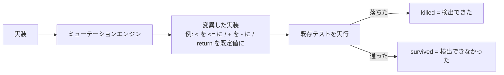

各 mutant の状態は次のように読む。

- **KILLED** … 壊したらテストが落ちた。良い。
- **SURVIVED** … 壊してもテストが通った。テストはあるが**アサーションが弱い**。
- **NO_COVERAGE** … その行を通る (例ベース) テストが無い。未カバー。

指標は二つに分けて見る。

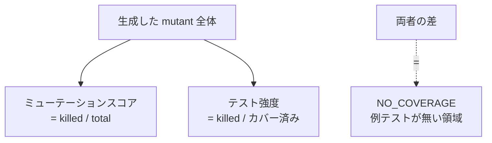

- **ミューテーションスコア** = killed / 全体。未カバーも含む全体の検出力。
- **テスト強度** = killed / (全体 − 未カバー)。*テストが触れている範囲*での検出力。

カバレッジが「実行したか」を測るのに対し、ミューテーションは「**検出できるか**」を測る。これがカバレッジに対する本質的な追加情報になる。

## どこをねらって作るか

闇雲に全 mutant を潰そうとすると消耗する。状態と価値で優先順位を付ける。

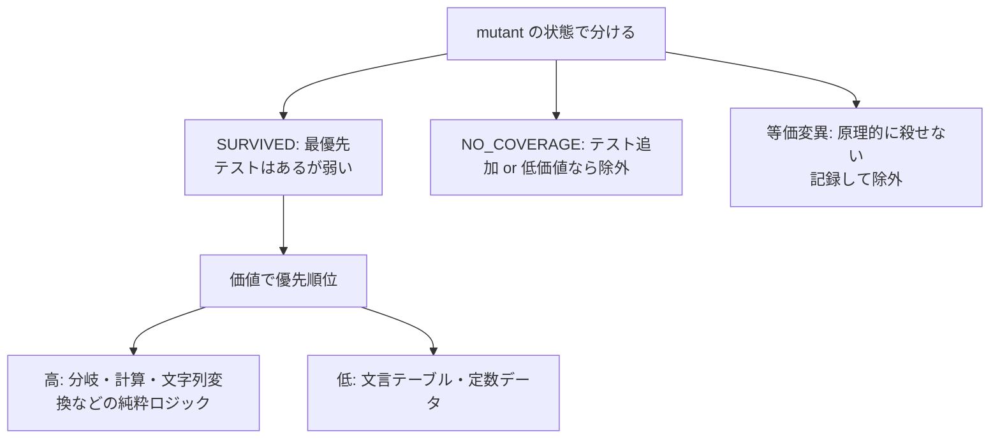

### 状態に応じた対応

- **SURVIVED を最優先**に潰す。「テストはあるのに壊れても気づけない」のが一番危ない。
- **NO_COVERAGE** はテストを足すか、価値が低ければ対象から外す (理由を残す)。
- **等価変異** (意味的に同じで原理的に殺せない mutant) は記録して除外し、スコアの責に帰さない。

### mutant の種類から不足テストを逆算する

どの mutant が生き残ったかを見れば、足りないテストの種類が分かる。

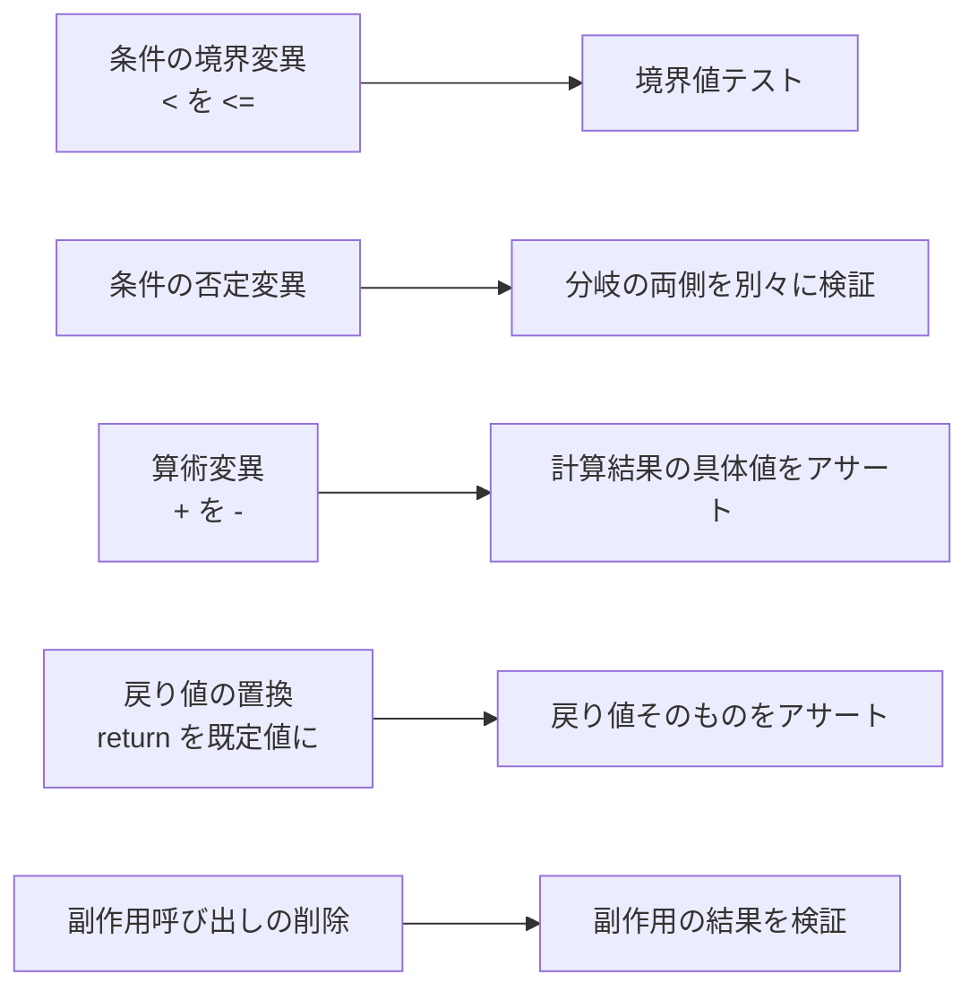

### 殺しやすい対象・殺しにくい対象

経験上、**入力と出力の対応が決まっている純粋関数**が最も殺しやすい。文字列変換 (コードハイライタのように、ソース文字列を整形済み文字列に変える処理) は、出力文字列を厳密にアサートするだけで、境界反転・否定・副作用削除・戻り値置換がすべて検出できる。

一方で殺しにくい対象もある。

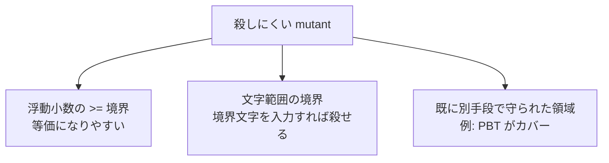

- **浮動小数の `>=` 境界**は、ちょうど等しい入力を作らないと殺せず、実質的に等価変異になりやすい。無理に追わない。
- **文字の範囲判定** (`'a' <= c && c <= 'z'` など) は、文字が離散なので**境界文字** (`a`/`z`/`A`/`Z`/`0`/`9` など) を入力に使えば、緩められた境界を確実に検出できる。
- すでに別の層 (たとえば性質ベーステスト) が実カバーしている領域の SURVIVED は、見かけより危険度が低い。

### 混ぜてはいけないもの

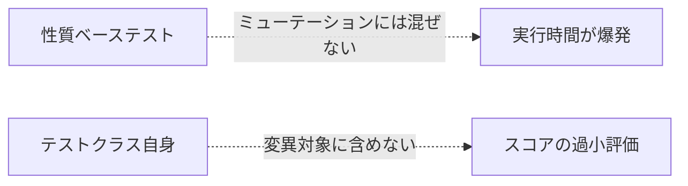

- **性質ベーステストを常用テストに混ぜない**。1 mutant あたり多数の生成ケースを再実行するため、組み合わせると実行時間が爆発する。検出力の測定は例ベーステストで行い、性質テストは通常のテストジョブで別に回す。
- **テストクラス自身を変異対象に含めない**。本番コードとテストが同じパッケージにあると、対象指定がテストまで巻き込み、「テストのテスト」が無いぶん大量に survive してスコアを過小評価する。本番クラスだけを対象にする。

## それによって得られた効果

例ベーステストの「弱い箇所」が**数値と具体名**で見えるようになった。

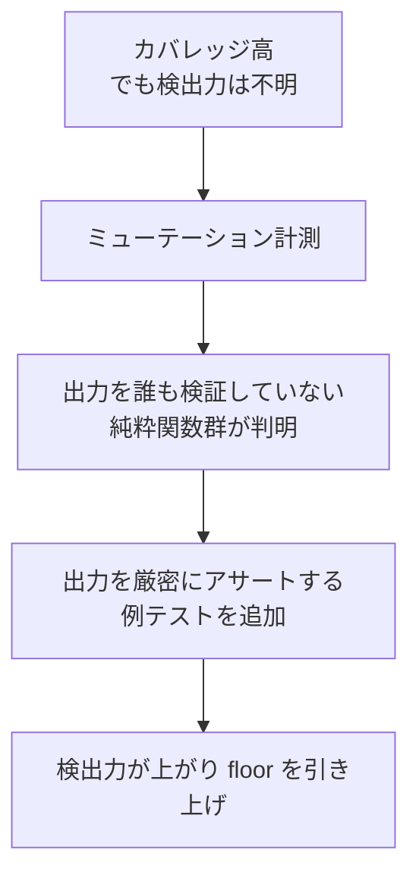

実際に、コードハイライタ群 (出力 HTML を誰もアサートしていなかった) に出力厳密アサートの例テストを足すと、各クラスの SURVIVED がほぼ 0 まで落ち、全体のミューテーションスコアとテスト強度が目に見えて上がった。境界反転・否定・副作用削除・文字範囲の緩和といった mutant が、一つひとつ検出されるようになった。

副次的だが重要な効果として、**計測そのものが計測の欠陥を暴いた**。最初の計測でテストクラスを変異対象に巻き込んでいたため、本来より低いスコアが出ていた。対象を本番コードだけに絞ると正味の値が見え、過小評価だったと分かった。「測ってみて初めて、測り方の誤りに気づけた」。

検証の三層 — **手動の欠陥挿入 → ミューテーション → 性質ベーステスト** — のうち、ミューテーションは中段にあたる。ここが空いていると「テストはあるが弱い」状態を機械的に検出できない。

## ハーネスとして何が嬉しいか

ミューテーションは、単発で回す道具としてより、**ハーネスに組み込んで改善ループを駆動する**ときに価値が出る。

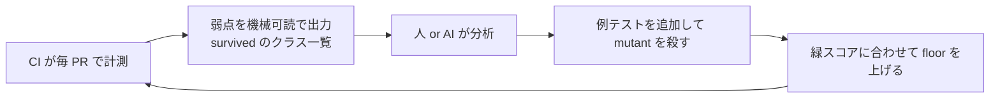

嬉しい点を分解すると次のようになる。

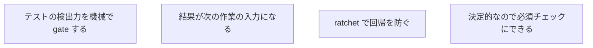

- **検出力を gate できる**。「カバレッジ X%」では弱いテストを通してしまうが、ミューテーションは「壊しても気づけないテスト」でマージを止められる。
- **結果が改善の入力になる**。survived の一覧を「次に強化すべきクラス」として出力すれば、そのまま改善作業の指示になる。とくに LLM に渡しやすい形 (クラス名・行・mutant の種類) で出すと、分析と修正の自動化に乗せやすい。これは「測る → 分析 → 直す → 基準を上げる」というループの、センサー出力にあたる。
- **ratchet floor で後退を防ぐ**。一度上げた検出力を下限として固定し、テストを消すなどで弱くなったら落ちるようにする。floor は目標ではなく「ここから下がらない」という床で、改善のたびに少しずつ上げる。
- **決定的なので必須チェックにできる**。実機テストのように flaky ではなく、純粋ロジックを対象にすれば結果は安定する。ただし遅いので、毎 PR の高速チェックとは**別ジョブ**に分け、ロジック層が変わった PR でだけ重い解析を走らせる、といった切り分けが要る。

### 運用上の勘所

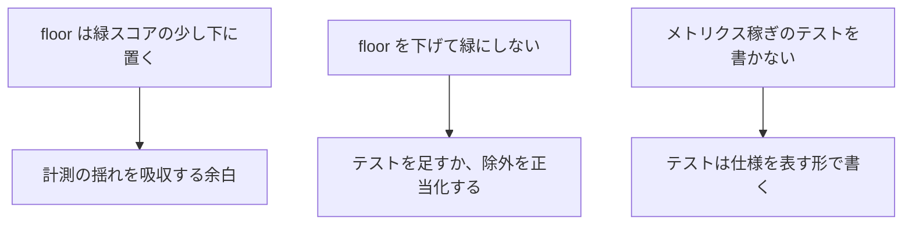

- floor は緑スコアぴったりではなく**少し下**に置く。計測には環境由来の小さな揺れがあるため、余白がないと偶発的に落ちる。
- **floor を下げて緑にしてはいけない**。緑にできないなら、テストを足すか、対象から外す理由を残す。基準を緩めて通すのは本末転倒。
- **メトリクスを上げるためだけのテスト** (アサーションが無い、実装をなぞるだけ) を書かない。mutant を殺すこと自体が目的化すると、仕様を表さない無意味なテストが増える。テスト名は性質を、本体は具体例を表す形に保つ。

## 限界と、向かない使い方

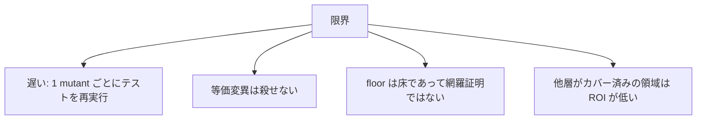

- **遅い**。mutant ごとに被覆テストを再実行するので、対象とテストの選び方を誤ると現実的な時間で終わらない。対象は純粋ロジックに絞り、重いテスト (性質テストなど) は混ぜない。
- **等価変異は殺せない**。意味が変わらない変更や、原コード自身が拒否する経路の変異は、原理的にテストで区別できない。追い続けるのではなく、記録して除外する。
- **floor は網羅の証明ではない**。「80% を超えた」は「壊しても気づけない箇所が 2 割ある」とも読める。スコアは万能の品質指標ではなく、検出力の一つの近似にすぎない。
- **多層防御が効いている領域**は、ミューテーション上 survive していても危険度が低いことがある。スコアの数字だけで優先順位を決めず、その mutant が現実にどう害になるかで判断する。

## テストの形式が計測を壊す: main() 形式テストの落とし穴

JUnit 5 で計測する場合、**テストメソッドの形式**が計測精度に直結する。

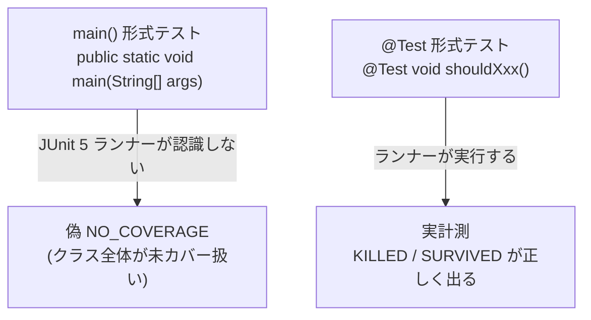

`main()` 形式でアサートを書くスタイルは、IDE から直接実行する「手軽な動作確認」として書かれることがある。しかし JUnit 5 のテストランナー (`@ExtendWith` や Surefire) はこれをテストとして認識しない。その結果、クラスを呼び出すテストが存在しないとみなされ、そのクラスの mutant が全て **偽 NO_COVERAGE** として報告される。

### 実例

```java
// これは JUnit 5 ランナーに認識されない → クラス全体が偽 NO_COVERAGE になる
public class MarkdownHeadingsTest {
    public static void main(String[] args) {
        var result = MarkdownHeadings.parse("# hello");
        assert result.size() == 1;
    }
}
```

```java
// これは認識される → KILLED / SURVIVED として正しく計測される
class MarkdownHeadingsTest {
    @Test
    void singleHeading() {
        var result = MarkdownHeadings.parse("# hello");
        assertThat(result).hasSize(1);
    }
}
```

### 対策

- スコアの低下原因を調べるとき、**NO_COVERAGE が集中しているクラスのテストファイルを開いて形式を確認する**。`@Test` アノテーションがないテストメソッドがあれば偽 NO_COVERAGE の犯人。
- 新しくテストを書くときは `@Test` 形式を徹底する。`main()` 形式の既存テストを見つけたら変換する。

この問題は「テストはある・カバレッジも高い・でも NO_COVERAGE が減らない」という症状で現れる。計測結果が予想と合わないときの診断ポイントの一つとして覚えておくと良い。

関連: [ハーネスエンジニアリングで学んだこと](harness-engineering.md) / [性質ベーステスト (PBT) で学んだこと](property-based-testing.md)
