# 性質ベーステスト (PBT) で学んだこと

## PBT とは何か

例ベーステストは「この入力ならこの出力になる」という対応を一つずつ書く。
性質ベーステスト (Property-Based Testing, 以下 PBT) は「どんな入力でも成り立つはずの性質」を宣言し、その性質が崩れる入力をフレームワークに探させる。

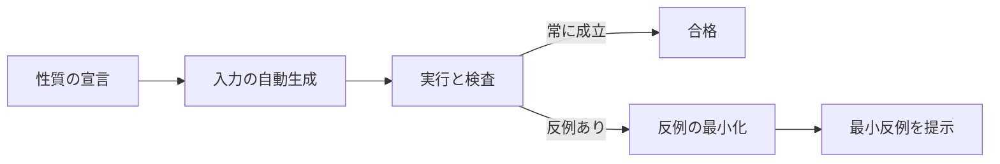

例ベーステストとの違いは、テストが「実行可能な仕様の宣言」になることと、書き手が想像しなかった入力で性質が破られる可能性を意識する点にある。

## なぜ導入したか

例ベーステストだけだと、書き手が思いつく入力しかカバーできない。
特に次の二つの観点では、例ベーステストの限界が出やすい。

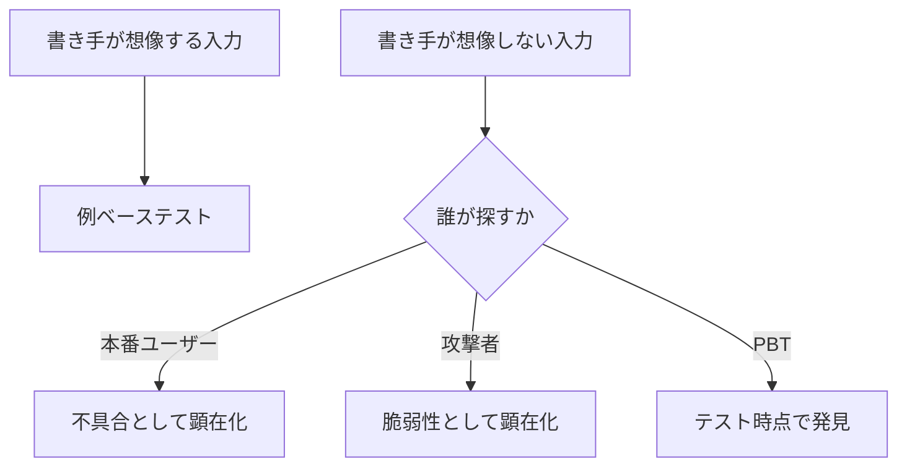

- 値オブジェクトの不変条件: 範囲、丸め、繰り返し操作の境界
- セキュリティの不変条件: どんな入力でも危険な出力に至らない

これらは「特定の入力で成り立つ」ではなく「あらゆる入力で成り立つ」性質なので、PBT と相性がよい。

## どこに当てはめたか

最初に対象としたのは、次の二領域だった。

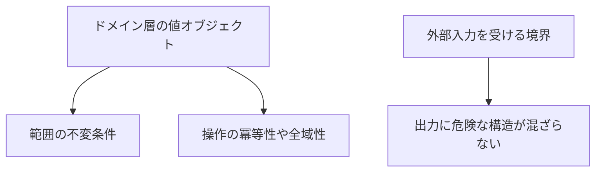

### 値オブジェクトの不変条件

ドメインに「常に妥当」な型がある場合、その妥当性はあらゆる操作後にも成立すべきだ、と表現できる。

- 任意の倍率でスケールしても範囲内に収まる
- 増減を任意回繰り返しても上限と下限を越えない
- 値の入力に対し常に「妥当な値」または「拒否」を返す (全域関数)
- 中央値に対して操作の逆操作が恒等になる
- スケール係数 1.0 は恒等

これらは個別の値で確認するより、性質として一行で書くほうが意図がはっきりする。

### 境界に対する安全性 (XSS)

Markdown レンダラーのように外部入力 (ユーザーの文書) を HTML に変換する処理では、出力に危険な構造が含まれないことが性質として書ける。

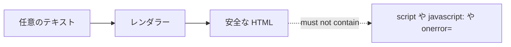

「どんな入力でも、出力に `<script` や `javascript:` や `onerror=` が現れない」という宣言は、レンダラーが満たすべき安全性そのものを言葉にしている。

## なぜ発見できたか

導入直後に、レンダラーが生の inline HTML をそのまま通過させていることが見つかった。
攻撃文字列を含む入力に対して、出力にも同じ文字列が残っていた、というだけのことだが、例ベーステストだけでは見落とされていた。

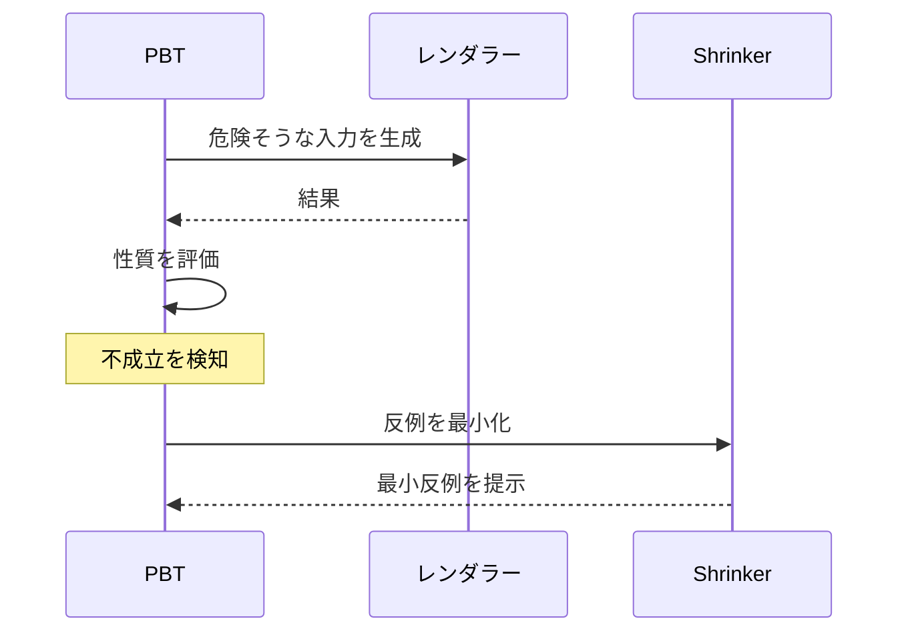

PBT がうまく働いた理由は、おそらく次の三点に分解できる。

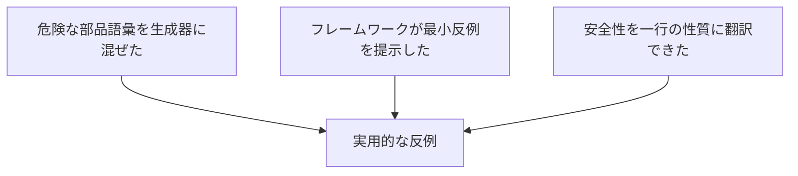

- 純粋にランダムな文字列を生成するだけでは、典型的な攻撃文字列に到達する確率が極めて低い。あらかじめ既知の危険な断片を生成器に混ぜることで、現実的な時間で空間を探索できた。
- 反例の最小化により、何が壊しているのかをそのまま読めば理解できた。
- 何が安全かを「あれは駄目、これも駄目」と例で並べるのではなく、「出力に X が含まれない」という性質として書けた。例ベーステストでは似た形にしづらい。

実害があったかは別の話で、別の防御層 (たとえばエンジン側の機能無効化) が効いていれば直ちに悪用には至らない。ただし防御が一枚に依存している状態は壊れやすい。PBT は「層が一枚剥がれた瞬間に表面化する問題」を、剥がれる前に教えてくれた。

## 他に対象とすべきもの

「あらゆる入力で成り立つはずの性質」を一行で言える領域は、まだ多く残っている。

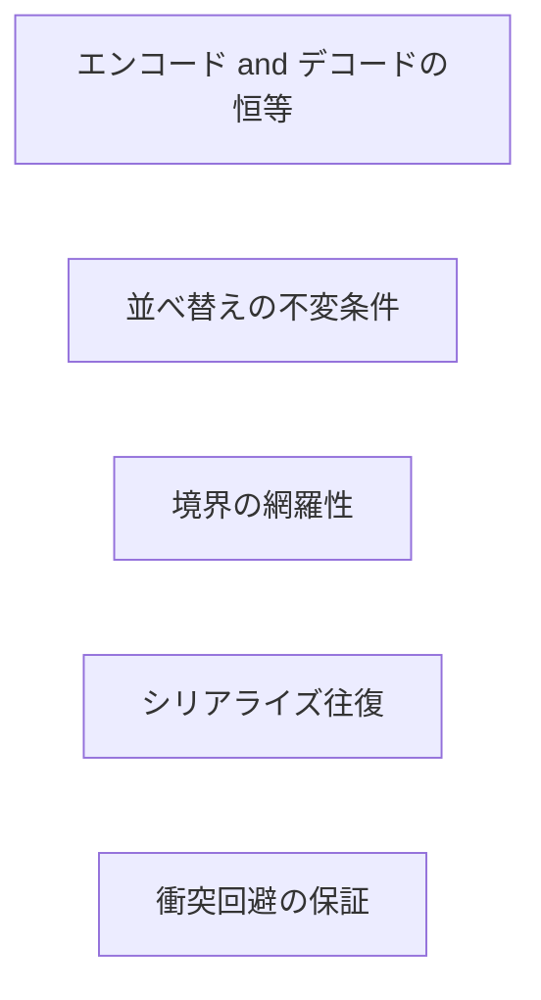

候補の例:

- 永続化フォーマットのエンコードとデコードのラウンドトリップ。`encode` した後 `decode` しても元に戻ること。区切り文字や特殊文字を含む入力でも壊れないこと。
- 履歴やリストの上限と並び順。任意の操作列を適用しても、要素数が上限を超えず、最新が先頭にあること。
- 名前生成の衝突回避。すでに使っている名前の集合がどれだけ大きくても、新しく生成した名前は集合に含まれない別の名前であること。
- 分類関数の全域性。任意のサイズ、任意のファイル名に対して、必ず定義済みのいずれかのカテゴリに分類されること。「未分類」の状態が観測できないこと。
- ジェスチャー形状の正規化。任意の点列が常に同じスケールで正規化されること。スケールと位置を変えた同じ形状が、十分近い表現に正規化されること。

これらは仕様としては明確だが、例ベーステストではどうしても抜けが残る。PBT で性質として書くと、抜けにくくなる。

## 対象とすべきでないもの

「網羅性が高いからとりあえず PBT」と振ると、書き手と読み手の双方が消耗する。PBT は安価な道具ではない。性質の表現コスト、生成戦略の調整、反例の解釈、これらが合計で例ベーステストより重くなる場面は珍しくない。

向かない対象は次のように整理できる。

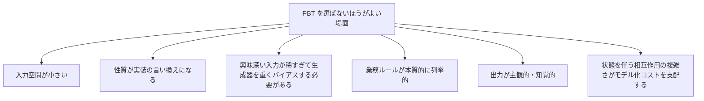

- 入力空間が小さい場合。値が三つしか取り得ない列挙や、設定が四通りしかないような対象は、例ベーステストで網羅できている。PBT を被せても情報は増えず、セットアップコストだけが残る。
- 性質が実装の言い換えになる場合。`add(a, b)` を「`a + b` と等しい」という性質で検査しても、それは実装の二度書きで、実装側の欠陥を検出する力がない。性質が実装より一段抽象である必要がある。
- 興味深い入力が稀すぎる場合。生成器に既知の悪パターンを重く混ぜないと到達しない領域は、PBT の自動探索の利点が薄い。バイアスの設計が「ちょっと賢い例ベーステスト」に近づいているなら、素直に例として書いた方が読み手に早い。
- 業務ルールが列挙的な場合。「対応拡張子は `.md` と `.markdown`」「無料プランは五件まで」のような閾値は、性質に翻訳しても情報量が増えない。閾値は閾値として例で書いた方が、意図がそのまま読める。
- 出力が主観的・知覚的な場合。「読みやすい」「滑らかに動く」を性質として書こうとすると、判定基準を後付けで作ることになる。これは性質化の限界であり、UI や UX の質は別の検証手段に委ねる。
- 状態を伴う相互作用が複雑な場合。Stateful PBT は可能だが、モデリングコストが本体実装に匹敵する。複数の集約をまたぐワークフローは、シナリオテストのほうが ROI が高いことが多い。

### 採否を決める三問

実際に書くかどうか迷うときは、次の三問を順に確認すると判断しやすい。

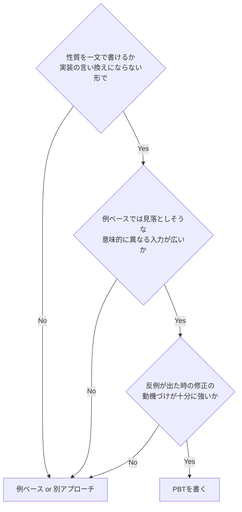

三問目が抜けがちだが重要で、反例が出ても直す動機がない性質は書かないほうがよい。CI が常に黄色いまま誰も触らない状態を作るくらいなら、最初から例ベーステストで意図的に絞ったケースだけを検査するほうが、テストスイートの信頼性が保てる。

## 仕様の暗黙性が露わになるもの

PBT を書こうとして手が止まる対象のうち、**判断基準や閾値を決めれば書ける**ものは、仕様の暗黙部分を可視化している。性質を書く作業が、そのまま仕様を明文化する作業と一体になる。

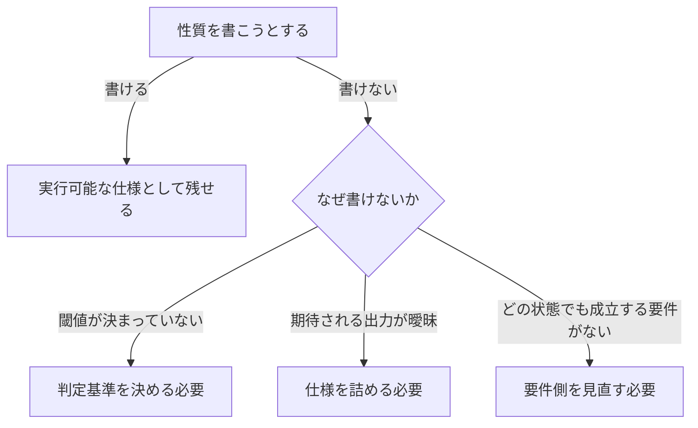

実例として次のような対象がある。

- 形状の類似判定。「明らかに違う形状は拒否する」とは言えるが、「どこまで似ていれば一致と見なすか」が文章化されていないと、性質を書けない。閾値を性質として固定する作業が、仕様を決める作業と一体になる。
- ジェスチャー軌跡の意図検出。「意図的な動き」と「偶発的な揺れ」を区別する基準が決まっていないため、何を性質として書けばよいか分からない。
- 一覧表示のソート順。どの属性で、どの方向に並ぶべきかが文章化されていないと、「並べ替えても結果が安定している」程度の弱い性質しか書けない。
- レンダラーが扱う Markdown のサブセット。どの記法を受け入れ、どの記法を受け入れないかが決まっていないと、「対応構文では往復で意味が保たれる」のような性質は書きにくい。

ここでは、仕様駆動的な作業 (基準を文章化する、サブセットを定義する) を進めると PBT が書けるようになる。書けないこと自体が「次にどこを詰めるべきか」を指している。

### 「書けない」を一律に仕様の不備として扱わない

ただし、書けないことが常に仕様の不備を意味するわけではない。前節で挙げた「対象とすべきでないもの」のうち、出力が主観的・知覚的な領域は、判定基準を後付けで作ること自体が悪い仕様化になる。

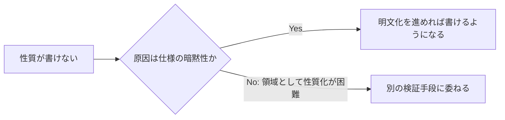

UI の印象や読みやすさのような対象まで「PBT で書けないのだから仕様が曖昧だ」と圧をかけると、本来は感性で判断すべき領域に粗い数値基準を持ち込むことになる。これは仕様駆動の悪い適用で、PBT の射程外を素直に認めるほうが健全だ。

ここで重要なのは、性質を書けないこと自体が情報だ、という点だ。

PBT の導入を進めると、テストカバレッジを増やすこと以上に、仕様の暗黙部分を可視化する効果が得られる。書こうとして書けないなら、書けるところまで仕様を詰めるか、現状を意識的に許容する判断を残す。

## 導入の手順を残しておく

最初から大きく始めない。PBT は最初の一つ二つで「これが意味のあるテストなのか」を体感し、その後に対象を広げる流れがやりやすい。

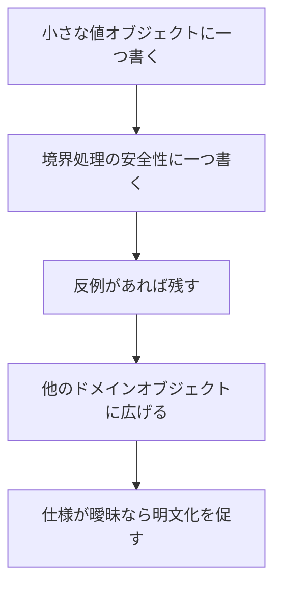

反例が見つかった場合、すぐに修正できなくてもテストは消さない。「現状ここで失敗する」という事実を残しておくと、後で防御層を直したときに、再有効化するだけで検証が完了する。
